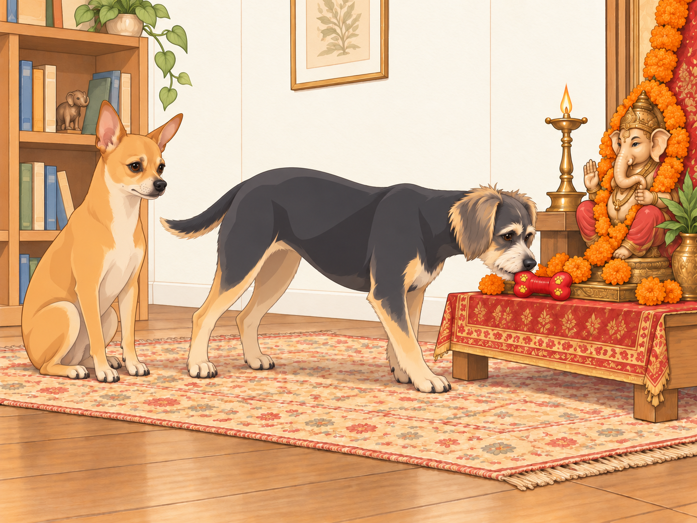

# The Arrival of Ganesha

## Dawn: Suspicious Energy in the Air

Saturday mornings in the Patel household were usually slow affairs: chai on the patio, Neet patrolling for squirrels, Buddy chasing invisible intruders in the backyard (sometimes his own shadow).

But this Saturday was different.

Heather was awake at dawn, stringing marigolds into garlands with the precision of a jeweler. The living room floor was scattered with jasmine petals, brass lamps, coconuts, incense sticks, and bags of sugar. Sagar was grinding fresh cardamom pods for chai while simultaneously polishing the brass diya until it shone like liquid gold.

Neet sniffed the air suspiciously. “Something’s brewing. The humans are in high alert mode.”

Buddy tilted his head, tail wagging. “Birthday party?”

Neet narrowed his eyes. “No. This smells… holy.”

Buddy gasped. “Holy snacks?”

---

## Operation Temple Setup

By 9:00 a.m., the house was no longer a house. It was a festival command center.

Heather draped a crimson-and-gold cloth across the temple shelf in Sagar’s office. She carefully arranged peacock feathers, bells, and fresh flowers. Sagar measured the placement of each plate with military precision: coconuts stacked like ammunition, modaks lined in disciplined rows, incense in a perfect triangle.

Neet inspected the arrangement like a general on parade. He circled the setup three times. “Approved. Mostly. Garlands slightly uneven.”

Buddy trotted up to the plate of fruits, grabbed an apple, and sprinted to the couch.

“Buddy Patel!” Heather exclaimed.

Buddy set the apple between his paws and wagged innocently. “Quality check! The Lord deserves the best!”

Heather held out her hand. Buddy looked at the apple, then at her empty hand, as though disappointed by what she had brought to the exchange.

“Thank you,” she said, taking it.

His quality-control department closed.

Neet groaned. “You are embarrassing me in front of divine company.”

Buddy looked at the still-empty throne. “He’s not here yet.”

“Preparatory embarrassment.”

---

## The Threshold Drama

Late morning, Sagar returned from the temple carrying the radiant Ganesh murti. His form was painted in vibrant reds and golds, trunk curling gracefully, eyes twinkling with serenity.

The whole family gathered at the front door. Heather held the bell in her hand, her voice ringing with devotion:

“Ganpati Bappa Morya!”

Neet barked once, deep and commanding, as though announcing to the entire neighborhood: VIP guest arriving.

Buddy tried to join in: “Woooo-eee-ooooo!” His howl sounded like a squeaky toy being stepped on.

As the idol crossed the threshold, even the air seemed to shift — the house filled with warmth, joy, and a sudden hush.

Neet sat upright, tail thumping once. “Approved.”

Buddy whispered, wide-eyed: “He’s so cool.”

---

## Morning Aarti: Buddy’s Big Debut

The family placed Lord Ganesha on his decorated throne. Heather lit the diya, its flame shimmering like a heartbeat. Sagar circled the lamp reverently, Heather sang softly.

Neet sat perfectly still, eyes locked on the flame. If anyone had looked closely, they might have thought he was meditating.

Buddy had been listening to Heather’s rising note. He drew breath. Neet glanced sideways, too late.

When Heather’s voice rose, Buddy joined in. Except his “singing” was more of a wobbly howl. “Ooooo-Woooo-oooo!”

Heather giggled mid-song. “Oh no, Buddy’s part of the choir now.”

She finished the phrase. Buddy continued. She waited. He had found another note, and evidently intended to keep it.

Sagar smiled. “Ganpati probably loves it.”

Buddy wagged proudly. “See? I’m holy too.”

Neet rolled his eyes. “You sound like a rusty harmonium.”

---

## Snack Sabotage

After the aarti, Heather placed offerings: plates of modaks, bowls of kheer, fruits stacked high.

Buddy looked from the offerings to the murti. “Look at all that FOOD! For HIM?!”

He inched forward, tongue practically unrolling like a cartoon.

“Buddy Patel, no,” Sagar warned.

Buddy plopped dramatically on the floor. “But Ganpati LOVES modaks. I was just trying to be his assistant eater!”

Neet sniffed the tray, sitting straighter than usual. “Prasad approved. Security perimeter intact.” His nose, however, lingered dangerously close to the modaks.

Heather caught him. “Neet. Step back.”

Neet immediately stiffened into parade rest. “Inspection only.”

Buddy raised his head from the floor. “Your inspection was licking its lips.”

Neet moved back one tile.

---

## Afternoon Festivities: Buddy’s Holy Offering

By afternoon, the house was glowing with decorations. Fairy lights draped the backyard, marigolds brightened every doorway, and the smell of sandalwood and incense floated everywhere.

Sagar prepared sandalwood paste for tilak. Buddy thought it was peanut butter and tried to lick his own forehead. Heather nearly collapsed laughing. Buddy’s tongue reached his nose. He tried again, with greater conviction and exactly the same result.

Neet sighed. “That isn’t peanut butter.”

Buddy gave up on his forehead and went to fetch something he understood. He waddled up to Ganesha’s murti and gently placed his squeaky toy bone at Bappa’s feet.

“An offering!” he barked proudly. He nudged the bone until its squeaker faced the new guest.

Heather clapped her hands, touched. “Oh, Buddy, that’s the sweetest prasad of all.”

Even Neet softened. “Approved.”

---

## Evening Aarti: The Fire Demon Incident

As twilight fell, the second aarti began. The family circled the diya while the house glowed with golden light. Neet sat stiff and solemn, but Buddy noticed something alarming — the flame’s reflection bouncing on the tiled floor.

“Fire demon!” he yelped, and pounced.

His paws skidded across the floor, nearly knocking over the prasad plate. Sagar caught it mid-air, Heather steadied the diya.

“Buddy Patel!” Sagar scolded.

Buddy wagged sheepishly. “But… I saved us from the reflection!”

Neet stepped between Buddy and the dancing reflection. “You’ve saved us. Stay here now.”

Sagar set the rescued plate well out of reach. Heather moved the lamp, and the reflection slid away.

Buddy watched it retreat. “See?”

Neet did not spoil his victory. He simply stayed in the way.

---

## Dinner of Devotion

The family dined simply but royally: dal, okra, parathas, rice, and a fresh bowl of coconut kheer for dessert. The first serving, of course, went to Ganesha.

Neet and Buddy each got their share of blessed prasad — a bite of paratha, a little dal, a spoon of kheer.

Buddy’s eyes glazed in bliss. “Best. Festival. Ever.”

Neet licked saffron from his whiskers, murmuring gravely. “Five-star ceremony. Highly approved.”

---

## Night Benediction

The final aarti filled the house with serene chants. Marigold petals glowed, fairy lights twinkled in the backyard, and the diya flame flickered like an eternal blessing.

Sagar whispered a prayer: “Thank you, Bappa, for wisdom, patience, and laughter in this home.”

Heather leaned against him, smiling. Their first Ganesh Chaturthi in Austin had required more catching than either of them had expected.

Neet, exhausted, dozed off in the sunroom, tail twitching. Buddy lingered by the shrine.

Buddy’s bone remained at Bappa’s feet. Before he settled beneath the shrine, he gave it one last nudge, just in case the guest hadn’t found the squeaker.

## Provenance and editorial notes

Working selection dated October 3, 2026. Selection and shelf order are editorial; owner approval and event chronology remain unverified.

Original numbering: independent captured sequence Chapter 21.

Archive recovery: use [Studio recovery guidance](../Studio/Recovery.md). The paths below are paths **inside the verified snapshot**, not active navigation. SHA-256 pins identify the exact sources.

- `elevenlabs-reader-12` — `02_Story_Library/ElevenLabs_Imports/reader-12-the-arrival-of-ganesha.txt`; SHA-256 `efb71f8bd3996070ac4a830cac0f2d882b50f7a474a87fd7d1ba025edd7243c4`.

## Refinement record

Refined October 3, 2026; [episode record](../Productions/E052-the-arrival-of-ganesha/episode.json) documents the reading comparison and illustration work. The pre-refinement text is preserved in the [dated recovery snapshot](/Users/sagar/Documents/ChatGPT/NBC_Archives/NBC-before-refinement-2026-10-03_200659.tar.gz) at `NBC/Stories/S052-the-arrival-of-ganesha.md`. Historical provenance above remains unchanged.
