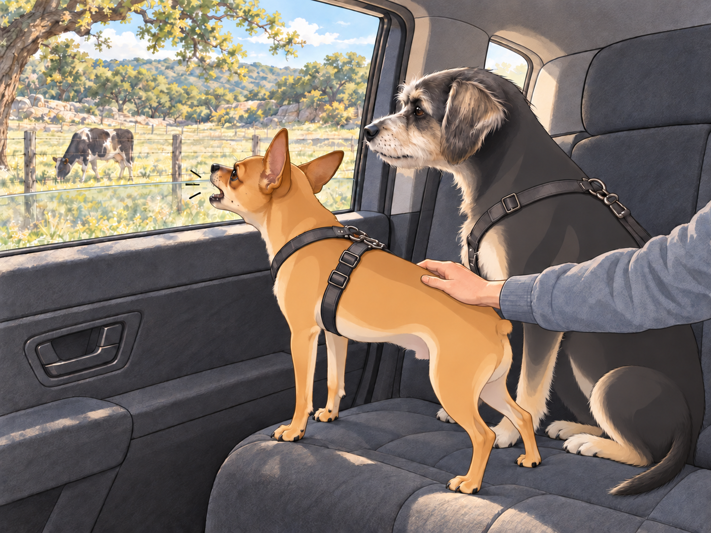
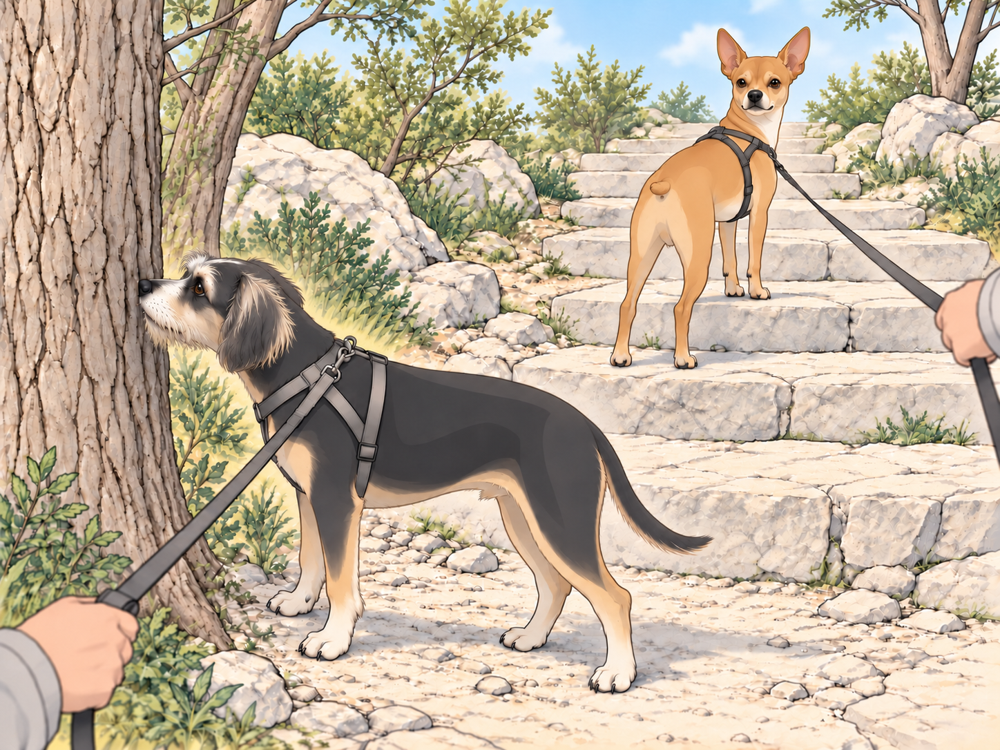
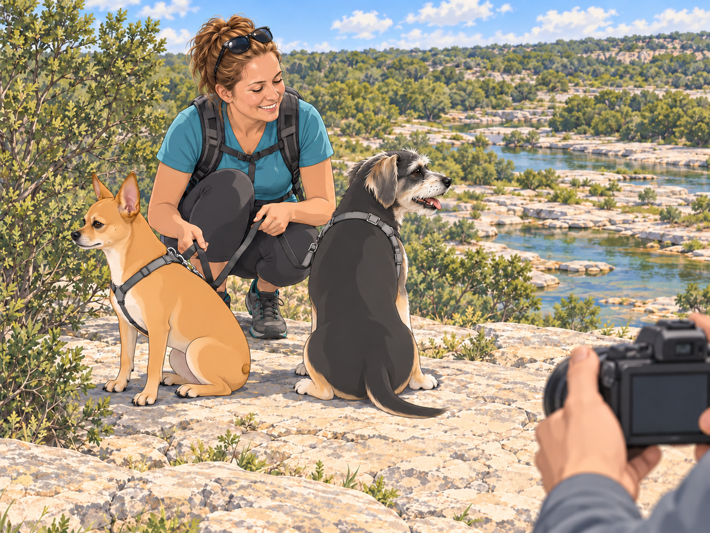
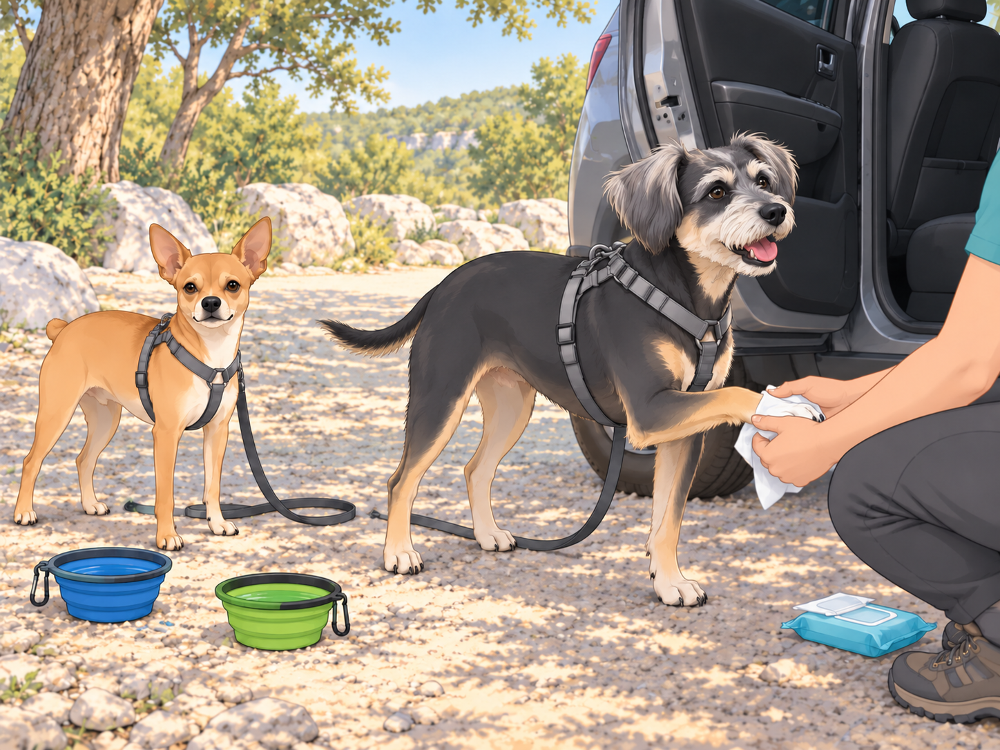

# The Day Trip to Pedernales Falls

## Prologue: T minus 90 minutes to Adventure

At 6:30 a.m., the Patel kingdom was humming like a beehive that had read a travel blog.

Sagar— The King of Calm— lined up the preflight checklist on the kitchen island: water bottles, collapsible dog bowls, paw wipes (labeled in black marker: “PAW WIPES, not ‘poor wipes,’ though the paws are indeed poor”), extra leashes, snacks, sunscreen, and a damp bandana for each general. He set the dog bowls on top, where nobody could miss them.

Heather knotted her hair, zipped a daypack, and found one last side pocket for an extra trash bag. She gave the boys a pep talk: “Stairs, views, sparkling water. Minimal chaos. Yes?”

Buddy pogoed in place. “YES CHAOS!”

Neet puffed his chest. “Minimal chaos. Controlled excellence. Approved.”

Sagar moved the snack bag off the edge of the island. Both generals followed it with their eyes. For three seconds, the briefing had perfect attendance.

## Wheels Up: Backseat Brigade

By 7:00 a.m., the royal chariot rolled out. Sagar captained the ship; Heather rode in the back with the generals, one arm around Buddy, the other resting on Neet’s harness like a seatbelt made of love and light warnings.

The windows cracked down and Neet’s head shot out like a periscope. He inhaled the morning air with the concentration of a sommelier.

“Wildflower bouquet— approved!” he announced.

Two blocks later: “Freshly cut grass— approved!”

A sudden waft of questionable dumpster: “Not approved.”

Buddy had his whole face smushed to the glass, fogging it with passionate commentary. “Mail truck! Smells like heroism. Ooo the bakery— sourdough ghosts! We’re definitely passing a chicken somewhere, I can FEEL it in my soul.”

The road tipped into Hill Country. Live oaks leaned like old professors; fences followed the rise and fall of the pastures. And then… a ranch.

A cow lifted her head and made eye contact with Neet.

The general detonated. “INTRUDER! FOUR-LEGGED TITAN! COMMENCE WARNING BARKS.”

WOOF-WOOF-WOOF-WOOF-WOOF!

The cow blinked like, tiny sir, I am breakfasting on grass. Buddy whispered, awestruck, “General… that’s a mega-dog.”

Neet snorted. “Not approved. Suspicious chewing.”

The cow lowered her head and took another mouthful.

Neet kept barking until a bend in the road removed her from his jurisdiction.

Heather was already laughing. “Neet Patel, you dramatic walnut.”

## Pit Stop: Lucky Labs Coffee Shop

They slid into the parking lot of Lucky Labs Coffee Shop, a dog-themed haven with paw prints painted along the path and a chalkboard sign that read: “Sit. Stay. Sip.” Bowls of water lined the patio like a canine champagne service.

Inside, Heather ordered the maple & sage cream coffee— fragrant as a forest pancake— and took one sip, eyes closing. “Oh wow. This tastes like a Vermont cabin married a herb garden.”

Sagar, grin bright as sunrise, chose the peach & raspberry lemonade. “Crisp, tart, happy,” he said. “Like a picnic in a flute.”

Buddy tried to sign the guest book with a paw. Heather caught it before contact and redirected him to a water bowl. He drank, then checked whether the book was still accepting visitors. Neet inspected every chair leg. “Solid joinery. Approved. Floors a bit slippery— conditionally approved.”

They stepped back into the day, caffeinated and citrused, the generals watering the nearest patch of mulch with the gravity of a ribbon-cutting ceremony.

## The Winding Ribbon & The Not-Approved Tummies

The road tightened into gentle S-curves. Hill Country winked and dipped. Heather pressed her palm to her tummy and breathed through it like a pro. Neet swallowed hard and set his jaw.

Heather: “Uhhhh. Slightly… swirly.”

Neet, thin-lipped: “Road design… questionably approved.”

Sagar cracked the windows, dropped a gear, smoothed his arc through turns like a dancer. “Almost there.”

Buddy, unfazed, offered medical advice: “If you open your mouth AND stick out your tongue AND think about bacon, it heals you. I read that in a dream.”

They crested a hill— and there it was. Pedernales Falls State Park, sunlight kissing the signage. The moment the gate came into view, both Heather and Neet’s stomachs declared amnesty.

## Trailhead Theater

They parked at the trailhead. The car chimed politely; the A/C exhaled a final cool blessing. Doors popped. Adventure smelled like cedar and limestone and a thousand tiny stories.

Neet hit the ground in a forward lean, the leash a taut violin string. “On me! Single file! We move like a river!”

Buddy immediately stopped at Tree #1.

Buddy: “Permit me to examine this important legislature.”

Heather tugged gently. “Buddy, we haven’t even made it to Tree #2.”

Buddy trotted five steps and halted at Tree #2. “Whoa, this one’s a committee chair.”

Sagar laughed. “We’re going to finish this short trail next Wednesday.”

Neet tried going around Buddy. The leashes crossed. He stopped, looked back at Sagar, and waited for the expedition to be untangled. Buddy used the delay to finish reading.

The path dappled into light. Stairs appeared— broad limestone steps, sun-warmed and handsome. Neet’s eyes went star-bright.

“STAIRS! A sacred escalation device! Make way!”

He surged forward like a cable car, tugging the entire family up each riser with gleeful yanks. Heather grinned, letting his enthusiasm be her metronome. Buddy trudged behind, tongue out, already doing his best impression of a melted popsicle.

Buddy: “It’s so hot my thoughts are sweating.”

Neet: “Heat: not approved. Stairs: loudly approved.”

## The Emerald Reveal

The stairs swung them onto a broad overlook where the world opened, and the Pedernales River staged its classic trick: emerald water moving in quilts over terraced limestone, pockets glowing like gemstone bowls, foam catching sunbeams and tossing them back as confetti.

Even Buddy stopped pulling toward the next tree. Water moved below them with a low, steady hush.

Heather touched Sagar’s wrist. “It looks unreal.”

Sagar nodded. “Like someone spilled liquid jade.”

Buddy squinted. “Or melted mint ice cream.”

Neet sat tall, eyes scanning like a general safeguarding a treasure. “Scenic exceptionalism: fully approved.”

They took a beat. Then Sagar lifted the camera. “Picture time! Troops, assemble.”

Neet instantly found the only uninteresting bush and stared at it as though it owed him rent.

“Neet, here!” Sagar chirped. Nothing. “Buddy, sit!” Buddy sat facing southwest, thinking about the committee tree.

Sagar took one step sideways to find their faces. Neet adjusted toward the bush. Heather held her smile. “We could photograph the backs of their heads. They’re very committed.”

Sagar exhaled, then used the magic phrase heard only in this family’s private galaxy. “Hey, idiot!”

Neet snapped his head around, ears crisp. Click! Perfection: Heather glowing, Buddy mid-pant smile, Neet with eyes moon-bright, the falls a painting behind them.

A nearby couple burst into laughter. A kid whispered, “He called his dog an idiot!” Heather turned crimson and waved, hands fluttering like doves. “It’s a love-name! He made it up at home! He’s the world’s most loved idiot! Like— like a goofball prince!”

The couple kept giggling, charmed. The kid tried it on his dad. “Hey, idiot!” Dad saluted solemnly. Laughter pinged around the overlook like wind chimes.

## The Quickening Heat & The Strategic Retreat

Texas turned the thermostat from “ahh” to “woof” in eight minutes. Buddy’s trot degraded into a shuffle. Neet’s proud march softened into efficient minimalism.

Buddy leaned against Heather’s leg. “My tongue is now a scarf.”

Neet puffed. “Resources low. Morale intact. Recommendation: tactical withdrawal.”

Sagar checked the time, then Buddy’s slowing steps. “Back to the trailhead. Hydration, shade, and the A/C temple await.”

Heather kissed each furry forehead. “Good call.”

They descended. Buddy still attempted the sacred sniff at Tree #5. He stopped with his nose an inch from the bark, felt the heat, and left the matter pending. Neet maintained pace, occasionally pausing to stand on a step and survey his domain like a limestone governor.

## Parking Lot Spa: Hydration & the “Poor” Wipes

The car clicked open like a miracle. The cabin already hummed at a perfectly cool temperature (Sagar’s Logistics Sorcery, Level 99). But first: rehab.

Sagar poured cold water into travel bowls. Neet drank with dignified sips, parted lips, a satisfied “hm.” Buddy dunked half his face and came up looking like a tiny otter that had seen the face of God.

“Approved,” Neet declared, eyes half-closed.

“BLESSED,” Buddy corrected. “It’s like the river came inside my mouth.”

Heather produced the wipes. “Paw spa! Paws up, please.”

Neet lifted each paw like a violinist presenting a Stradivarius. “Under protest, but approved; the dust was organizing a union.”

Buddy wriggled. “Noooo my trail seasoning!” Then he saw the open car door and offered the next paw. Cool air required sacrifices.

Heather wiped it and reached for another. Buddy presented the same clean paw.

“Other one.”

He considered arguing. A cool draught reached his nose. He changed paws.

Sagar towel-patted faces, flicked a stray burr from Neet’s chest, and whispered, “Good hike, gentlemen.”

They all slid into their seats. The A/C kissed foreheads. Both generals stuck their tongues out like victory flags and sighed in stereo.

Buddy: “Please inform my legs I loved them.”

Neet: “Operating temperature restored. Mission success.”

## Homeward: The Scenic Exhale

The return drive was quieter, sunlight now pouring broad and uncomplicated across the road. Heather stroked ears and dozed; Buddy snored with an occasional “hrrr-oof” dream bark; Neet kept one eye on the window like a lighthouse keeper who moonlights as a poet.

They passed the ranch again. The cow looked up. Neet considered, then inclined his head. “Approved… from a distance.”

Buddy, barely lifting his head: “Tell the mega-dog I said hi.”

Sagar sipped the last of his peach-raspberry lemonade. “Still crisp.”

Heather squeezed his shoulder from the back seat. “Good day.”

## Epilogue: Feast & Siesta

At home, shoes off became ceremony. Heather assembled a lunch worthy of the heat: cool cucumber salad, leftover paneer revived in a sizzling pan, fluffy rotis that puffed like tiny hot-air balloons. Sagar added bowls of cold yogurt with a whisper of cumin and salt. The generals received cool water refills and victory snacks, presented like medals.

Buddy ate, sighed, and flopped dramatically on the cool tile, star-fishing like a Roman senator after a banquet. “Best rock river day in history.”

Neet curled on the doorway threshold where the A/C draught made a tiny wind tunnel. “Scenery: five stars. Stairs: six. Heat: not approved; mitigated by logistical excellence.”

Sagar stacked the plates. Heather clicked the backyard string lights on even though it was daytime— habit, blessing. The house hummed, full of that specific peace that only follows a well-spent morning outdoors.

They drifted to bedrooms and couches, a royal siesta decree enacted without paperwork. Buddy was asleep before his chin found his paws. Neet, eyes half-closed, murmured something that sounded very much like “approved.”

The car still smelled faintly of sage-maple and peach-raspberry. On the kitchen island, the paw-wipe packet lay beside the checklist. Sagar had added one item: “Untangle generals.”

## Provenance and editorial notes

Working selection dated October 3, 2026. Selection and shelf order are editorial; owner approval and event chronology remain unverified.

Original numbering: independent captured sequence Chapter 25.

Archive recovery: use [Studio recovery guidance](../Studio/Recovery.md). The paths below are paths **inside the verified snapshot**, not active navigation. SHA-256 pins identify the exact sources.

- `elevenlabs-reader-02` — `02_Story_Library/ElevenLabs_Imports/reader-02-the-day-trip-to-pedernales-falls-directors-cut.txt`; SHA-256 `db30dcc9dcf511bae9c69e01faf0dceab6383af7b099a2b078f345eda3c1fc42`.

## Refinement record

Refined October 3, 2026; [episode record](../Productions/E056-the-day-trip-to-pedernales-falls/episode.json) documents the reading comparison and illustration work. The pre-refinement text is preserved in the [dated recovery snapshot](/Users/sagar/Documents/ChatGPT/NBC_Archives/NBC-before-refinement-2026-10-03_200659.tar.gz) at `NBC/Stories/S056-the-day-trip-to-pedernales-falls.md`. Historical provenance above remains unchanged.
