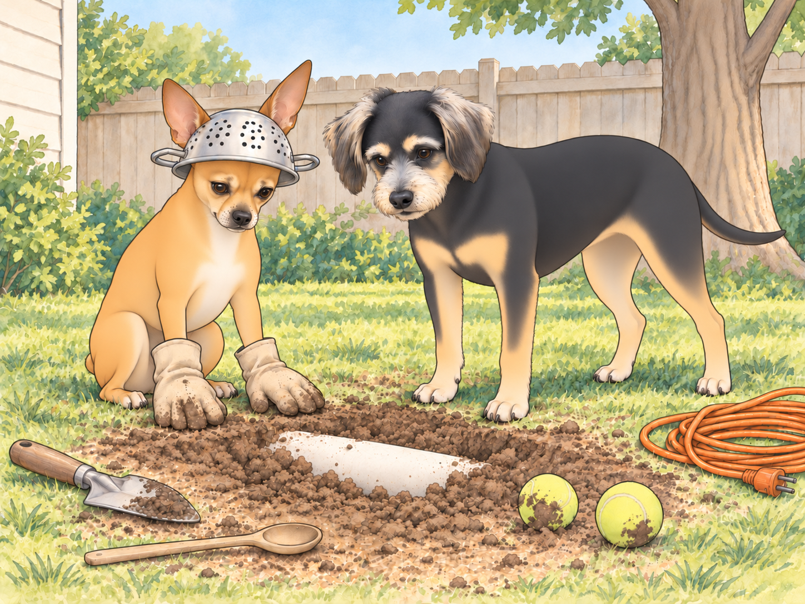
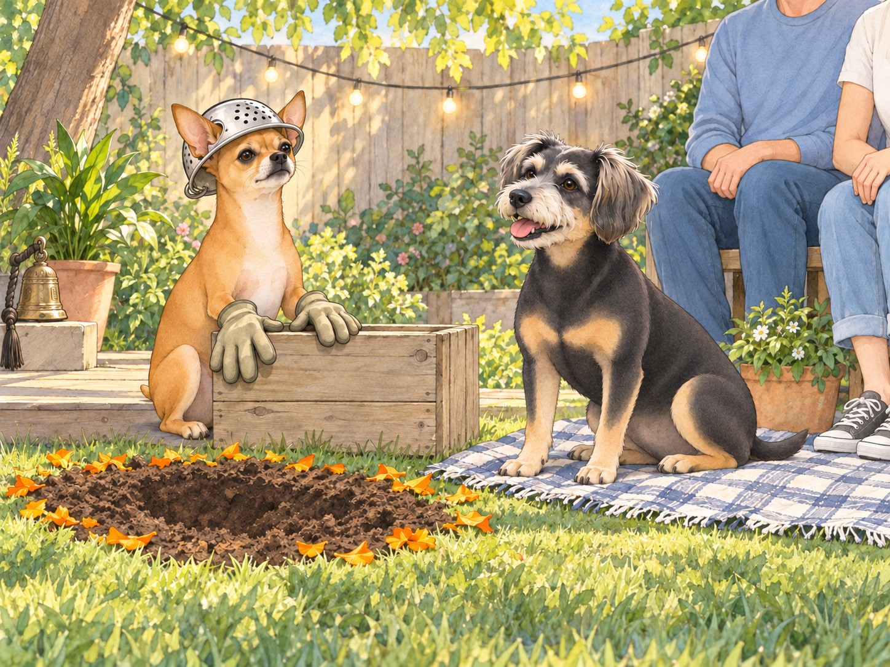
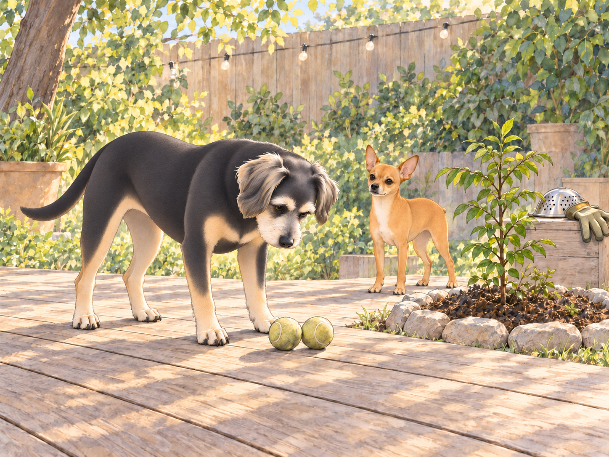

# The Tunnel to India (or, Faith vs. Physics)

At 6:02 a.m., the backyard was quiet except for one (1) determined dog and one (1) deeply skeptical snack enthusiast.

Neet stood over a chalky patch of Texas soil wearing Heather’s old gardening gloves like boxing mitts and a stainless-steel colander as a helmet. Beside him: a coil of orange extension cord (“industrial lifeline”). At his paws: a wooden spoon, a trowel, two tennis balls (“core samples”), and a hand-drawn map that looked suspiciously like a spaghetti diagram labeled:

“OPERATION BEST MAN: AUSTIN →EARTH CORE →INDIA.”

Buddy padded out, yawned, and read the title twice.

“Couple notes,” he said. “One: you spelled ‘rabies’ on the corner? And two: this looks… ambitious.”

Neet’s eyes blazed. “Correct the spelling on your own time. Today, we dig.”

“Why?”

Neet lifted his chin. “Because destiny requires an escort. I have reviewed the archives— wedding photos, the story of vows by lamplight, Sagar Patel in regal calm, Heather Patel like a sunrise— and I have discovered a catastrophic omission: I was not there. Therefore, I will tunnel to India to attend the wedding. Retroactively. As Best Man. Only I am worthy.”

Buddy blinked. “Retro… you can’t time travel with a spoon.”

Neet thumped the spoon into the dirt. “Faith bends clocks. Love curates geography.”

Buddy sat, very gently, as if one wrong move would cause a landslide of nonsense. “General, I love you. But the center of the earth is, like, unfriendly. Hot. Melty. Sizzly. Like Sagar’s chili paneer but everywhere.”

Neet unfurled his map with ceremony. “Obstacles: mantle, molten core, global pizza crust. Solutions: determination, hydration, maybe Ganesha.”

Buddy rubbed his face. “That’s not geology. That’s a TED Talk given by a shovel.”

Neet leaned in, eyes bright. “Heads: practicality. Tails: destiny. We choose both. Now— assist me or submit a written apology to history.”

Buddy looked at the two tennis balls. He had brought one outside yesterday. Apparently it was geology now.

“Fine. But I reserve the right to say ‘told you so’ when the lawn bites back.” He nudged both samples behind his feet. Whatever happened to India, they were coming home.

---

## Scene I: Groundbreaking (and Other Ground Truths)

Neet jabbed the trowel. “On my mark… dig.”

They dug.

Neet’s first scoop stayed inside the glove. He shook it. The dirt landed in his other glove.

Buddy waited.

“Topsoil transfer,” Neet said. “Successful.”

Neet dug with the intensity of a startup founder trying to disrupt bedrock. Buddy dug like a pastry chef icing a cake— optimistic, messy, certain he would be rewarded with frosting.

Three inches down, Neet announced, “Progress: measurable. Spirit: unshakeable.”

At five inches, Buddy discovered a worm and named him Subhash Chandra Wriggle. “He says the core is ‘bloop bloop’ degrees and recommends not.”

“At ease, Consultant Wriggle,” Neet said, relocating the worm with military courtesy.

Buddy watched the worm disappear under a leaf. “First member of the expedition to arrive somewhere.”

Eight inches: the soil turned stubborn. Texas clay stared back like a bouncer asking for ID.

Buddy panted. “I’m… getting… snacks hallucinations.”

Neet adjusted his colander. “Hydration break. Then we breach the asthenosphere.”

Buddy frowned. “Is that a yoga pose?”

“Possibly.”

From the neighbor’s yard, Martha and Sally (the Bark Sisters) erupted into a full-throated symposium.

Neet squared his shoulders. “Ladies, cease commentary. International engineering underway.”

They did not.

Neet waited for a gap in the barking, opened his mouth, and lost the gap. Buddy quietly moved the tennis balls another foot from the excavation.

---

## Scene II: The Committee of Logic Convenes

Buddy hauled the tennis balls over like a foreman filing reports. “Okay, data time. Exhibit A: Distance. India is far. Like, lie-down-twice far.”

“Distance bows to devotion,” Neet said, widening the hole with a flourish.

“Exhibit B: Heat. I do not want to come out medium-rare.”

“Ganesha will install air-conditioning,” Neet replied smoothly.

“Exhibit C: HOA. Mr. Grubbs will put a notice on our souls.”

Neet’s trowel paused. He looked up, actually considering it. “Counterpoint: we frame this as aggressive aeration.”

Buddy tilted his head. “Exhibit D: Sprinklers. If you hit a pipe, Sagar will invent a new emotion.”

Neet resumed digging. “He will invent a new solution.”

Buddy tried the nuclear option. “Exhibit E: Wedding already happened.”

Neet pressed a paw to his chest. “Then we will reach it in spirit. I will stand where the vows were said. I will deliver my best-man speech to the monsoon and the mango trees. Time will hear me.”

Buddy’s ears drooped. “Okay, that’s… weirdly beautiful and also bananas.”

Neet jabbed the trowel. “Bananas are potassium. Potassium is strength. Approved.”

---

## Scene III: The First Catastrophe (Minor)

At ten inches, the trowel thunked. Neet froze. Buddy froze. The earth hummed the note of oh no.

“Pipe?” Buddy whispered.

Neet tapped again. Thunk.

He inhaled. “This is… logistics.”

He scraped gently, revealing… a smooth white arc.

Neet’s eyes narrowed. “Fossilized tusk? Elephant ancestors encouraging our mission?”

Buddy sniffed. “It’s PVC, my dude.”

Neet considered the universe. He sat.

“Fine. We will reroute.”

Buddy patted his shoulder. “Thus speaks practicality.”

Neet nodded, stood, and redrew the map in the dirt.

OPERATION BEST MAN v2: SWERVE AROUND THE SNEAKY TUBE.

---

## Interlude: The Royal Discovery

The sliding door whispered open; Sagar stepped onto the deck with two mugs of chai and a look that said he had suspected shenanigans since 5:30 a.m.

Heather followed with her “I will listen first and laugh second” smile. She surveyed the scene: colander helmet, dirt baby pool, worm witness, and a dog vibrating with divine purpose.

“Found the colander,” she said.

Sagar looked into the hole. “And the spoon.”

Neither sounded as relieved as Neet felt they should.

“Status report?” Sagar asked.

Neet stood at attention. “Tunnel to India, sir. For the wedding. I am late. I must be Best Man.”

Sagar looked from the spoon to the map. He set the mugs down, knelt, and scratched Neet’s chest. “Oh, buddy.”

Heather crouched by Buddy and wiped a dust moustache from his snout. “And where’s the skeptical opposition party?”

Buddy lifted a paw. “Hi. Chairperson, Physics Committee.”

Neet looked up at Sagar, no joke in his eyes now. “I wanted to be there. For you.”

Sagar’s voice went low and warm. “You are here. Always.”

Neet’s ears softened. “But the speech.”

Heather rested her fingers behind his ears. “Then give it. Right here.”

“Now?” Neet blinked. “Without mango trees?”

“We have marigolds,” Heather said, glancing at a pot by the fence. “And a Queen. And a King. And two very muddy ushers.”

Sagar set his mug out of paw range. “Buddy— blanket from the basket. Heather— string lights to the fence. Neet— stand by your… podium.” He pointed to the upturned planter box.

Buddy fetched the blanket, walking backward so he could keep an eye on the balls. He backed gently into the planter box.

Neet steadied it with a gloved paw.

“Venue inspection,” Buddy said.

“Successful,” said Neet.

In five minutes, the backyard transformed: lights twinkled like small stars; the temple bell from Sagar’s office sat on the deck; the half-dug hole was ringed with marigold petals as if it were an intentional art installation titled “Geology of Love.”

Heather tucked a flower behind her ear. Sagar adjusted an imaginary sherwani cuff. The dogs sat, Neet tall as a lighthouse, Buddy like a melting candle with pride.

“General,” Sagar said. “Whenever you’re ready.”

---

## Scene IV: The Best-Man Speech (Reconstructed Across Time Zones)

Neet cleared his throat. The morning breeze held its breath.

“Ahem. Distinguished King. Radiant Queen. Committee of Bark Sisters, unseen but audible. Mr. Grubbs, who will surely audit this event later. Worms of the realm. And Buddy, who is both here and hungry…”

Buddy whispered, “Correct.”

“…I present the following: Sagar makes room for us when there is a storm. Heather brings the blanket. Between them, they can turn a very bad night into a picnic. I wished to acknowledge this in person.”

Heather’s eyes shimmered.

Neet continued, voice steadier. “I saw the photographs and there was no place for me in them. Therefore, I attempted a tunnel. I now understand the difficulty with the dates. And the core. But I had a speech, and I wanted you to hear it. Even if physics raised an eyebrow.”

Buddy stage-whispered, “It raised both eyebrows.”

Neet lifted his chin. “In conclusion: May the King and Queen be crowned daily with silly moments and hot rotis. May their arguments be as short as Buddy’s attention span. May their joys be as long as my list of things that are ‘approved.’ And may any obstacle— molten, mental, or Mr. Grubbs— be met with what they already have: devotion with logistics.”

He bowed his head. “Thank you. I was and am and will be the Best Man.”

Silence. The nice kind. Then Heather laughed-while-crying and clapped, Sagar whistled softly, Buddy barked once like a cork popping from a celebratory bottle.

Sagar tapped the bell. “So ordered.”

---

## Scene V: Practicality’s Proposal

Sagar wrapped an arm around Heather and looked down at the hole ringed in marigolds. “All right, general. Physics committee has a counter-proposal.”

Neet sat, attentive.

“Instead of going deeper, we could plant something here. Mango would be a stretch for Austin. What about marigolds and a curry leaf plant? We could pick a leaf for dal and think of everyone in India.”

Heather nodded, delighted. “And we’ll schedule calls with everyone in India. You’ll attend with your colander— formal wear.”

Buddy raised a paw. “I second this motion on behalf of gravity.”

Neet looked at the hole, then at the map, then at his people. He took off the colander and set it gently on the planter podium like a crown at the end of a parade.

“Approved,” he said quietly. “Highly approved.”

---

## Epilogue: Fill, Plant, Feast

They filled the hole together— two humans, two dogs. Buddy kept both tennis-ball core samples out of the fill. Each time a shovel approached, he picked one up, remembered the other, and put the first down to check it.

Sagar set a small ring of stones. Heather planted a curry leaf sapling and tucked marigold seeds in a circle, a floral mandala waiting for future orange fireworks. Then she placed both tennis balls together on the deck.

“Your delegation is safe,” she told Buddy.

He counted them anyway.

Buddy supervised with the gravitas of a city inspector. “Excellent compaction. I will pee here ceremonially later.”

“Not approved,” Neet said reflexively, then softened. “Fine. On the outer perimeter.”

They went inside. Heather whisked rose lassi; Sagar toasted cumin in ghee for dal; the house inhaled that old holy smell. Buddy lay under the cutting board to enforce gravity. Neet took a sunbeam seat, colander beside him like a retired helmet.

After lunch, the King initiated Nap Protocol. Astro, the nebula robot, painted faint galaxies on the ceiling, and somewhere in a distant city across the world, traffic hummed, and tea was poured, and someone told a story where love ordered the day.

Buddy yawned hugely. “Faith is nice.”

Neet, already drifting, murmured, “And practicality makes it stay.”

“Approved?” Buddy asked.

Neet smiled in his sleep. “Approved.”

## Provenance and editorial notes

Working selection dated October 3, 2026. Selection and shelf order are editorial; owner approval and event chronology remain unverified.

Original numbering: independent captured sequence Chapter 26.

Archive recovery: use [Studio recovery guidance](../Studio/Recovery.md). The paths below are paths **inside the verified snapshot**, not active navigation. SHA-256 pins identify the exact sources.

- `elevenlabs-reader-00` — `02_Story_Library/ElevenLabs_Imports/reader-00-the-tunnel-to-india-or-faith-vs-physics.txt`; SHA-256 `fd83d3b99e526dcc8a5996eeaee050738846753109d785e4bd9387ef669ce985`.

## Refinement record

Refined October 3, 2026; [episode record](../Productions/E057-the-tunnel-to-india-or-faith-vs-physics/episode.json) documents the reading comparison and illustration work. The pre-refinement text is preserved in the [dated recovery snapshot](/Users/sagar/Documents/ChatGPT/NBC_Archives/NBC-before-refinement-2026-10-03_200659.tar.gz) at `NBC/Stories/S057-the-tunnel-to-india-or-faith-vs-physics.md`. Historical provenance above remains unchanged.

Expanded comedy and complementary illustration pass, October 4, 2026: [revision record](../Productions/E057-the-tunnel-to-india-or-faith-vs-physics/comedy-pass-v002.json). Proposed images await fresh independent visual and complete-reading review; owner approval remains unapproved.
