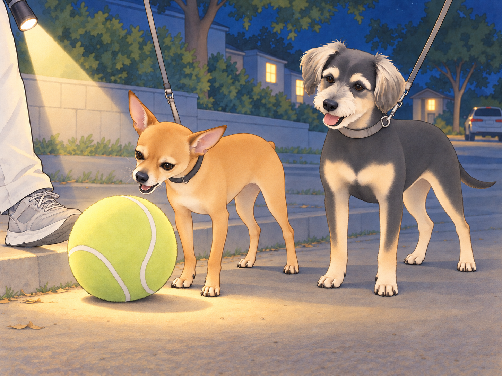
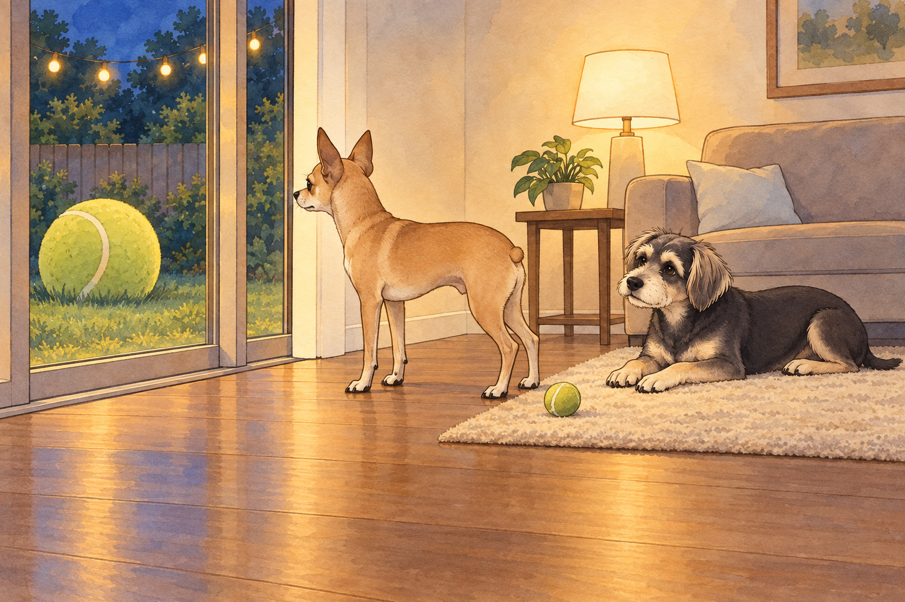
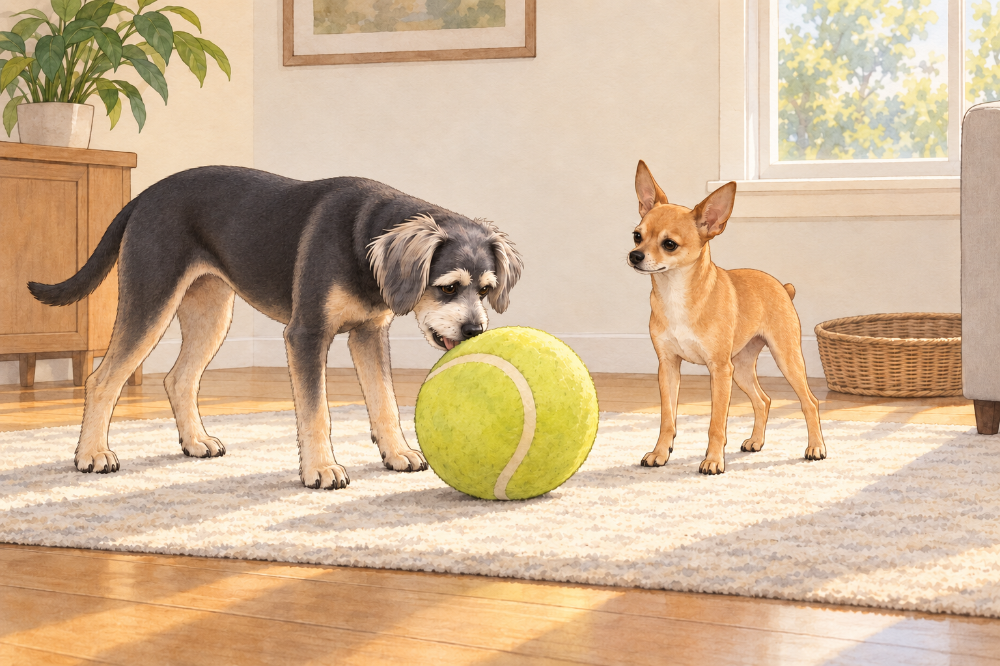

# The Era of the Cool Ball

## 1) Night Walk, Strange Discovery

It was one of those Austin nights when the air is warm but cooperative, the sidewalks still holding a little heat, and the crickets playing backup vocals. Sagar had the leashes looped in his hand; Heather carried a small flashlight and two pockets worth of treats because hope springs eternal.

Neet trotted like a detective on a case. Buddy zigzagged with the attention span of a golden pinball.

They rounded the corner by Andromeda Drive when Neet froze, ears pricked, nose quivering. The beam of Heather’s flashlight found it too: a giant tennis ball, the novelty kind from some dog store— chartreuse, scuffed, and unquestionably glorious— resting against a curb as if the universe had rolled it there on purpose.

Neet stalked up to it, sniffed with ceremony, and announced to no one in particular, “Approved.”

He tried to pick it up.

The ball was bigger than his head. His jaw opened wide… wider… a little wider… chomp— slip. The ball popped out and bounced once. Neet blinked, offended.

Buddy grinned. “You look like you’re trying to eat the moon.”

Neet tried again with a new angle, tongue concentrating, eyes determined. Chomp— skitter— bonk. The ball rolled. He chased, tried again. Chomp— pop. The sound was undignified.

Sagar couldn’t help it; he laughed. “Okay, General, I got you.” He set his foot behind the ball and gave it a gentle kick. The big neon planet rolled forward.

Neet lit up like a switch. He pressed his chest behind it and shuffle-herded the ball, paws chugging, tiny nub working. Sagar kept kicking, a dad-powered assist. Heather’s flashlight bobbed on the sidewalk like a stage spotlight for a very specific show.

They kick-herded that ridiculous ball all the way home— past the hibiscus hedge, past the glow-in-the-dark garden gnome (Neet gave it a warning stare), past the neighbor’s driveway where Martha & Sally erupted at the fence.

Neet ignored everything. He had a mission and a sphere.

At the gate, the ball wouldn’t fit under Neet’s chin or through the slats, so Sagar lifted it over like a trophy. The second it hit the grass, Neet flopped a paw over it possessively and exhaled with deep, ancestral satisfaction.

Heather smiled. “Well. Somebody’s found his cool ball.”

## 2) Day One: We Live in a Ball-Based Economy Now

From dawn, the house entered a new regime.

Neet rolled the cool ball out to the kitchen like a bowling champion. He ate breakfast with one paw hooked around it, pausing between bites to nudge it closer. He escorted it to Sagar’s office and parked it beside the standing desk like an executive paperweight. He brought it to the back door to sunbathe. He pushed it through the living room, grunting happily like a tiny forklift.

Heather tried to tidy. “Neet, can you… not bring that to the bathroom?”

He stared at her. Blinked once. Rolled the ball two inches forward. “Approved.”

Buddy brought his ordinary tennis ball to the kitchen and set it beside the cool ball. He waited for someone to admire its convenient size.

Neet rolled straight past.

Buddy picked his ball up in one easy bite, carried it ahead of him, and put it down again. A demonstration. Nothing.

“This is excessive,” Buddy said. “Mine comes with a handle.”

“What handle?”

“My mouth.”

Neet draped a paw over the giant ball. “Mine has security.”

Buddy sniffed the ball. “It smells like a thousand other dogs and also probably a hot parking lot.”

“History,” Neet corrected.

At lunch, the cool ball took a seat beside Neet’s bowl. At dinner, he insisted it sit between his paws as he chewed, eyes flicking between paneer crumbs and yellow fuzz like a jeweler watching a glowing kiln.

If the ball rolled an inch away, he moved it back. If Buddy looked at it for more than two seconds, Neet tightened his shoulders like an art museum guard.

Heather texted a photo to the family thread: Neet & The Orb, Day 1. Caption: “He will not be taking questions at this time.”

## 3) The Window Melodrama (Backyard Edition)

Inevitably, the ball was left outside.

It happened after the sunset potty loop. Neet had walked it out like a valet escorting a celebrity and then gotten distracted by a moth with questionable motives. The ball remained on the grass, haloed by the string lights.

Ten minutes later, inside, Neet realized the betrayal.

He trotted to the back door. The cool ball shone through the glass like a lighthouse of joy. Neet emitted a small, contained whine.

Heather glanced over the book she was reading. “Do you need to go out again, buddy?”

Neet escalated to low whistles and chirps, the strangled pigeon sounds he saves only for emergencies. He put one paw on the door. He looked back at Heather with the pleading eyes of a courtroom drama.

Buddy, sprawled on the rug, opened one eye. He followed Neet’s gaze through the glass, then looked at the perfectly serviceable tennis ball between his own paws.

He pushed it toward Neet.

Neet stepped over it.

“Right,” Buddy said. “Wrong moon.”

Neet turned up the volume: one dignified bark. Another. A small, outraged growl at the laws of architecture.

Sagar emerged from the kitchen, dish towel over his shoulder. “Alright, alright— opening.”

The second the door clicked, Neet bolted like a yellow-fuzz paramedic, scooped the ball with his chest, and herded it inside. He parked himself beside it, then looked up at Sagar and Heather with relief so pure it landed like a joke. He sighed, full-body, and rested his chin on the orb.

Heather tried not to laugh. “Okay, I get it. It’s his cool ball.”

Buddy muttered, “It’s his entire personality now.”

## 4) Guard Duty (and the First Lunatic Incident)

Neet shared sunbeams without complaint. The cool ball was different. If Sagar reached toward it, Neet’s shoulders tightened before his paw did.

Sagar sat on the floor a little way from the ball, treats ready and voice calm. “Neet, look.” Reward. “Leave it.” Reward. Light touch on the ball. Reward. No drama. They practiced a few minutes every day, working the guardy edges into something more civilized.

It helped… mostly.

Then came The Incident.

Early evening, the AC humming, Heather organizing mail, Sagar rinsing a pan. Buddy, seeking the prime nap spot by Heather’s chair, wagged backward and accidentally parked his warm butt on the cool ball.

Neet gave a sharp bark, quite unlike his hopeful breakfast noises. He sprang forward, hackles up, voice big enough to fill the room.

Buddy levitated three inches. “WHAT THE— LUNATIC!”

Sagar was already there, hand out like a traffic cop. “Neet, leave it.” Calm, low, steady. Neet froze, chest heaving. Sagar body-blocked the ball without touching Neet, soft-voiced: “Hey, buddy. We’re good. That was an accident.”

Heather put a hand on Buddy’s shoulders, kneeling to make herself smaller, praise flowing. “Good boy. You moved. It’s okay.”

Neet blinked, head lowering. His mouth softened; his little nub settled. He stepped back two paces like a soldier standing down and looked up at Sagar, checking his face.

Sagar scratched under his chin. “There you go.” He lifted the ball, placed it against the wall, and asked for a sit. Neet sat, trembling once, then exhaled.

Buddy huffed and moved his nap to the other side of Heather’s chair. “I was sitting down.”

Neet glanced sideways without moving his head. “…Apologies. Do not sit on my moon.”

Buddy stuck his tongue out. “Then don’t leave your moon in public airspace.”

Five minutes later, they were both asleep— Neet with his paw draped over the ball, Buddy two feet away with his back turned, muttering “lunatic” under his breath like a bedtime prayer.

## 5) The Week of the Orb

It became a house-wide sitcom arc.

Day Two: Neet tried to carry the ball into Sagar’s office during a Zoom. He couldn’t fit it through the door on the first pass, so he rammed it gently like a tiny bulldozer until it shunted across the threshold. On camera, someone asked, “Uh… do you have… a beach ball?”

“A colleague,” Sagar said. “He’s just rolling in.”

Heather passed the doorway, saw him trying to keep a straight face, and kept walking with her lips pressed together. Neet parked the ball under the desk and fell asleep like a goalie who died doing what he loved.

Day Three: Heather attempted to mop. The ball rolled into the mop’s path. Neet tracked it like the Secret Service trailing a foreign dignitary. Buddy decided to help by nudging the ball onto the dry side. Neet immediately escorted it back. Buddy tried once more. Neet returned it once more.

Heather stopped mopping. Both dogs stopped too, pleased with the teamwork.

“Lovely,” she said. “That bit was clean when we started.”

Day Four: The backyard sprinklers turned on mid-Orb Patrol. The ball got wet. Neet did not appreciate the surprise bath. He herded the ball onto the patio and shook himself like an outraged sponge. Buddy giggled. “You look like a drowned avocado.” Neet sniffed: “Still cool.”

Day Five: Sagar tested a gentle compromise: “Ball time” basket. When the ball was out, they’d play. When it was away, it was away. They practiced trade-ups— ball for treat, ball for tug toy, ball for quick chase then “leave it,” reward. Some trades went smoothly; on others, Neet needed more space and another try. Neet learned a new trick: chin-rest on the ball while Sagar handled it. Treats rained. Confidence rose.

Buddy waited until Neet let the ball go, then nosed it once toward Sagar. “My turn?”

Sagar rolled it toward him. Neet followed it with his eyes but stayed in place. Heather ruffled Neet’s ears. “He’s trying. Big feelings.”

Buddy marched after the ball, lowered his chin, and tried to pick it up.

Chomp—slip.

Neet’s ears rose. Buddy kept his eyes on the ball.

“I was checking.”

“Approved,” Neet said, with magnificent restraint.

Buddy nudged the ball back to him. “We all have our moon.”

## 6) Night Walk, Revisited

A week later, they took another night loop. The air was soft; the sky was that black-blue that makes streetlights look like planets.

Neet didn’t bring the ball— house rule— but he walked with a new bounce. Buddy meandered from mailbox to mailbox like a door-to-door optimist.

They reached the stretch of sidewalk where the big tennis ball had first appeared. There was only a rectangle of faint dirt— and the memory of neon destiny.

Neet paused. He looked at Sagar and Heather, then back at the empty curb. He didn’t whine or sprint or demand. He just gave a small, satisfied exhale and wagged once, like a person who sees the restaurant where they met someone important and thinks: yep, that was the spot.

Sagar bent and rubbed the back of his neck. “You and your cool ball, man.”

Heather smiled. “Seasonal obsession. Very on-brand.”

Buddy leaned into Neet. “Still a lunatic, but… a lovable one.”

Neet bumped his shoulder. “Approved.”

## 7) Epilogue: Order Restored (Mostly)

At home, the ball now lived in the “Ball Time” basket, out for play and in for peace. Neet could settle without it; could let Sagar lift it; could even (sometimes) allow Buddy to nose it during chase before reclaiming with a polite ahem.

The fixation had softened into a ritual: morning nudge in the backyard, afternoon chin-rest while Sagar typed, evening tuck-in where Neet nosed the ball back into its basket and gave it one last supervising sniff.

Heather looked around their tidy living room, string lights glowing lightly on the patio, the cool ball tucked like a small sun in the corner, two dogs asleep with room between their beds and the basket.

Sagar yawned. “We survived the Orb Era.”

Buddy, eyes closed: “Tomorrow I’m bringing mine.”

Neet, also eyes closed, flicked an ear. “History will vindicate me.”

Heather laughed. “It already has, sweet boy.”

The house settled. The moon climbed. Somewhere in the basket, the cool ball waited for tomorrow, and Neet dreamed of herding it across sunlit grass while the King and Queen clapped from the porch and Buddy waited at the far end for his turn.

## Provenance and editorial notes

Working selection dated October 3, 2026. Selection and shelf order are editorial; owner approval and event chronology remain unverified.

Original numbering: independent captured sequence Chapter 27.

Archive recovery: use [Studio recovery guidance](../Studio/Recovery.md). The paths below are paths **inside the verified snapshot**, not active navigation. SHA-256 pins identify the exact sources.

- `elevenlabs-reader-10` — `02_Story_Library/ElevenLabs_Imports/reader-10-the-era-of-the-cool-ball.txt`; SHA-256 `8f881a96deaacbc0cacb6ab0be3fd781417da2839227c8f80a74efe9e49db968`.

## Refinement record

Refined October 3, 2026; [episode record](../Productions/E058-the-era-of-the-cool-ball/episode.json) documents the reading comparison and illustration work. The pre-refinement text is preserved in the [dated recovery snapshot](/Users/sagar/Documents/ChatGPT/NBC_Archives/NBC-before-refinement-2026-10-03_200659.tar.gz) at `NBC/Stories/S058-the-era-of-the-cool-ball.md`. Historical provenance above remains unchanged.
