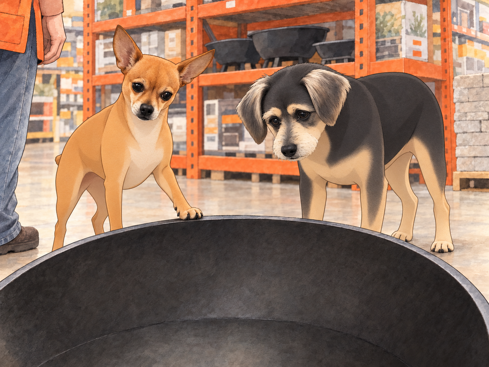
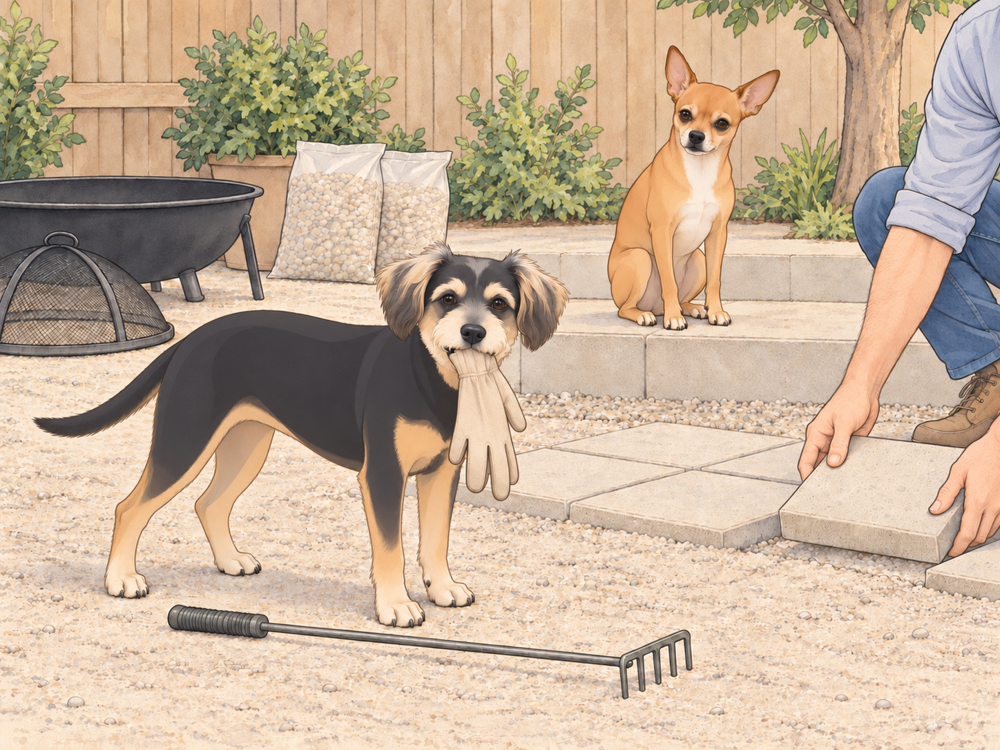
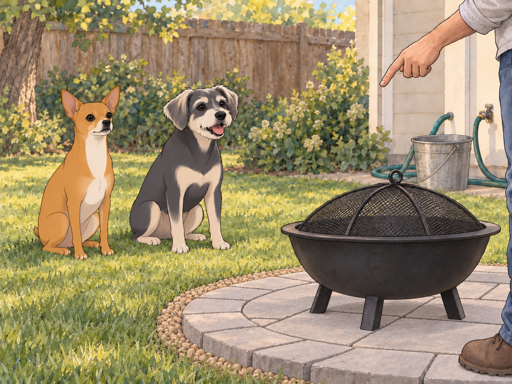
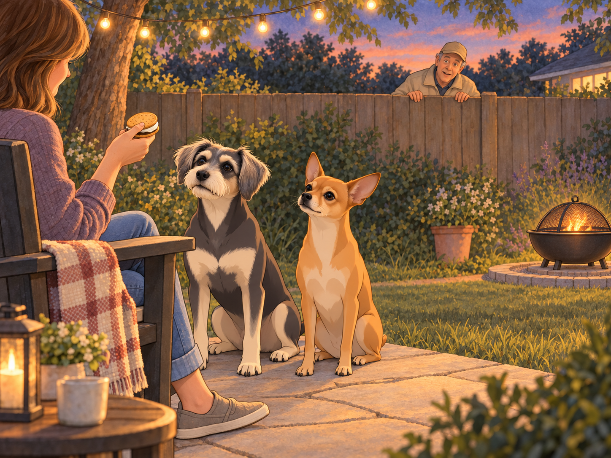
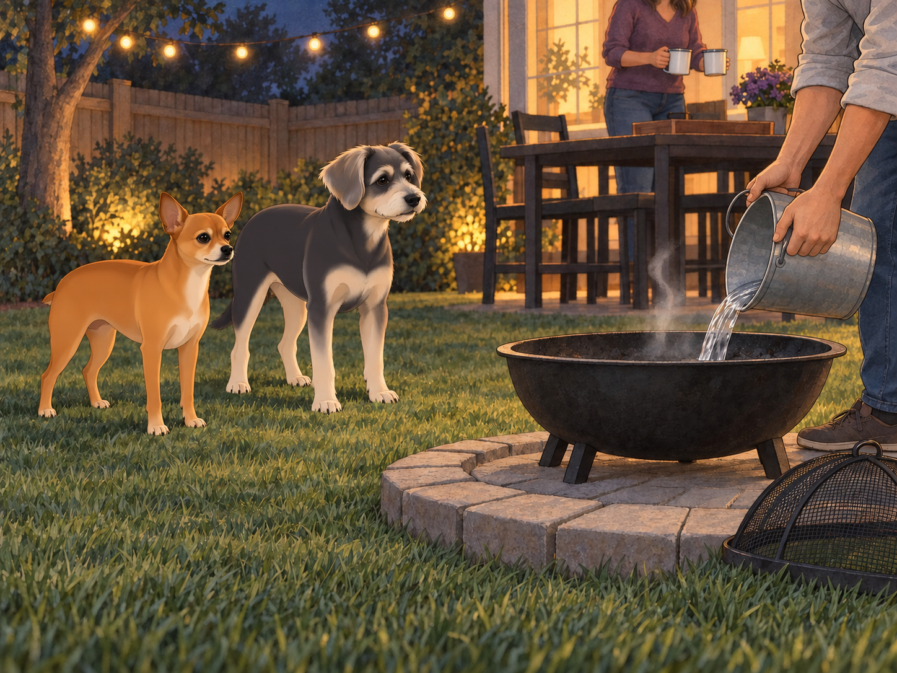

# The Fire Conspiracy

## 1) The Saturday Proposal

It started with Heather standing at the back door in her socks, coffee in hand, measuring the late afternoon with her eyes.

“Picture it,” she said, lifting her mug like a pointer. “Here. A fire pit. Blankets. Stories. Hot things on sticks. Maybe music. Definitely twinkle lights. Our backyard becomes a small universe.”

Sagar did a slow survey of the yard— the flagstone path, the string lights, the lawn where Neet held court. He set his mug down to free both hands. “Wind comes from that side,” he said, nodding at the neighbor’s oak. “We’ve got twelve feet clear to the fence. No branches overhead. I can run a gravel ring and set pavers.”

Neet trotted over, sat at his feet, and squinted at the patch of grass like a city inspector considering a high-rise. “Location… promising.”

Buddy had no idea what was happening but wanted to be included. “If there are snacks, I support all motions.”

Neet moved onto the proposed site and sat down. Sagar measured around him.

“Existing structure,” Heather said.

“Difficult to relocate,” Sagar agreed.

Heather grinned. “Home Depot?”

Sagar didn’t answer. He simply grabbed the tape measure like a knight drawing Excalibur.

---

## 2) The Orange-Vest Odyssey

Home Depot on a Saturday was its own parade: carts rolling like bass drums, families comparing lumber as if choosing baby names, an aisle where screws are arranged like tiny glittering constellations.

Neet walked slightly ahead in commander stride, his tiny nub at regulation height. Buddy trotted behind, inspecting the bottom shelf of every aisle for the snacks that surely justified this trip.

In Seasonal & Outdoor, the options assembled like suitors. A sleek propane table with lava rock and a price tag that made Buddy whistle. A smokeless steel cylinder whose packaging suggested camping hair would never smell like smoke again. And a classic steel fire bowl with a spark screen, the spiritual descendant of every backyard story since backyards were invented.

Sagar crouched to examine bolts. Heather leaned over finishes like a jeweler. They compared the three options.

“Propane is neat,” he murmured, “but I love wood crackle.”

“And I love not storing tanks,” she said. “The bowl looks timeless. Plus, spark screen. Safer with the boys.”

Neet put a paw on the rim of the steel bowl as if swearing it in. “Sturdy. Approved.”

Buddy peered into it. Empty.

He checked the propane table. Also empty.

“These are very expensive bowls.”

A cheerful associate in an orange vest rolled up with the vibe of a man who has explained pilot lights eleven hundred times and still enjoys it. “First pit?” he asked.

Sagar smiled. “First at this house.”

“Get the paver base bag— keeps the heat off grass. Ring of pea gravel helps. Buckets for water. Don’t feed it construction wood; nails and chemicals, bad news. And if the HOA has feelings?” He lowered his voice like a conspirator. “Invite ‘em for s’mores.”

Heather laughed. “You’re dangerous.”

“Ma’am, I am an enabler in a vest,” he said, bowing.

They loaded: the fire bowl kit, four packs of square pavers (“the round ones were trying too hard,” Heather decided), two bags of pea gravel, a metal ash shovel, an ember rake, and a bundle of cedar kindling that smelled like a tiny forest telling secrets. Sagar Tetris’d it into the car with quiet pride— the man could pack a palace into a hatchback.

Buddy stuck his nose in the cedar. “If a tree could be a cookie.”

Neet sniffed the steel rim one last time and nodded gravely. “Let’s bring our small sun home.”

---

## 3) The Ground Game

Backyard. Tape measure. Chalk circle. Sagar moved like a surveyor who believed in good angles and good karma. He scraped away the top thatch, leveled paver base, tamped, and laid the first ring of pavers with the care of a calligrapher placing strokes.

Heather followed, rinsing each paver and setting them in like tiles of a quiet mosaic. She adjusted; he fine-tuned; they worked in that comfortable duet of long partnerships that looks like choreography to outsiders.

Neet supervised from shade, seated sphinx-like on the step. Every few minutes he made a small approving sound, like an auditor finding the numbers precise. Buddy fetched exactly one glove, then decided the glove was a friend, then tried to introduce glove-friend to the ember rake.

Heather traded a treat for the glove with the diplomacy of the UN. Buddy released his friend immediately. Then he looked back at the rake, as if hoping it hadn’t seen.

“Buddy,” she said, “tools are not snacks.”

He looked wounded. “They’re not… not snacks.”

When the paver pad was even, Sagar poured a halo of pea gravel. The bag gave way with a sound like rain. The ring looked clean and intentional— ready for the bowl.

Neet stood and paced the perimeter: sniff, step, sniff, step, stopping to check wind with his nose. “Cross-breeze acceptable,” he announced to exactly no one but himself.

Heather brushed her hands off and peered into the steel bowl. “It’s pretty.”

“Elegant,” Sagar agreed. “Like an exclamation point for the yard.”

Buddy tilted his head. “An ex-what now?”

“A shiny round thing,” Neet translated.

“Approved,” Buddy declared.

---

## 4) Safety Briefing (Royal Edition)

Before any sparks, Sagar called the meeting. He placed a water bucket by the patio, a hose uncoiled nearby, and sat both dogs on the grass.

“House rules,” he said, voice calm. “No paws past the paver ring. We look, we don’t touch. We sit for calm. Marshmallows are a privilege. Everyone say ‘aye.’”

Heather saluted. “Aye.”

Neet raised a paw. “Aye.”

Buddy blinked rapidly. “What’s a privilege and can I have it twice?”

Sagar pointed to a spot well back from the ring. Neet sat on it. Buddy sat beside him. Then Buddy stood and sat again.

“Still one meeting,” Neet told him.

Buddy settled. He had been testing whether a second sit earned a second privilege.

“Good meeting,” Sagar said.

Heather unfurled wool blankets over the chairs. The string lights already hung like punctuation in the air. She brought out a tray: enamel mugs, dark chocolate, graham crackers, and— because this was her— Marie biscuits for a South Asian s’more variation. There was also a little jar of ghee and a tiny brush. “A whisper on the marshmallow,” she said, “pure luxury.”

Buddy’s pupils dilated like telescopes.

---

## 5) First Light

Sagar built the fire with the same care he used on travel itineraries: small teepee of kindling, a few wafer-thin splits, space for air, match angled like a violin bow. The cedar caught, exhaled a thin ribbon of smoke, then a crackle. Flame tipped into orange, then licked higher.

Heather’s face went soft in the glow, the way people do when they watch something alive that doesn’t know it’s being watched.

Neet stared, unblinking. You could feel him decide this was not an enemy. It was a phenomenon. He repositioned himself two paces back, a guard at an art opening.

Buddy, mesmerized, whispered, “It’s a warm TV that smells amazing.”

The flame settled into a friendly conversation. Sagar set the spark screen, checked the wind again, and leaned back, satisfied. He had that look— the one that says the plan worked and now the plan is to stop planning.

Heather held up a marshmallow. “Science?”

“Science,” Sagar confirmed.

She brushed the faintest veil of ghee, toasted it to a perfect freckled brown, and slid it neatly between a Marie biscuit and a tile of dark chocolate. She handed it to Sagar with a raised brow: your move, King.

He took a bite, closed his eyes, and made a quiet sound that could cause diplomacy between nations.

“Heaven,” he said.

“Approved,” Neet said reflexively.

Buddy swallowed audibly. “I’m free for internships.”

Heather laughed, made a small marshmallow for each dog— plain, cooled, offered on open palm like a trust exercise. Neet took his with monk-like restraint; Buddy tried to inhale his and discovered it sticks to tongues. He opened his mouth to complain. The complaint stayed attached.

Sagar brought his water. Buddy drank, swallowed, and considered the tray from a new distance.

“I will need longer for the next one.”

“There isn’t a next one,” Neet said.

“Then I timed that perfectly.”

---

## 6) The Neighbor Audit

From over the back fence came the distinctive throat-clearing of Mr. Grubbs— The Manager, wrapped in a beige windbreaker regardless of season. He peered over like a prairie dog with bylaws.

“Evening,” he said. “I see… combustion.”

Sagar stood and gestured at the ring, the screen, the hose, the bucket, the distance from the fence as if presenting a courtroom exhibit. “Screened, with water on hand.” He pointed out the clearance they had measured. “We checked the city guidance.”

Grubbs pursed his lips, scanning. You could almost hear the scroll of HOA regulations unspooling behind his eyes.

Heather leaned back in her chair, the picture of grace. “Would you like a s’more?”

Grubbs blinked. That had not been in the manual.

Buddy had risen at the throat-clearing. Now he sat beside Heather’s chair. He could support diplomacy from here, close to the biscuits. Neet sat very straight. Someone had to represent the fence.

“Are those… Marie biscuits?” Grubbs asked.

“They are,” she said.

Grubbs’s mother had been from Pune. He looked at the biscuit box for a moment longer, then back at Heather. “Carry on,” he said, softer. “Be safe.”

He disappeared. A moment later, his porch light clicked off, which counted as an endorsement in Grubbsian language.

Neet watched him go and murmured to Buddy, “Perimeter respected.”

Buddy nodded sagely. “Never fight a man who can cite section numbers from memory.”

---

## 7) Fire Stories

Flames are invitations. They asked for stories and got them.

Heather told one about her childhood— the first time her father lit a campfire, the way sparks floated up and she thought they were stars falling down. Sagar told the tale of a monsoon in Vadodara, a power cut, and a borrowed kerosene lamp that made one small room look like a palace.

Neet listened hard, nose lifted just enough to catch smells and sentiments. Buddy pressed his cheek to Heather’s ankle. He had stopped watching the tray.

A gust nudged the screen; a cinder tried to leap. Sagar was already there with the rake, guiding, closing the lid, reading the fire like a complex but friendly book.

“Look at us,” Heather said. “We made our own little sun.”

Sagar smiled sideways. “And I didn’t even need a spreadsheet.”

“You absolutely made a spreadsheet,” she said.

He conceded with a nod.

“Did you budget for the glove?”

“Recovered asset.”

Buddy lifted his cheek from Heather’s ankle. They were discussing an old friend. When no one produced it, he put his head back.

---

## 8) Last Embers

When the logs were down to velvet coals, Sagar let the fire think about sleeping. He stirred gently, spread the embers thin, and set the screen again. Stars had appeared beyond the string lights. Nobody had noticed when.

Neet stood, stretched, and came closer, stopping at the paver’s edge. He lowered his head and gave a single ceremonial huff. Not a bark; an acknowledgement. “Approved,” he said, and if fires understood words, this one would have preened.

Buddy yawned so wide you could have stored a marshmallow in there. “This might be my favorite TV.”

Neet stepped back beside Buddy on the grass. Heather gathered mugs; Sagar doused the last glow with the hush of water meeting warmth. Steam lifted, brief and theatrical. The bowl went dark.

Buddy watched the last curl of steam disappear. “You turned it off.”

“Bedtime,” Heather said.

He looked at the empty tray, then the dark bowl. At least both programs had finished.

They sat a few more minutes in the honest quiet that comes only after you’ve watched a thing all the way from spark to ash.

Inside, they washed sticky fingers and stacked plates. Neet curled in his usual spot like a comma, content to pause the sentence. Buddy thumped twice and was gone to sleep.

Before lights out, Heather looked into the yard where the new fire pit sat on its clean ring, a punctuation mark in the grass. “It changed the shape of the night.”

Sagar slipped an arm around her. “And gave it a plot.”

From the floor came a single sleepy word, crisp and certain even in dreams.

“Approved.”

## Provenance and editorial notes

Working selection dated October 3, 2026. Selection and shelf order are editorial; owner approval and event chronology remain unverified.

Original numbering: independent captured sequence Chapter 28.

Archive recovery: use [Studio recovery guidance](../Studio/Recovery.md). The paths below are paths **inside the verified snapshot**, not active navigation. SHA-256 pins identify the exact sources.

- `elevenlabs-reader-09` — `02_Story_Library/ElevenLabs_Imports/reader-09-the-fire-conspiracy.txt`; SHA-256 `6f2ca1cda029d83b9143654dbf5c78a817d1e53d6ea62973f08486c54e355c15`.

## Refinement record

Refined October 3, 2026; [episode record](../Productions/E059-the-fire-conspiracy/episode.json) documents the reading comparison and illustration work. The pre-refinement text is preserved in the [dated recovery snapshot](/Users/sagar/Documents/ChatGPT/NBC_Archives/NBC-before-refinement-2026-10-03_200659.tar.gz) at `NBC/Stories/S059-the-fire-conspiracy.md`. Historical provenance above remains unchanged.

Expanded comedy and complementary illustration pass, October 4, 2026: [revision record](../Productions/E059-the-fire-conspiracy/comedy-pass-v002.json). Proposed artwork awaits independent visual and complete-reading review.
