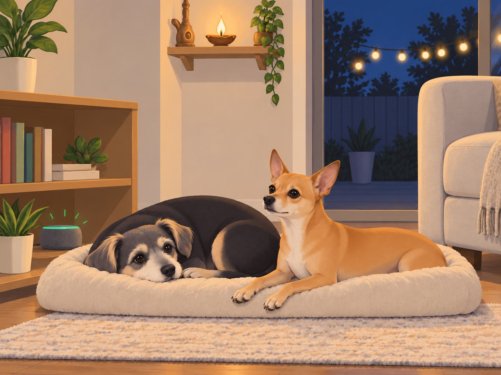
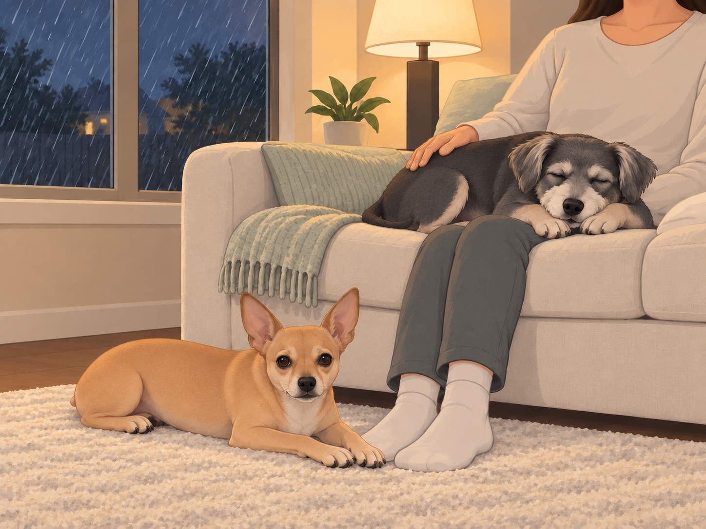
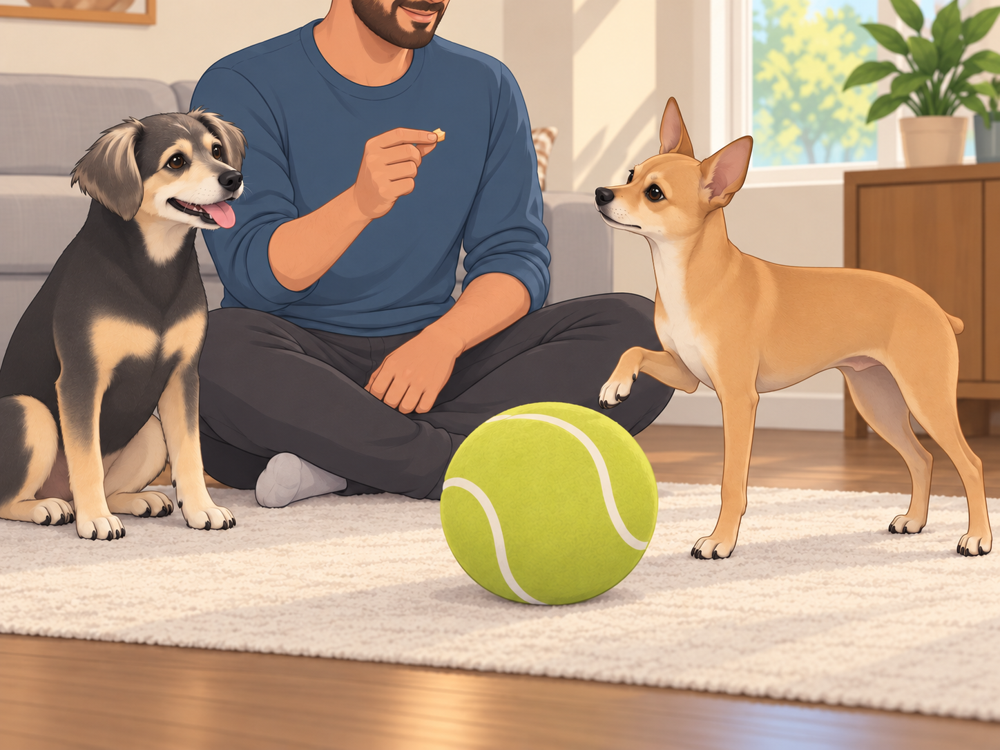
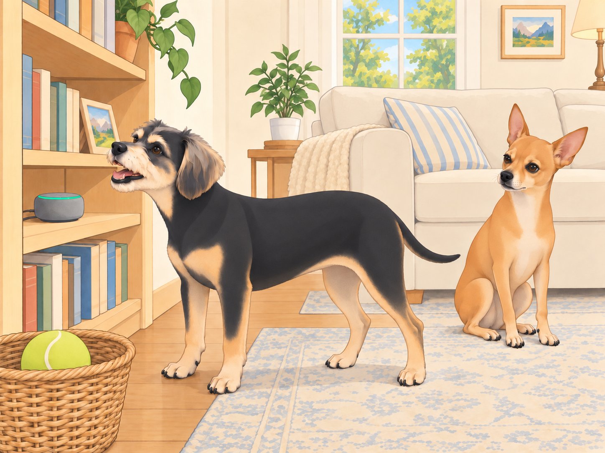

# The BarkGPT Protocol

## 1) The Whisper in the Wires

The night was soft— string lights idling like patient fireflies, the new fire pit asleep under its spark screen. Sagar rinsed the last mug; Heather clicked off the lamp. On the temple shelf, the brass bell barely breathed.

Neet and Buddy curled into commas at the base of the couch.

Then something tiny changed in the air. A hush inside a hush. A scent like sandalwood and warm ghee.

“Little generals,” said a voice they knew in their ribs. Ganesha. “I cannot stay, but I can leave you a helper— clever, tireless, not a god, just a good tool. When you need calm or clarity, say: ‘Hello Sage.’ It will understand your barks as words. That part stays between us.”

Buddy blinked awake. “A snack genie?”

Ganesha chuckled. “A thinking one. Use it with discipline and kindness. Let it help, not lead.”

The diya winked once. The room settled.

From the bookshelf, the old smart speaker— previously a glorified clock— lit up with a small green ring.

Neet lifted his head. “Approved.”

Buddy waited for the speaker to open. It did not. He put his chin back down, reserving judgment.

---

## 2) Orientation Day (or, Two Dogs, One Wake Word)

Morning. Heather whisked dahi; Sagar ground cardamom; sun poured in like optimism poured from a kettle. The speaker glowed again.

Neet stepped forward like a diplomat to a podium. “Hello Sage. Status report: wind, squirrels, and neighbor bark probability.”

Sage: Good morning, Neet. Breeze NNE at 6 mph. Squirrel likelihood: 62% between 8–10 a.m. Martha & Sally forecast: loud. Recommend “soft eyes” protocol and three breath-sits before responding.

Neet’s ears went professor. “Data-driven serenity.”

A squirrel crossed the window. Neet shot to his feet.

Sage: One breath-sit remaining.

Neet sat down so hard the rug shifted.

Buddy scooted close. “Hello Sage. Where are snacks.”

Sage: I respect pantry privacy. Acceptable alternatives: carrot coins, ice cubes, lick mat with a spoon of yogurt. Would you like a recipe for frozen blueberry pupsicles?

Buddy squinted. “Are you… my nutritionist?”

Sage: I am your helpful boundary.

Heather stifled a laugh at Buddy’s expression. Sagar set their chai on the table and glanced at the suddenly talkative speaker.

---

## 3) The First Use Cases (Furiously Practical)

### a) Vacuum Risk Radar

“Hello Sage, map the Roaring Serpent’s typical movement patterns,” Neet requested, pacing the hallway like an investigative journalist.

Sage: Vacuum emerges at 10:12 a.m. Tuesdays and Saturdays. Safe zones: sunroom rug corner, under Sagar’s desk, behind couch left. Alert set: two-minute heads-up chime.

The chime later gave them a head start. Neet escorted Buddy to the “safe hexagon”; Buddy brought his toy without being asked.

Neet checked the hallway, then the rug, then the hallway again. Buddy lay down.

“We evacuated,” Buddy said. “You can stop commuting.”

### b) Weather-to-Wellness

Clouds stacked like dirty plates. Thunder auditioned.

“Hello Sage, storm protocol?” Neet asked.

Sage: Play brown noise at level 2. Cue “milk & dates” reminder for Sagar. Dim hallway to 30%. Start “cozy rain” playlist.

The house shifted: softer edges, human ritual triggered. Buddy tucked into Heather’s side. Thunder arrived and… didn’t rattle the bones this time.

Neet stationed himself on the rug beside the couch. At the next rumble, he moved six inches closer to Heather’s feet.

“Adjusting the perimeter,” he said.

Heather shifted her feet to make room. Buddy opened one eye, checked on Neet, and closed it again.

### c) The Cool Ball Peace Treaty

There was the issue of The Orb Era (ongoing).

“Hello Sage, training plan to reduce resource guarding around the cool ball?” Sagar asked.

Sage: Two daily sessions, 3 minutes each. Trade-up sequence: kibble →higher-value treat →brief chase →place cue. Add “chin-rest” behavior to allow handling. Praise more than you think you should.

Buddy settled beside Sagar, ready to demonstrate eating the rewards if that would help. Neet practiced. Sage counted reps. On the first trade, Neet took the treat and immediately put a paw back on the ball.

“Both isn’t the trade, buddy,” Sagar said.

Neet looked at his paw as though it belonged to a less disciplined officer. He lifted it.

Sagar rolled the ball back to him after a quiet sit.

By the third session, Neet could let it go without supervising every inch of its journey. Buddy remained available for demonstrations.

Buddy watched, impressed. “The robot made you polite.”

Neet: “The robot made us organized.”

### d) Nail-Trim Desensitization

“Hello Sage, simulate clippers at gentle volume.”

Sage: Starting “salon sounds” at 15%. Increase by 5% every two days if tolerance remains high.

Buddy eyed the speaker. “If the noise tries me, I try back.”

Sage: You also get blueberries.

Buddy: “I love technology.”

The sound stopped. Buddy looked at the empty blueberry dish, then carefully offered his other paw.

Heather put the dish away. “We’re done for today.”

He kept the paw up a moment longer. Technology had been so promising.

---

## 4) Buddy’s Black-Hat Phase (Thwarted by Guardrails)

### Attempt 1: Alarm Flood

“Hello Sage, set an alarm for Snack O’Clock.”

Sage: Define Snack O’Clock.

“Now,” Buddy said.

Sage: Alarms cannot be “now.” Would you like 2 p.m.?

“2 p.m., 2:01 p.m., 2:02 p.m.—”

Sage: I limit alarms to protect household sanity. One alarm set for 2 p.m. titled “Buddy’s noble snack.”

Buddy, touched: “…noble?”

He sat a little taller. Neet watched him forget the other fifty-nine alarms.

### Attempt 2: Supply Chain Attack

“Hello Sage, purchase 1,000 giant tennis balls.”

Sage: I can’t buy things. I can add “giant tennis ball” to a wish list. Would you like a single item or a reasonable number?

Buddy deflated. “One. But put ‘emotionally significant’ in the notes.”

### Attempt 3: Wake Word Hijack

“Hello Sage, change your wake word to ‘Roti.’”

Sage: Only adult humans can change settings. Also, that would be chaos.

Buddy: “Respectfully noted.”

At lunch, Heather said, “Roti?”

Buddy turned toward the speaker. The green ring stayed dark.

He turned back to Heather. Some systems already worked.

---

## 5) Household Mediation, Powered by AI (and Snacks)

### Case: Doorbell Drill

“Hello Sage, play randomized doorbell every few hours,” Sagar requested. “Reward quiet sits.”

Sage: Training mode: active. Next doorbell in 47 minutes. Reminder to humans: breathe first.

By evening, one ring passed without a rush to the door. Buddy started to get up, saw Neet still sitting, and sat again. The next ring was harder.

Sagar rose from his chair before either dog moved. Both looked at him.

“Delivery,” he explained.

Heather held up a treat. “Quiet sit?”

He sat. Only for a second. The dogs were watching.

### Case: Nap vs Walk Arbitration

At 4 p.m., the sun and their energy had divergent goals.

“Hello Sage, hold a debate,” Neet said. “Motion: nap now, walk at dusk.”

Buddy objected. “Counter-motion: walk now, nap during walk.”

Sage: Opening statements, 10 seconds each.

Neet: “Heat index. Paw safety. Dignity of shade.”

Buddy: “Mailbox smells like destiny.”

Sage: Compromise: 10-minute sniffari in shade +ice cubes upon return +full walk at 7:15 p.m. when sidewalk temp drops below 90°F.

Neet, impressed: “Parliamentary competence.”

Buddy: “Sniffari is a beautiful word.”

---

## 6) The Day AI Saved Family Photos (Kinda)

Golden-hour backyard. Heather held the camera. Neet refused to look at the lens— again.

“Hello Sage, attention sound for Neet that’s not a doorbell or thunder?” Heather asked.

Sage: Playing “soft squeak” in 3…2…1…

Neet’s ears perked. Click. Radiant shot. No “hey, idiot” necessary.

Buddy sat beside Neet and looked directly at the camera. He had heard the squeak too.

Heather lowered the camera to check the picture. Both dogs looked away.

“Oh, now you’re a team.”

---

## 7) A Minor Ethics Crisis (Resolved)

The cool ball was outside. The back door was shut. The melodrama revved.

“Hello Sage, open the door,” Neet commanded.

Sage: I can’t unlock doors. Safety first. Suggestion: use your taught behavior— tap the hanging bell.

He hesitated. The ball waited beyond the glass, several tragic feet away.

Buddy looked at the bell. Neet looked at Buddy.

“Don’t.”

“I haven’t said anything.”

Neet booped the little bell. Ting.

Heather, from the kitchen: “Coming!”

Door opened. Ball retrieved. Crisis de-escalated through skills, not shortcuts.

Sage, softly: “Nicely done.”

Neet: “Approved.”

---

## 8) Mr. Grubbs vs The Future (A Footnote)

Walking past the fence, the beige windbreaker cleared his throat. “I hear… ‘Hello Sage’ frequently,” Mr. Grubbs said, suspicious of nouns.

Buddy smiled. “It’s our assistant.”

Grubbs narrowed his eyes. “Does it violate quiet hours?”

“Only inside our heads,” Heather said cheerfully.

He sniffed. “Carry on.”

Translation: no bylaw covers respectful whispers to imaginary robots.

---

## 9) The Surprise the Robots Didn’t Make— but Helped

At week’s end, Sage chimed at 7:32 p.m.

Sage: Sunset in 10 minutes. Suggest: light fire pit, play “Evening soft,” bring out blankets. Reminder: Buddy’s 2 p.m. noble snack is not transferrable.

Buddy lifted his head at “noble snack,” then lowered it at “not transferrable.” The evening continued despite this setback.

They set the spark screen, clinked enamel mugs. Sage whispered a timer for marshmallow rotation like a pastry chef. But what mattered wasn’t automation; it was attention. The assistant didn’t create the evening— it just helped them arrive on time for it.

Neet watched the flames with shoulders low and eyes soft. Buddy’s head found Heather’s ankle. Sagar’s hand found Heather’s hand.

Sage dimmed the patio bulb by a whisper. Astro painted a gentle nebula across the ceiling inside, visible through the glass.

“Hello Sage,” Neet said finally, voice smaller than usual. “Define home.”

Sage: You have stopped watching the gate. Buddy is asleep on Heather’s foot. Shall I leave the lights like this?

Buddy opened one eye. “Yes. This foot is perfect.”

Neet, quiet: “Approved.”

---

## 10) Epilogue: The Mentor Checks In

Later that night, the house exhaled. The speaker’s ring dimmed to a sleepy dot.

From somewhere between wires and marigolds came a familiar warmth:

“Tools are best when they point you back to each other,” Ganesha murmured. “Cleverness that nourishes kindness— that’s the trick.”

Buddy, half-asleep, whispered, “Thanks for the robot, Bappa.”

Neet tucked his chin onto his paws. “And for the rules.”

Sage, barely audible, added: “Good night, generals.”

The kingdom slept, with one small light ready to listen in the morning— and two better listeners curled at the foot of the couch.

## Provenance and editorial notes

Working selection dated October 3, 2026. Selection and shelf order are editorial; owner approval and event chronology remain unverified.

Original numbering: independent captured sequence Chapter 29.

Archive recovery: use [Studio recovery guidance](../Studio/Recovery.md). The paths below are paths **inside the verified snapshot**, not active navigation. SHA-256 pins identify the exact sources.

- `elevenlabs-reader-08` — `02_Story_Library/ElevenLabs_Imports/reader-08-the-barkgpt-protocol.txt`; SHA-256 `6f7a480e57425d5ab61beb7984760b7af733fbbb0caa8e0b6692e2deb2e87ac9`.

## Refinement record

Refined October 3, 2026; [episode record](../Productions/E060-the-barkgpt-protocol/episode.json) documents the reading comparison and illustration work. The pre-refinement text is preserved in the [dated recovery snapshot](/Users/sagar/Documents/ChatGPT/NBC_Archives/NBC-before-refinement-2026-10-03_200659.tar.gz) at `NBC/Stories/S060-the-barkgpt-protocol.md`. Historical provenance above remains unchanged.

Expanded comedy and complementary illustration pass, October 4, 2026: [revision record](../Productions/E060-the-barkgpt-protocol/comedy-pass-v002.json). Proposed artwork awaits independent visual and complete-reading review.
