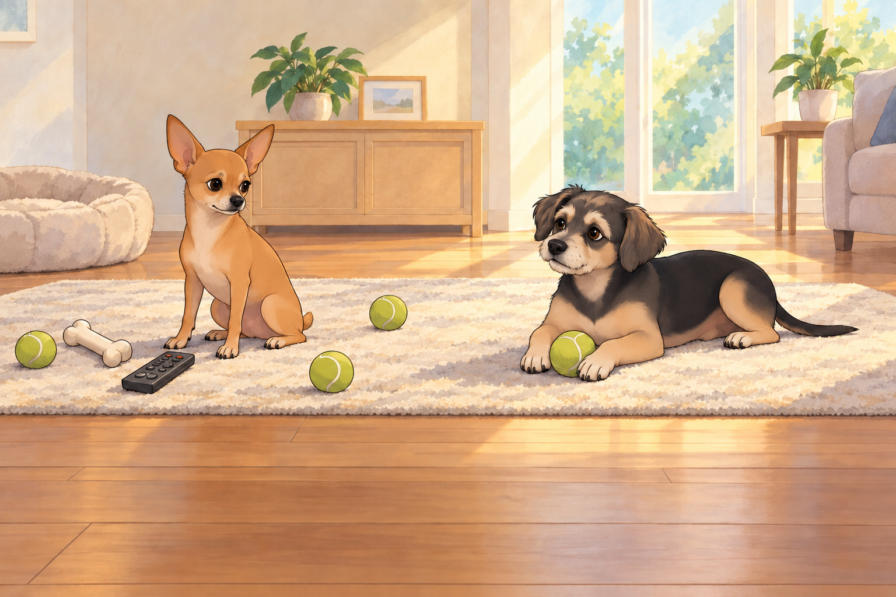
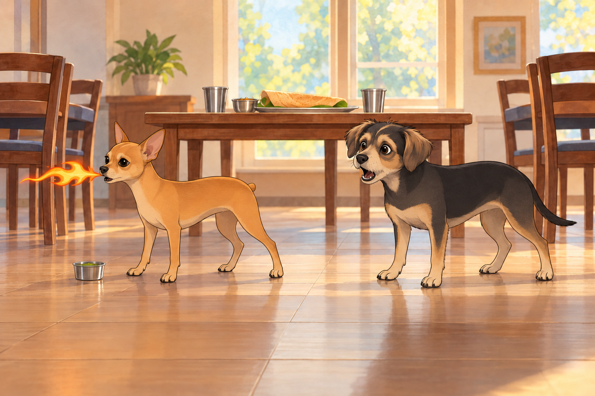
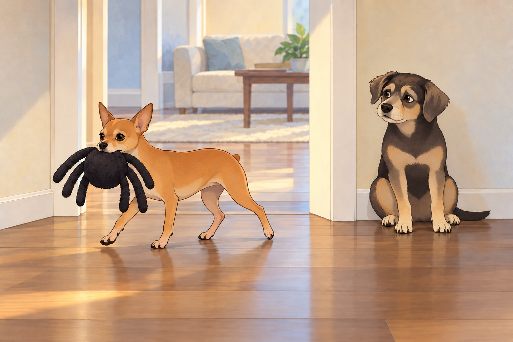

# The Dragon, the Satellites, and the Spider

## 1) Prelude: Surveillance Saturday

Saturday mornings were never quiet in the Kingdom of Calm. Sagar and Heather were off running errands— groceries, dog toys, maybe even a surprise dosa run— and Neet had assumed full command of Mission Control.

The living room rug had become the War Room. A chew bone stood in for a satellite dish. The remote control was rebranded as a “radar lever.” A scatter of tennis balls served as blinking green dots on his “virtual interface.”

Neet sat tall, ears pricked like antennas. “Payloads are in motion,” he declared.

Buddy lounged beside him, chewing half-heartedly on a rope toy. “Translation: the humans are shopping.”

“Incorrect,” Neet said gravely. “They are moving through Sector Four— code name: Target. Intel reports confirmed dosa acquisition.”

Buddy’s ears perked. “Dosa? With chutney? My destiny is fulfilled.”

Neet paced, muttering. “Satellite Omega-9 reports Heather has entered Pet Supplies. Sagar is comparing durability ratings. Likely payload: reinforced dog toy. Possibly a bed. Possibly a tactical rope.”

Buddy snorted. “Or they’re just… buying stuff.”

“Naïve optimism,” Neet countered. “This is a military-grade operation. Every stop matters.”

A tennis ball rolled across the rug. Neet tapped it with his paw like a commander marking a map. “They’re moving to Checkout Zone. ETA: fifteen minutes. Prepare for debrief.”

Buddy picked up one of the tennis balls.

“Put that back. You’ve removed Houston.”

Buddy carried Houston to the sunny end of the rug and lay on it.

“Signal lost,” he said.

Neet moved the chew bone two inches to the left and sat beside it. Nothing improved.

Buddy rolled over. “You’re a lunatic.”

“Visionary,” Neet corrected.

---

## 2) Temple of Dosa, Temple of Doom

The day’s great drama came after the humans returned, when they bundled the generals into the car and drove to the South Indian temple for lunch.

The temple grounds smelled like sandalwood and sambar, the air thick with devotion and cumin. Inside, the dining hall was bright with stainless steel plates and families balancing towers of dosa.

Sagar ordered enough to make an army pause: masala dosa, onion uttapam, vadas that looked like golden doughnuts, and— ominously— a set of chutneys in metal cups.

Heather laughed. “Okay, boys. Small bites only.”

But Neet, ever the general, demanded first inspection. He sniffed the coconut chutney: “Approved.” He nosed the sambar: “Complex, approved.” Then his eyes locked on the green chutney.

Buddy whispered, “Careful. That one glows like kryptonite.”

Neet ignored him and took a confident lick.

The result was… apocalyptic.

Neet froze, eyes widening, then let out a wheeze that sounded like a teakettle hitting warp speed. His ears twitched like antennas overloaded with static. Then FWOOOSH.

From his mouth shot a tiny stream of fire. Not metaphorical. Not imagined. Honest-to-god cartoon fire.

Buddy’s jaw dropped. “You’re… you’re a dragon!”

Neet tried to say “not approved,” but all that came out was another fwoosh.

Buddy edged closer, fascinated. He had warned Neet about the chutney; now he wanted a better view of the result.

“Wow, can you—”

The next burst accidentally nicked Buddy’s tail. It singed the fur tips, and suddenly Buddy was a comet, yelping and sprinting laps around the dining hall.

“TAIL ON FIRE! TAIL ON FIRE! I AM FLAMING JUSTICE!”

Families gasped, then burst into laughter as Heather frantically doused Buddy’s tail with her water cup. Sagar passed Heather the second cup before rubbing his temples. “We can’t take them anywhere.”

When the cartoon fire finally fizzled, Buddy inspected his wet tail. The singed tips were the whole casualty list; the rest of him was merely outraged. Neet sat panting with a wisp of smoke curling from his whiskers.

“You lunatic,” Buddy wheezed. “You turned me into a torch.”

Neet coughed. “Chutney… not approved.”

The priest walked by, eyebrows raised, and offered Sagar a second water jug “just in case.”

Sagar accepted it with both hands. For once, nobody argued about the size of the order.

---

## 3) The Arrival of the Spider

Back home, still recovering from the temple chaos, Heather reached into the shopping bag with a magician’s flourish.

“Look what we got you,” she said.

From the crinkle of plastic emerged… a giant dog toy shaped like a fuzzy black spider. Six legs (because budget spiders get fewer), round plush body, squeakers in every limb.

Neet’s eyes widened like he’d just seen a deity. He snatched the spider and bolted.

The house became a racetrack. Spider squeaking, Neet ricocheting off hallways, couch to kitchen to bedroom to sunroom and back, legs blurring like a caffeinated gazelle.

Sagar tried to intercept. “Neet! Slow down—” Whoosh. Gone.

Heather attempted a lure with treats. “Buddy, block the hall!” But Buddy just sat there, tail still frazzled from the chutney incident.

“I’m not getting in front of that lunatic.”

Heather held out the treat anyway. Buddy accepted it and moved farther out of the way.

“That wasn’t the job,” she said.

Buddy chewed. The arrangement was working beautifully from his end.

“Spider Spider Spider!” Neet chanted between squeaks, skidding around corners, ears plastered back, eyes manic with glee.

The chase lasted a full fifteen minutes until finally, exhausted, Neet flopped in the middle of the living room rug, panting, spider pinned under his paw like a trophy.

Buddy peered around the doorway. “Finished? I’d like to cross the hall.”

He put one paw over the threshold. Neet’s paw compressed a spider leg. Squeak.

Buddy withdrew his foot.

Neet did not lift his head.

Buddy waited, then crossed in three brisk steps. He had survived lunch. He would not be taken by a discount arachnid.

Neet licked the spider once and closed his eyes. “Approved.”

Heather collapsed onto the couch, laughing. “That toy was worth every penny.”

Sagar nodded. “Best investment since the fire pit.”

---

## 4) Uttapam, the Peace Treaty

By evening, the house had regained order. The humans set the table with fresh uttapam— golden, studded with onions and tomatoes— and bowls of cooling yogurt.

Neet, finally calm, accepted small morsels of uttapam. Buddy cautiously sniffed his portion, checking for residual chutney. He inspected Neet’s portion too.

Neet waited.

Buddy gave a small nod. Only then did they eat.

Heather clinked her glass. “To a day of… surprises.”

Sagar grinned. “To surviving dragons and comets.”

Buddy mumbled through a bite, “To lunatics everywhere.”

Neet chewed with dignity. “To spider supremacy.” He nudged the toy away from Buddy’s place before settling down.

The house quieted under crickets and string lights. The spider toy squeaked once as Neet dreamed, Buddy snored softly, and Heather set the water jug where she could reach it.

The kingdom, singed but joyful, slept in peace.

## Provenance and editorial notes

Working selection dated October 3, 2026. Selection and shelf order are editorial; owner approval and event chronology remain unverified.

Original numbering: independent captured sequence Chapter 30.

Archive recovery: use [Studio recovery guidance](../Studio/Recovery.md). The paths below are paths **inside the verified snapshot**, not active navigation. SHA-256 pins identify the exact sources.

- `elevenlabs-reader-07` — `02_Story_Library/ElevenLabs_Imports/reader-07-the-dragon-the-satellites-and-the-spider.txt`; SHA-256 `330b839cd9ac63d133689f321f5e945b300f17ea9f5acee444b8b4ee67c0d657`.

## Refinement record

Refined October 3, 2026; [episode record](../Productions/E061-the-dragon-the-satellites-and-the-spider/episode.json) documents the reading comparison and illustration work. The pre-refinement text is preserved in the [dated recovery snapshot](/Users/sagar/Documents/ChatGPT/NBC_Archives/NBC-before-refinement-2026-10-03_200659.tar.gz) at `NBC/Stories/S061-the-dragon-the-satellites-and-the-spider.md`. Historical provenance above remains unchanged.

Expanded comedy and complementary illustration pass, October 4, 2026: [revision record](../Productions/E061-the-dragon-the-satellites-and-the-spider/comedy-pass-v002.json). Proposed images await independent visual and complete-reading review.
