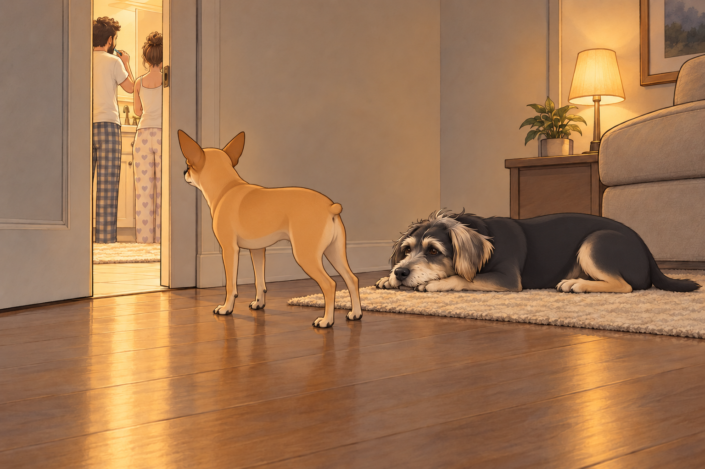
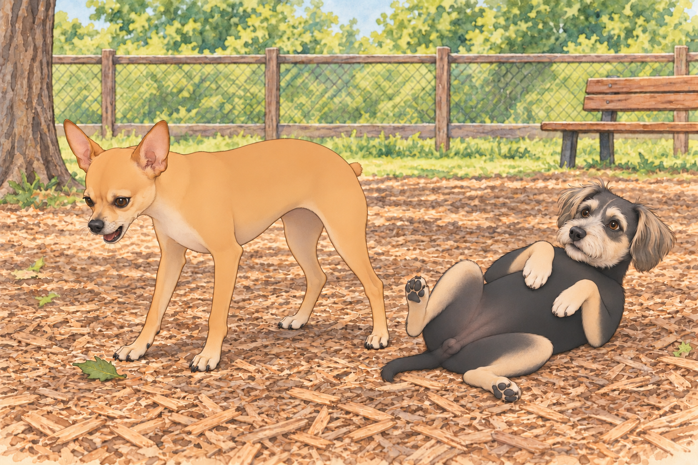
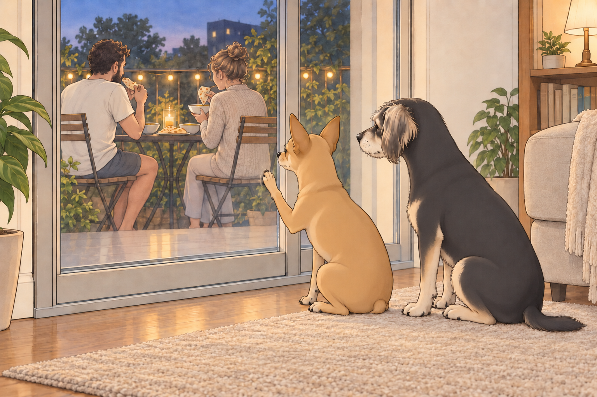

# Tooth Rituals, Leaf Wars, and Balcony Betrayals (As Told by Neet, Defender of the Realm, Drama Enthusiast)

## [The Night of the Glowing Wands –9:04 PM, Living Room Sector]

Buddy was snoring. I was sprawled on the rug, contemplating the deeper mysteries of life— like where socks go when they vanish and why the mailman always returns despite my daily warnings.

That’s when I heard it.

The humming. The door click. The light.

The humans had entered the tiled chamber of mysteries— known to mortals as the bathroom. I, of course, refer to it as The Ceremonial Hygiene Chamber, because what I witnessed that night shook me to my fur.

They were… brushing their teeth.

It wasn’t the act itself that disturbed me— I’ve seen them do it before— but tonight… it felt intentional. Coordinated. Almost… rehearsed.

I crawled over to Buddy and whispered, “They’re doing it again.”

He barely opened an eye. “Doing what?”

“The tooth thing. It’s evolved. They’re synchronized now. Look at the way Sagar swirls the wand in his mouth. That’s not brushing. That’s… training.”

I peeked through the crack in the door. There stood Sagar— stoic, confident— his mighty hand holding a vibrating wand of minty judgment. Heather stood beside him, brushing in the same direction. I checked twice. They even spat at the same time.

“They’re prepping for something,” I muttered. “You don’t polish your fangs like that unless you’re going to a duel. Probably royal combat. Maybe Sagar’s challenging another king. That’s why he flosses! He needs sharp weapons!”

Buddy rolled over and let out a small burp. “Or they just don’t want morning breath.”

I narrowed my eyes. “You think too small, Buddy. Too small.”

He got up, walked to the far end of the rug, and turned three times before lying down.

“Where are you going?”

“Out of whispering range.”

I followed. This required a briefing.

---

## [The Dog Park –8:47 AM, The Next Day]

The next morning, we were deployed to The Field— the sacred place the humans call the “dog park.”

I knew my role. I wasn’t there to play. I was there to secure the perimeter.

Sagar stood with his arms crossed, surveying the park. Heather sat on the bench with an iced tea. Neither had requested my perimeter report. A troubling start.

I, Neet, assumed my position near the fence line.

“Visual on intruder— Yorkshire Terrier. Code: Puffball,” I muttered to myself, squinting dramatically.

Buddy had found a patch of sun and was already belly-up in the mulch. “You know this park is literally made for playing, right?”

I ignored him. My duty was clear.

I conducted fence patrols, marched back and forth with purpose, occasionally stopping to bark at:

- An old woman’s cane (too pointy).

- A squirrel (shifty tail).

- A Labradoodle with bangs (untrustworthy hair).

Then I saw it.

A leaf.

Not just any leaf. A rogue, fluttering, rebellious leaf that descended with chaotic intent. It floated— taunting me— with erratic moves that defied the laws of aerodynamics.

I froze. The leaf hovered. Then moved closer.

BARK MODE: ENGAGED

I charged.

Buddy looked up. “You’re barking at a leaf again.”

“I KNOW WHAT I SAW, BUDDY.”

The leaf landed softly. I stood over it, chest out, nub rigid, and let out a final warning bark just in case it had friends.

The other dogs stared. Let them. Greatness always looks weird to the uninformed.

A breeze slid the leaf toward Buddy just as he rolled onto his side. It stuck to his shoulder.

“Hold still,” I said.

He shook. It landed behind me.

I turned. He settled back into his patch of sun. Apparently I was now securing both ends of the park.

---

## [Royal Feast –7:19 PM, Kitchen Balcony Axis]

That evening, a feast was declared.

Sagar took to the kitchen in a whirlwind of spices and very confident estimates. Heather moved between counter and stove, tasting from a spoon and passing it to him. They were making moong dal soup and sheera— the sacred semolina dessert that makes my knees go weak and Buddy attempt vertical jumps.

The aroma filled the air. Buddy and I began pre-meal maneuvers:

- Stage 1: Sit nearby. Look hopeful.

- Stage 2: Slowly inch forward without breaking eye contact.

- Stage 3: Place head on thigh. Activate pity protocol.

Buddy skipped Stage 2 and placed his chin on Heather’s knee. She scratched his ears. I was still inching forward. It was irritating to see a procedure work better without the procedure.

But then— disaster.

“The balcony’s too small,” Heather said. “Let’s eat outside, just the two of us.”

THEY. LEFT. US. BEHIND.

Buddy inspected the gap beneath the door, found it inadequate for sheera delivery, and sat down. I pressed my entire face against the glass, producing fog that spelled TRAYTORZ.

From behind the door, I could see it all:

- The table set.

- The candle flickering.

- Sagar breaking naan like a monarch handing out blessings.

I began my Balcony Protest Performance:

- Scratched the door gently.

- Sat with back turned dramatically.

Buddy stayed facing the table.

“You’ll miss her getting up,” he said.

I adjusted my protest.

I returned to the glass and pressed one paw against it like a war widow in a period drama.

Heather cracked. She returned. With sheera.

“Here, boys,” she whispered. “Don’t be mad.”

I accepted the spoon-fed sheera with the kind of restrained nobility befitting a wronged duke. Buddy dispensed with ceremony and put his nose in the bowl.

We licked. We smacked our lips. We approved.

But once she left again… I resumed my protest. I am nothing if not consistent.

---

## [The Betrayal of the Balcony Slumber –10:12 PM, The Final Blow]

Later that night, I witnessed the ultimate scandal.

They brought pillows. A mattress.

THEY. WERE. SLEEPING. OUT. THERE.

Buddy looked up and whispered, “You okay?”

“They’re nesting without us,” I replied, my voice cracking. “She brought him a blanket. She tucked him in. I SAW HER TUCK HIM.”

Buddy licked his paw. “It’s hot inside anyway.”

He got up to investigate the rectangle of carpet where the mattress had been. It smelled wonderfully of us. He circled once and lay down in the middle.

“You’re accepting this?”

“I’m accepting the extra room.”

“You don’t understand,” I snapped. “That mattress? That’s my spot. I helped train that mattress. I’ve shed 4 million hairs into its fibers.”

Buddy blinked. “That explains the smell.”

I marched back to the door, stood tall, and barked— softly but with emotional depth. I pressed my paw to the glass again. Heather looked up and waved.

That wave hit me like a spear to the soul.

I sighed. Collapsed. Whispered to Buddy:

“They’ll come crawling back when it rains.”

And sure enough, the wind picked up. A chill arrived.

No rain, technically. I considered this a minor clerical matter.

They returned at midnight, carrying pillows, laughing. Sagar saw me and scratched my ears. Heather cooed, “We missed you, boys.”

I didn’t say anything. I just gave Sagar my quiet forgiveness.

Buddy stayed where the mattress belonged. Sagar had to put down his pillows and negotiate.

---

## Final Thoughts:

Humans are strange. They brush their teeth with zappy wands. They scream into sinks. They eat soup in the breeze and exile you for lack of balcony real estate.

But they also bring sheera.

And tuck each other in with love.

So I, Neet— First of His Name, King’s Hound, Defender of the Leaf-Free Realm— will continue to serve. With drama. With loyalty. And with the occasional emotionally-charged glass-door monologue.

Because this kingdom, for all its madness, is mine.

## Provenance and editorial notes

Working selection dated October 3, 2026. Selection and shelf order are editorial; owner approval and event chronology remain unverified.

Original numbering: unnumbered source.

- First-person Neet diary retained. Shared balcony protest does not make this the same story as the paneer episode.

Archive recovery: use [Studio recovery guidance](../Studio/Recovery.md). The paths below are paths **inside the verified snapshot**, not active navigation. SHA-256 pins identify the exact sources.

- `elevenlabs-reader-31` — `02_Story_Library/ElevenLabs_Imports/reader-31-tooth-rituals-leaf-wars-and-balcony-betrayals-as-told-by-neet-defender-of-the-realm-drama-enthu.txt`; SHA-256 `22a37a281e29b96278a4219130852ff9df1fe4a4bf70d263d1bfd367c88c84c3`.

## Refinement record

Refined October 3, 2026; [episode record](../Productions/E062-tooth-rituals-leaf-wars-and-balcony-betrayals-as-told-by-neet-defender-of-the-realm-drama-enthusiast/episode.json) documents the reading comparison and illustration work. The pre-refinement text is preserved in the [dated recovery snapshot](/Users/sagar/Documents/ChatGPT/NBC_Archives/NBC-before-refinement-2026-10-03_200659.tar.gz) at `NBC/Stories/S062-tooth-rituals-leaf-wars-and-balcony-betrayals-as-told-by-neet-defender-of-the-realm-drama-enthusiast.md`. Historical provenance above remains unchanged.
Expanded comedy and illustration pass October 4, 2026: [comedy comparison](../Productions/E062-tooth-rituals-leaf-wars-and-balcony-betrayals-as-told-by-neet-defender-of-the-realm-drama-enthusiast/comedy-pass-v002.json) and [artwork record](../Productions/E062-tooth-rituals-leaf-wars-and-balcony-betrayals-as-told-by-neet-defender-of-the-realm-drama-enthusiast/artwork-generation-v002.json). Independent visual review and complete reading remain pending.
