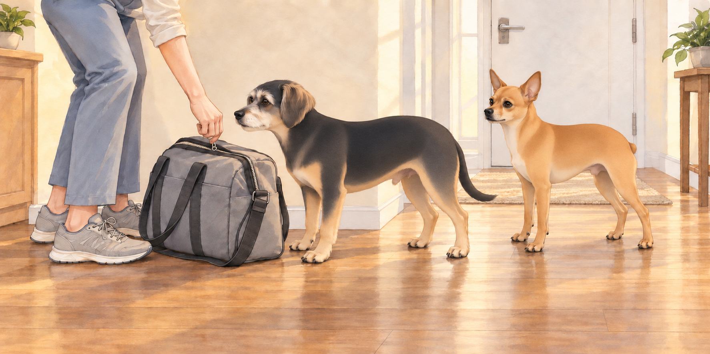
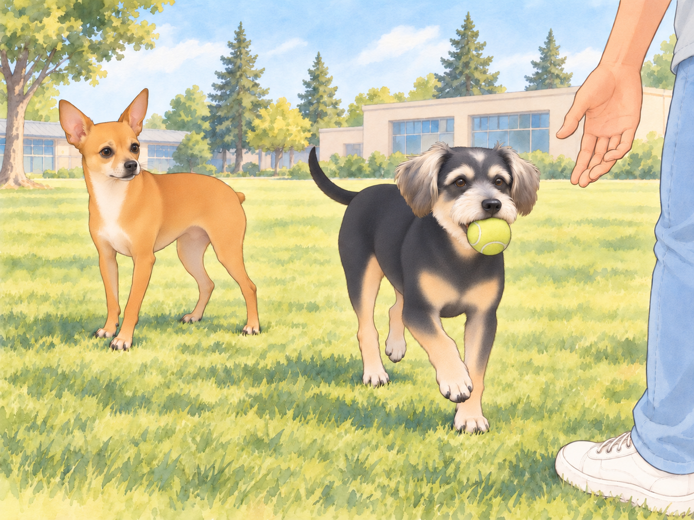

# The Field Trip to Love High and the Gospel of Good-Ass Prana

## 6:48 AM – The Apartment Lair

The morning began with a flurry of suspicious packing activity. Sagar pulled on his hoodie. Heather packed snacks, water, and The Royal Canine Travel Kit. Neet noticed the leash going in before any of it.

“We’re going somewhere,” he whispered to Buddy, tail twitching.

Buddy, sprawled across the hallway like a damp sponge, lifted his head, sniffed the air, and declared with confidence, “Yes. This smells like… a Field Trip Day.”

Buddy got up and parked himself against the travel kit. Heather had to ask him to move before she could zip it. He moved six inches.

Neet nodded. His eyes sparkled with destiny. “I shall prepare my nostrils.”

---

## 8:00 AM – Car Chariot of the Gods

The moment they hopped into the backseat of the car, Neet assumed his Rightful Position by the window. As Sagar started the engine and navigated into the winding hill station-esque neighborhood, Neet gently pressed the automatic window button with his nose like a seasoned operator. Heather sat beside them in the back, basking in queenly serenity.

And then— the wind.

Neet stuck his head out. The breeze hit him like enlightenment wrapped in joy. His eyes squinted, lips flapped, ears turned into miniature sails, and his face twisted into what can only be described as spiritual transcendence.

He inhaled deeply.

“GOOD. ASS. PRANA,” he declared, loud enough that only the ancient gods and perhaps a passing bird could hear.

Heather giggled, holding Neet’s harness. Buddy, meanwhile, was still inside the car with only his nose peeking out. “I don’t get it,” he said. “The air’s the same in here.”

“Fool,” Neet replied. “You must let it hit your molars. Only then will you taste the good-ass prana.”

The road twisted through lush green curves, tree canopies filtering the light into golden dapples on the dashboard. Sagar drove through the shaded bends while Neet tried to inhale every one of them.

Buddy, finally inspired, stuck his head out and was instantly slapped in the face by a leaf. “I hate nature,” he grumbled, retreating.

Neet, now thoroughly immersed in the drive, raised his snout to the heavens and whispered, “I AM THE WIND.”

---

## 9:17 AM – Arrival at Love High School

The car pulled into a quaint circular driveway, surrounded by tall pines, chirping birds, and the distant sound of teenage angst.

“Welcome to Love High,” Heather said cheerfully.

“Ah,” Neet whispered. “A kingdom of hormones and hallway crushes.”

As they leapt out of the car, Buddy suddenly entered a mode no one expected: Beast Mode Activated.

Without warning, he sprinted.

Not trotted. Not jogged. He went full Olympian.

“HE’S MOVING!” Heather gasped.

Buddy zoomed across the grassy field like a greyhound that had just been told there’s bacon at the finish line. He barked once— joyfully, no doubt— and then began chasing a tennis ball like his ancestors demanded it.

Sagar laughed and tossed the ball farther. Buddy was already running. Neet watched, stunned.

Buddy brought the ball straight past him and dropped it at Sagar’s feet. When Sagar paused to laugh, Buddy pushed it against his shoe. The admiration was holding up the game.

“I always thought he was… you know… emotionally sedentary.”

Heather tossed Neet a ball. “Your turn!”

Neet caught it. Spit it out. Looked up. “Fetch? Me? Darling. I don’t chase. I summon.”

Still, not wanting to be outdone, Neet trotted forward with a slow, deliberate swagger, sniffed the grass dramatically, then suddenly decided the wind had secrets and ran in a large circle like a mystical tornado.

Buddy was still zooming. Sagar shouted, “Buddy, come back!” and Buddy did. On command.

Neet gasped. “He’s been faking all these years…”

Buddy sat in front of Sagar, watching the throwing hand.

“Come back,” Neet tried.

Buddy did not move.

Heather put the abandoned second ball beside Neet. “Try having something to offer.”

---

## 1:23 PM – Return and the Sacred Sheera Offering

After hours of glorious play, photo ops, and suspiciously sniffing janitorial closets, the royal entourage returned home. But the day had one final act.

The Feast.

Sagar, still basking in post-chase adrenaline, announced the evening’s dinner: moong dal soup with ghee, cumin, and ginger and golden sheera laced with cardamom and raisins that glimmered like edible gems.

Later, as the scent filled the apartment, Buddy collapsed in the kitchen, panting, tail wagging lazily. Neet lay flat on the cool floor tiles, staring at the pot with intense spiritual focus.

Heather brought out their plates to the balcony.

Not again.

Not. Again.

The dogs weren’t allowed due to limited space and prior glass-licking incidents.

Neet pressed his nose to the glass, tail down, eyes haunted. “We went on the journey, Heather. We breathed the good-ass prana together. And now this?”

Heather glanced back and broke instantly. “Fine! Just one spoon of sheera each!”

She returned moments later with a plate, sat on the edge of the sofa, and whispered, “Don’t tell anyone.”

Buddy practically danced, then sat down so abruptly that Heather laughed and steadied the plate. Neet bowed his head solemnly.

Neet accepted his portion.

One lick. Pause. Lip smack. Tail wag. Approval granted.

---

## 10:04 PM – Balcony Sleep, Part Deux

As if the betrayal from the last time wasn’t enough, Heather and Sagar once again set up their nighttime sanctuary on the balcony. Pillows. Blankets. A flask of chai.

Neet lay inside, staring. Eyes glowing faintly in the dim light.

He turned to Buddy. “They’re out there again.”

Buddy yawned. “Probably just enjoying the breeze.”

“Or plotting to start a new society out there,” Neet hissed. “A balcony cult. I wouldn’t be surprised if they’ve renamed it already. ‘New Kingdom of Pillowonia.’”

Buddy stretched out on the rug. Neet’s pacing brought him past Buddy’s nose twice; on the third circuit, Buddy turned to face the sofa.

Then he snored.

Neet sighed dramatically. Pressed his paw to the glass. “Sagar,” he whispered. “I forgive you. But I shall never forget.”

Heather looked back through the door and smiled, waving at them. Sagar gave a thumbs up.

And just like that… Neet’s glare weakened. Sagar could see him; that was something.

He curled up by the door, tail twitching gently, and whispered, “Long live the King.”

---

## Final Thought:

From brushing rituals to wind-blessed field trips, from lightning-speed fetch games to sacred spoonfuls of sheera, this life is strange and hilarious.

But as long as Sagar drives, Heather packs snacks, and the air remains full of good-ass prana…

I, Neet— Fluff of Justice, Sniffer of Secrets, Wind-Lord of the Passenger Seat— shall continue to serve.

And maybe— just maybe— let Buddy fetch once in a while.

## Provenance and editorial notes

Working selection dated October 3, 2026. Selection and shelf order are editorial; owner approval and event chronology remain unverified.

Original numbering: unnumbered source.

- The text calls its final balcony scene Part Deux; placed after the tooth-and-leaf diary for browsing, without proving revision chronology.

Archive recovery: use [Studio recovery guidance](../Studio/Recovery.md). The paths below are paths **inside the verified snapshot**, not active navigation. SHA-256 pins identify the exact sources.

- `elevenlabs-reader-30` — `02_Story_Library/ElevenLabs_Imports/reader-30-the-field-trip-to-love-high-and-the-gospel-of-good-ass-prana.txt`; SHA-256 `c1d3eaae031926aacade77d2031299b4a79b16b404909d108415cac9f9b2e0b1`.

## Refinement record

Refined October 3, 2026; [episode record](../Productions/E063-the-field-trip-to-love-high-and-the-gospel-of-good-ass-prana/episode.json) documents the reading comparison and illustration work. The pre-refinement text is preserved in the [dated recovery snapshot](/Users/sagar/Documents/ChatGPT/NBC_Archives/NBC-before-refinement-2026-10-03_200659.tar.gz) at `NBC/Stories/S063-the-field-trip-to-love-high-and-the-gospel-of-good-ass-prana.md`. Historical provenance above remains unchanged.

Expanded October 4, 2026: [comedy comparison](../Productions/E063-the-field-trip-to-love-high-and-the-gospel-of-good-ass-prana/comedy-pass-v002.json) and [artwork provenance](../Productions/E063-the-field-trip-to-love-high-and-the-gospel-of-good-ass-prana/artwork-generation-v002.json). Proposed illustrations await independent visual and complete reading reviews.
