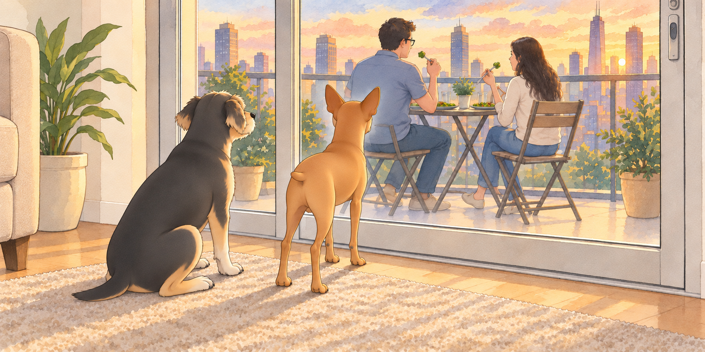
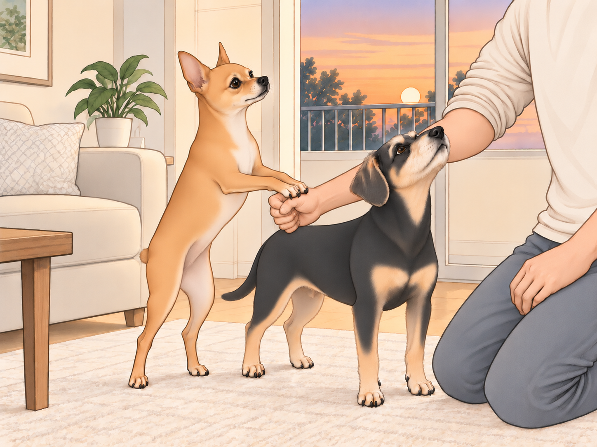
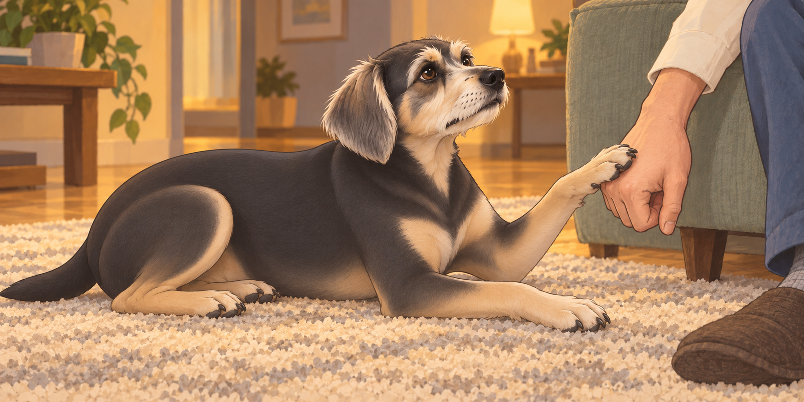

# The Great Paneer Balcony Scandal

The evening sun dipped lower in the horizon, casting a golden-orange glow over the city skyline. From the 17th-floor balcony of their apartment, the world looked serene and peaceful, the streets below bustling softly, far enough away to be comforting but close enough to remind them they were a part of it.

Inside, Neet had stationed himself at the kitchen entrance. Buddy kept checking whether the balcony door had opened yet. Neither dog knew what was for dinner, but both had accepted.

The chaos had begun hours earlier when Sagar boldly decided that today was the day to reinvent the classic dish— Saag Paneer. He had the spinach ready and a name picked out before the first spice hit the pan.

“What are you making?” Heather asked, peering suspiciously into the sizzling pan.

“It’s like Saag Paneer…but with a twist!” Sagar proclaimed, flipping spinach dramatically. “Henceforth, it shall be known as Sagar Patel Paneer!”

Heather raised an eyebrow skeptically. “So, basically, spinach paneer, but made by you.”

“Ah, but no!” Sagar exclaimed, waving his spatula like a wand. “My special touch is adding spices in a sequence that defies logic and traditional cooking. Behold, culinary anarchy!”

Heather laughed, shaking her head as she watched him sprinkle chili powder with a flourish worthy of a Bollywood actor. “Whatever you say, Chef Chaos.”

---

Meanwhile, Neet and Buddy, sensing that something delicious was happening, had established strategic positions in the kitchen. Neet sat stiffly at attention, his expression one of pure entitlement, eyes laser-focused on the pan. Buddy circled the floor, following the smell, and bumped into a cabinet. He checked beneath it anyway. A thorough search sometimes involved disappointment.

Soon, the aromatic masterpiece— Sagar Patel Paneer— was ready, along with steaming hot garlic naan. Sagar spooned it onto the plates, then wiped a stray green smear off one rim with great concentration.

“Shall we eat on the balcony?” Heather suggested, eyeing the perfect summer evening unfolding outside.

“Absolutely,” Sagar agreed enthusiastically, balancing their plates like a waiter who might be secretly panicking.

They quickly realized, however, the balcony was too small for humans and two furry royalty. Neet’s eyes widened dramatically as Sagar gently shut the full-glass balcony door, mouthing, “Sorry, buddy,” through the glass.

Neet stared at the closed door, then at the plates on the other side. He pressed his nose against the glass, creating a small foggy patch as if he were writing desperate SOS signals in invisible ink.

Buddy wanted a share of dinner. He tried sitting where Heather could see his very best manners, directly behind Neet’s foggy patch.

He moved six inches to the left. Neet followed Heather’s plate six inches to the left.

“Would you mind?” Buddy asked. “I’m being good here.”

Outside, the scene was blissful: cool evening breeze, delicious paneer, and the city sparkling below. Inside, however, Neet launched into a performance worthy of Broadway.

First, Neet dramatically pawed at the door, his eyes pleading as if to say, “Please reconsider your terrible, terrible decision.” When that failed, he lowered himself onto the rug one joint at a time, rolled onto his back and held his legs in the air.

Buddy looked down at him.

Neet opened one eye to check whether Heather was looking, then closed it again.

Heather tried to ignore it but kept glancing back. Sagar laughed, shaking his head. “Don’t cave. It’s psychological warfare.”

Neet escalated further— rising from the rug to deliver a series of soft but heartbreaking whimpers, gazing up mournfully through the glass. Heather set down her fork. Neet stopped long enough to watch her chair move.

“I can’t do this to them,” she whispered guiltily, ducking back inside.

She returned moments later, triumphant, holding small cubes of cheddar cheese. “Here,” she offered apologetically, “your tribute, my princes.”

Neet accepted, eyes briefly softening as he chewed. Buddy happily swallowed his cheese, confusion forgotten. Heather slipped back onto the balcony, relieved.

“There,” she said. “Everybody’s happy.”

Buddy was still checking his teeth. Neet was checking the door.

But victory was short-lived.

No sooner had she sat down than Neet resumed pawing the glass dramatically, as if he’d received cheese-flavored betrayal. He threw himself into even more elaborate theatrics— rolling dramatically, pressing his paws against the glass, eyes wide, like a wrongly imprisoned drama-king.

Sagar and Heather doubled over laughing, barely able to finish their meal. Buddy sat beside the door again. The first complaint had produced cheese; he was prepared to support a second.

---

Later, plates empty but stomachs happily full, Sagar and Heather returned inside. Neet and Buddy immediately sprang up, tails wagging furiously, the trauma of abandonment instantly forgotten— especially upon realizing leftover garlic naan had survived dinner.

“Opportunity for trick training!” Sagar declared, tearing the naan into two enticing chunks.

Neet and Buddy sat at attention, vibrating with anticipation.

“Okay, boys,” Sagar said, hiding naan inside his closed fists. “Fist bump time! Give me paw bumps!”

Neet tilted his head suspiciously, eyes narrowing into a skeptical glare. Buddy sniffed furiously at Sagar’s fist, then looked up blankly, clearly unsure of what exactly was being asked of him.

Heather giggled, recording the unfolding comedy. “Maybe demonstrate?”

Sagar awkwardly bumped his own fists together. “See? Paw bump!”

Neet exchanged a confused glance with Buddy.

“He’s hitting himself,” Neet said.

“Yes,” said Buddy. “But he has the bread.”

Neet, desperate, lifted a paw tentatively, then put it down, unsure. Buddy began enthusiastically licking Sagar’s fist instead. He worked carefully around the thumb, where it seemed most likely to open.

“No licking, bumping!” Sagar pleaded, laughing hysterically.

Neet decided the situation called for drastic action. He stood up, dramatically placed both paws on Sagar’s fist, balancing precariously as if trying to crack open a stubborn treasure chest. Buddy, interpreting this as progress, jumped excitedly, repeatedly nudging Sagar’s elbow with his nose, utterly misunderstanding the assignment.

“Now they’re dismantling you,” Heather said, keeping the camera steady with both hands.

After several chaotic minutes of failed attempts and laughter, Heather intervened. “Show them again clearly.”

This time, Sagar exaggerated his fist-bump gesture, adding an enthusiastic, “POW! Like superheroes!”

Neet squinted, suddenly focused, and slowly, gingerly extended one paw— tentatively tapping Sagar’s fist. Sagar erupted with joy.

“YES! NEET DID IT! GENIUS DOG ALERT!”

Buddy watched the naan change hands, then finally got the hint, awkwardly slapping his paw onto Sagar’s fist repeatedly, slightly harder than necessary, his eyes desperate. Heather cheered.

“One bump is enough,” Sagar told him.

Buddy gave him one more, in case the first several hadn’t gone through.

Finally rewarded, the two dogs happily inhaled their garlic naan, tails wagging at maximum speed.

---

The evening ended quietly, dogs curled up contentedly, humans relaxing in the afterglow of laughter. Sagar chuckled softly, watching Neet sleeping dramatically with his paws twitching, presumably dreaming of fist bumps and paneer rebellions.

Heather leaned over affectionately, whispering, “Your cooking may not make Michelin stars, but your comedy— and your dogs— are world-class.”

Sagar grinned proudly. “Behold: Sagar Patel Paneer— bringing families together through food, drama, and adorable chaos.”

Buddy’s paw touched Sagar’s closed hand. There was no naan left in it, but Sagar bumped him back.

## Provenance and editorial notes

Working selection dated October 3, 2026. Selection and shelf order are editorial; owner approval and event chronology remain unverified.

Original numbering: unnumbered source.

Archive recovery: use [Studio recovery guidance](../Studio/Recovery.md). The paths below are paths **inside the verified snapshot**, not active navigation. SHA-256 pins identify the exact sources.

- `elevenlabs-reader-32` — `02_Story_Library/ElevenLabs_Imports/reader-32-the-great-paneer-balcony-scandal.txt`; SHA-256 `481aef09a0cc2328248cbd9f3493b1f9c78459cb2686a25e7869645f50911e3f`.

## Refinement record

Refined October 3, 2026; [episode record](../Productions/E064-the-great-paneer-balcony-scandal/episode.json) documents the reading comparison and illustration work. The pre-refinement text is preserved in the [dated recovery snapshot](/Users/sagar/Documents/ChatGPT/NBC_Archives/NBC-before-refinement-2026-10-03_200659.tar.gz) at `NBC/Stories/S064-the-great-paneer-balcony-scandal.md`. Historical provenance above remains unchanged.
