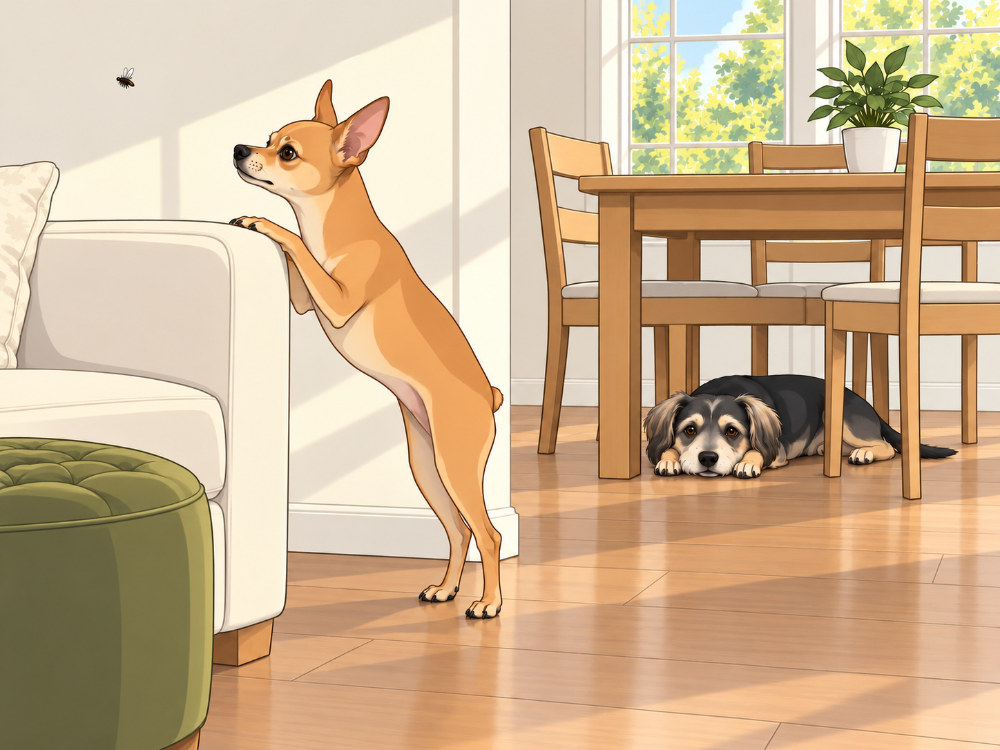
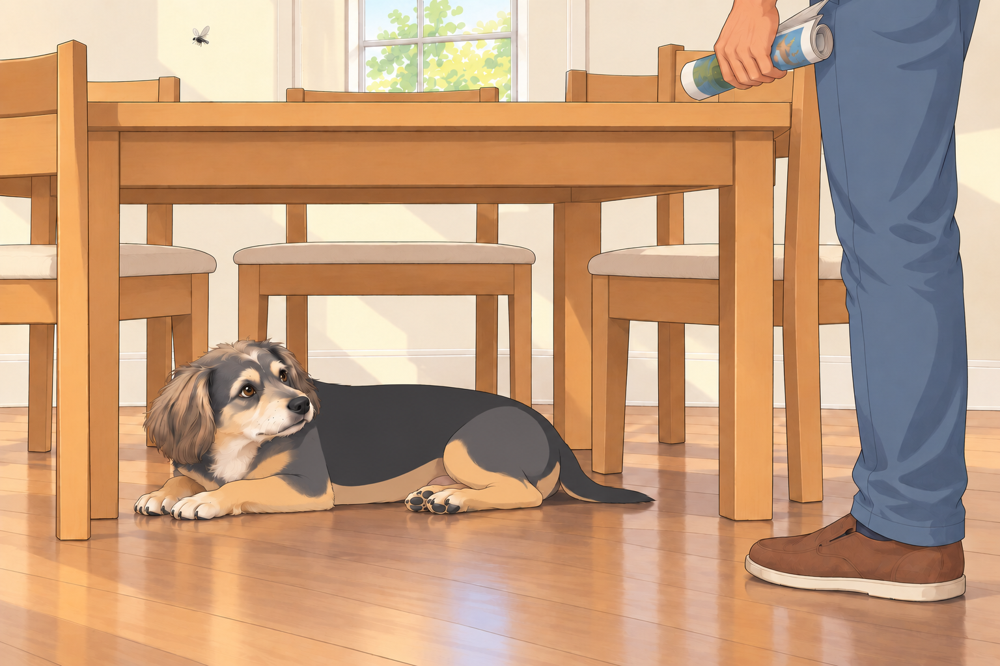
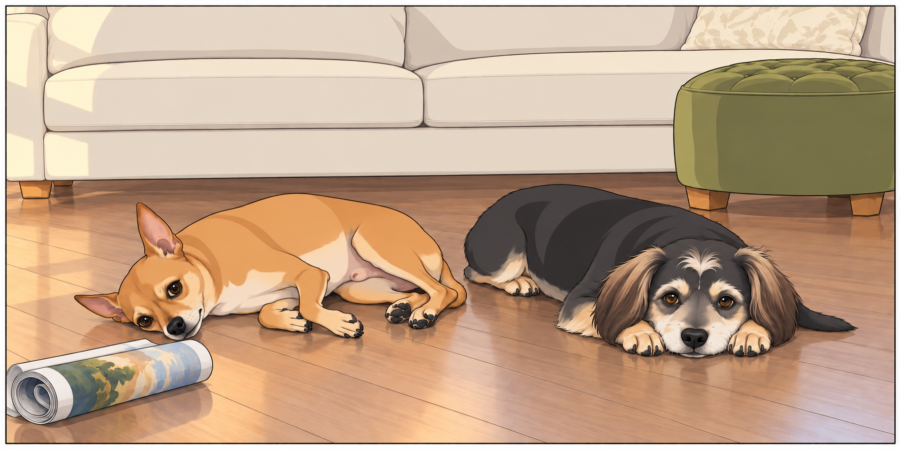

# The Winged Menace

Neet had arranged himself for a quiet afternoon and expected the afternoon to cooperate. He was sprawled luxuriously on the velvet ottoman, one paw artfully draped over the side like a Renaissance painting titled “The Tragic Prince in Exile.” Buddy slept under the dining table where the floor stayed cool, waking only when Heather folded the corner of a blanket over his tail.

Heather was busy folding laundry, humming a soft tune, while Sagar sat nearby, reading something suspiciously titled “The Advanced Science of Roti Puffing.”

And then…

It arrived.

A single fly.

It zipped in through the open window with the kind of swagger that suggested it paid rent.

The first to notice was Neet. His ears twitched. His eyes snapped open. His head shot up before the fly completed its first circuit.

And then came The Sound— that high-pitched, menacing “BZZZZZZZ” that echoes directly into a dog’s overactive imagination.

The fly made a low pass directly over Neet’s head, a blatant act of aerial disrespect.

Neet exploded off the ottoman in a full-body convulsion, his fine legs scrambling for traction. He landed with a heavy thud, then bolted behind the couch, peeking out cautiously like a spy in hostile territory.

Heather, unable to keep a straight face, called out, “Neet! It’s just a fly!”

But this wasn’t just a fly. This was an existential crisis with wings.

Buddy, hearing the commotion but not entirely sure why his rest was being disturbed, lifted his head lazily. His eyes followed the zig-zagging menace in the air, and for one brief moment, Buddy considered engaging. He shifted his weight as if preparing for battle…

…then watched it pass above the table. He shifted farther into the shade and put his chin down. Neet was welcome to the airspace.

“Come under here,” Buddy said. “It’s cooler.”

“It knows where I am.”

“So do I. You keep shouting.”

Meanwhile, Neet had entered full-scale Defcon 1. He performed evasive barrel rolls behind the furniture, peeking his head out every few seconds only to duck back with a dramatic gasp each time the fly so much as twitched its wings.

At one point, he stood on his hind legs behind the armrest like a tiny, panicked meerkat scanning for predators, his eyes wide with the grim knowledge that he was under attack.

The fly, drunk on its own power, took this moment to stage an encore performance. It buzzed low again, this time veering dangerously close to Sagar’s ear.

Sagar swatted at it with the exaggerated flair of a man trying to solve a kung-fu puzzle in mid-air. “I swear this thing has GPS!” he muttered.

And then, the fly made its ultimate move: a direct pass toward Neet’s royal snout.

Neet gave a high, startled yelp.

He bolted across the living room, his paws scrabbling for purchase, slid into the hallway like a cartoon character on a banana peel, and disappeared into the bedroom with a final, despairing “AROOOOOOO!”

Heather had collapsed onto the couch in hysterics by this point. “Is he… is he seriously hiding under the bed?!”

Buddy lifted his head. “There’s room under the table,” he called, too late. He moved one forepaw aside anyway.

With the battlefield cleared of canine resistance, it was up to Sagar, armed with nothing but a rolled-up magazine and the grim determination of a man who refused to be defeated in his own home.

For the next ten minutes, Sagar lunged, ducked and swatted at empty air. Buddy moved his chin each time the magazine passed the edge of the table. After the third pass, he got up, walked around one table leg and lay down on the other side.

Sagar came around that side.

Buddy looked at the empty place he had just left.

“You’re chasing him now,” Heather said.

“I’m following the fly.”

“So is everybody.”

The fly, supremely unimpressed, looped up to the ceiling fan. Buddy returned to his original patch of shade. He had successfully defended both sides of the table and had slept on neither.

Finally, in a moment of fate and physics, the fly made the fatal error of landing dramatically on the kitchen backsplash.

THWACK!

Sagar stayed still for a moment, listening for another buzz.

Heather applauded with a folded towel between her hands. “Our hero!”

Sagar bowed, then checked the backsplash again.

Once the coast was clear, Neet cautiously crept back out, his entire body low to the ground like he was sneaking back into a party after storming out dramatically.

He sniffed the air suspiciously. The house was calm again. He looked at Sagar, his eyes filled with the solemn pride of a soldier returning from the brink of emotional collapse.

Sagar knelt down and scratched his ears. “There you go, drama queen. The kingdom is safe.”

Neet sighed heavily and flopped onto his side like a true war veteran processing the horrors of battle.

Buddy stretched, yawned, and came over to sniff Neet’s ear. “You okay there, Shakespeare?”

Neet, still flat on the floor, gave a single, dignified twitch of his tiny nub.

“I was securing the bedroom.”

“Good,” Buddy said. “I’ve done the dining room.”

Buddy settled beside him. Sagar put the magazine down, and Neet kept one eye on it until he was sure it had finished flying too.

## Provenance and editorial notes

Working selection dated October 3, 2026. Selection and shelf order are editorial; owner approval and event chronology remain unverified.

Original numbering: unnumbered source.

Archive recovery: use [Studio recovery guidance](../Studio/Recovery.md). The paths below are paths **inside the verified snapshot**, not active navigation. SHA-256 pins identify the exact sources.

- `elevenlabs-reader-33` — `02_Story_Library/ElevenLabs_Imports/reader-33-the-winged-menace.txt`; SHA-256 `4520615090f4daf2e19d263016e62956f55afb5f0db6fb31672e514a9c132741`.

## Refinement record

Refined October 3, 2026; [episode record](../Productions/E065-the-winged-menace/episode.json) documents the reading comparison and illustration work. The pre-refinement text is preserved in the [dated recovery snapshot](/Users/sagar/Documents/ChatGPT/NBC_Archives/NBC-before-refinement-2026-10-03_200659.tar.gz) at `NBC/Stories/S065-the-winged-menace.md`. Historical provenance above remains unchanged.
