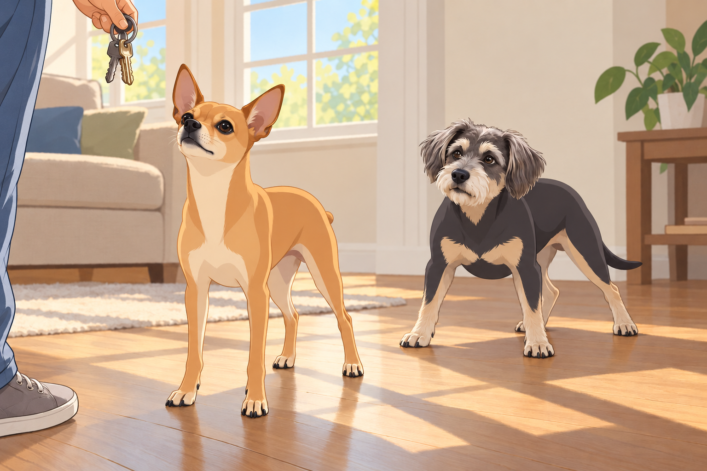
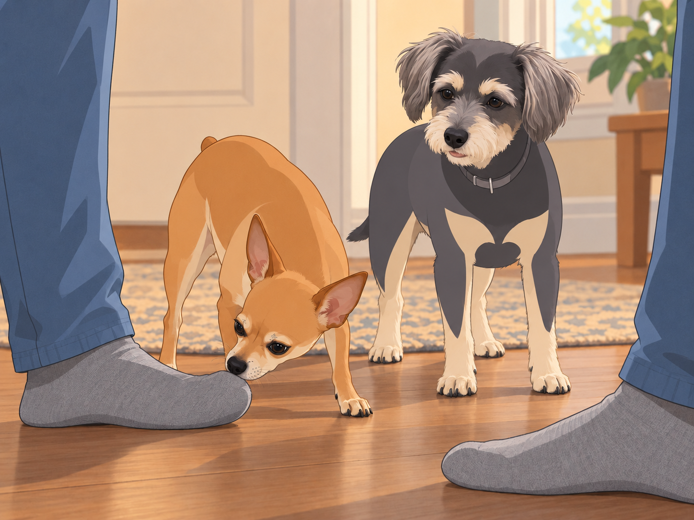
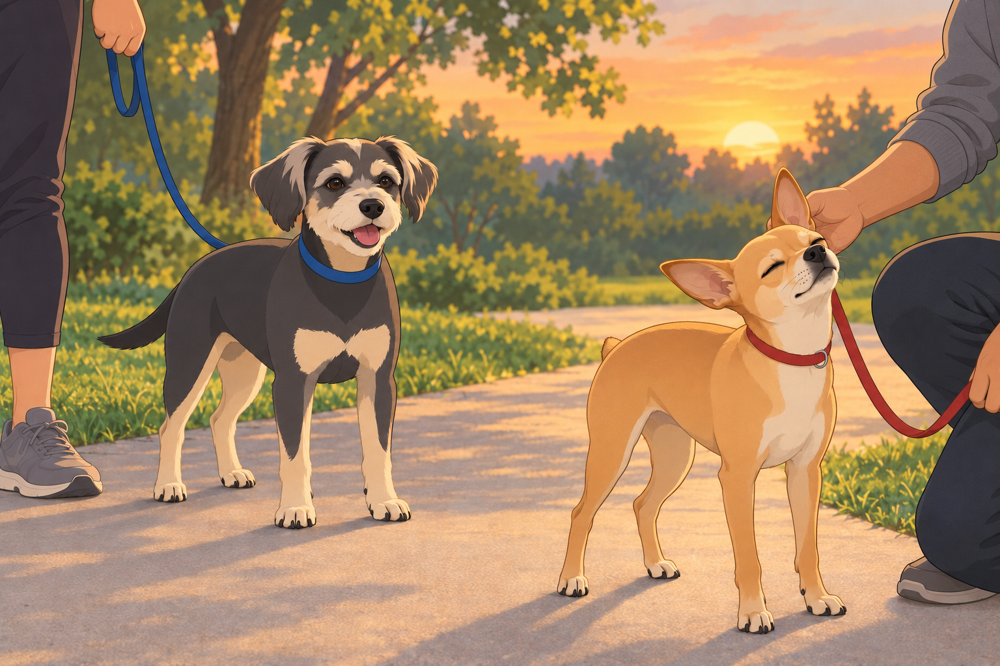

# The Scandal of Sweet Kulfi

It began, as all great dramas do, with a seemingly innocent morning. The sun was shining, the birds were chirping, and Neet and Buddy were basking in their carefully choreographed sun patches on the living room floor, angled just right like seasoned lounge professionals.

That’s when it happened.

Sagar reached for the keys.

Neet’s ears shot up like radar dishes locking onto an incoming missile. Buddy, mid-snore, woke with a startled snort and skidded across the hardwood floor like a malfunctioning Roomba.

Sagar, in his most diplomatic tone, tried to reassure them. “Boys, we’re just visiting an old friend. We’ll be back before you know it!”

Neet immediately launched into Emergency Protocol Alpha: sprint to the door and perform the patented ‘If-I-Lay-Flat-They-Can’t-Step-Over-Me’ maneuver. Buddy added flair by throwing in a series of rapid-fire sneezes, as if he’d suddenly developed a mysterious, highly emotional allergy to abandonment.

But their theatrics were no match for Heather’s distraction technique—two strategically tossed peanut butter bones.

Buddy stopped sneezing before the first one landed. Neet held the doorway for one more second, then abandoned his post to prevent Buddy from collecting both.

With the betrayal sealed and the door closed, Neet and Buddy exchanged grim looks.

Neet, the self-declared Supreme Commander of Household Affairs, paced the living room like a detective on the brink of solving a scandal. “Something’s not right, Buddy,” his narrowed eyes seemed to say. “This wasn’t a regular outing. I smell…treachery.”

Buddy had checked the closed front door and decided the pantry offered better prospects.

“Peanut butter,” he said.

“What?”

“That’s what you smell.”

Neet finished licking his lips. The investigation would continue.

Meanwhile…

At the friend’s house, destiny— or rather, Kulfi— made her grand entrance.

Kulfi was a tiny, impossibly fluffy white dog who looked like a marshmallow had fallen into a cotton candy machine and emerged with royal airs. She floated across the room as if propelled by invisible breezes, her little tail wagging at ultrasonic frequencies.

Upon seeing Sagar, Kulfi made a snap decision: This human shall now belong to me.

She launched directly onto his feet, treating them as if they were her personal spa day. She licked, nuzzled, and delicately pawed at his socks like a five-star masseuse who accepted only chin scratches as payment.

Heather chuckled as Sagar helplessly sat there, watching a small cloud of weaponized cuteness claim him. And then, the ultimate betrayal— Kulfi fluffed herself up like a tiny pillow, did three perfectly executed turns, and took a luxurious nap right on Sagar’s feet.

Sagar sat frozen, unsure if moving would violate some ancient dog treaty.

“We should probably go,” he said.

Heather looked under the chair. “Have you told your feet?”

Back at home, however, Neet was orchestrating what could only be described as a full-scale Operation Code Sniffstorm.

When the door finally creaked open, Neet and Buddy charged forward like customs agents at a top-security checkpoint.

Neet approached Sagar with slow, exaggerated steps, his expression a masterclass in betrayal.

Sniff. Sniff.

Sagar shifted his weight. Neet followed the sock. Sagar stopped moving.

And then—GASP!

Neet backed onto the rug, then rolled onto his side with both front paws over his nose. Sagar’s sock remained offensively close.

Heather barely held back her laughter.

Neet wasn’t done yet. He crawled to his feet, locked eyes with Buddy, and gave him the look: “It’s worse than we feared… there was… another.”

Buddy sniffed the sock for himself. Another dog, certainly. He tried Neet’s rolling protest and discovered that Heather immediately scratched his belly.

Neet waited for him to get up and share the outrage.

Buddy stretched out a back leg. “Go on without me.”

But Neet, ever the drama king, took it further. He stormed to his favorite window perch, nose pointed high into the air like a brooding poet who’d just discovered his muse had run off with a rival.

Heather knelt beside him, trying to reason. “Neet, it was just a friendly visit! Nothing happened!”

Neet turned his head away dramatically. Heather moved round to the other side. Neet turned the other way.

“All right,” she said, and sat beside the window.

He kept one ear pointed at her.

Later that evening, it was time for their family walk. But oh, Neet wasn’t about to make this easy.

He strutted ahead of them on the leash, chest puffed out, with the haughty air of a dog filing a silent but very public grievance. Occasionally, he’d stop, turn his head slowly, and shoot Sagar a look so piercing it could cut glass.

Buddy pranced along, stopping to sniff trees and occasionally trying another collapse beside Heather. The belly scratch had worked once; it seemed worth checking.

“Buddy, we’re walking,” Heather said.

He got up, walked three steps and tried a different patch of grass.

But as the walk continued, Neet’s icy exterior began to thaw.

Halfway through the route, Sagar knelt down, scratched that magical spot behind Neet’s ear, and whispered, “Come on, buddy. There’s still room for you.”

Neet leaned into the scratch before remembering to maintain his grievance. He straightened. Sagar’s fingers stopped.

Neet put his head back.

He gave a deep, dramatic sigh, followed by a final, drawn-out hmph. Then he forgave them.

By the time they reached home, Neet had reclaimed his rightful throne— Sagar’s lap. He flopped down with a long, satisfied groan, casting one final, suspicious glance at Sagar’s feet.

Just in case that Kulfi incident wasn’t a one-time offense.

But for now, peace had returned to the kingdom.

Buddy settled beside Heather without bothering to fall over first. She rubbed his chest anyway.

He shut his eyes. That would save a great deal of time.

## Provenance and editorial notes

Working selection dated October 3, 2026. Selection and shelf order are editorial; owner approval and event chronology remain unverified.

Original numbering: unnumbered source.

Archive recovery: use [Studio recovery guidance](../Studio/Recovery.md). The paths below are paths **inside the verified snapshot**, not active navigation. SHA-256 pins identify the exact sources.

- `elevenlabs-reader-35` — `02_Story_Library/ElevenLabs_Imports/reader-35-the-scandal-of-sweet-kulfi.txt`; SHA-256 `f68a2b4404e86871caadf988ac851725e49bd38c7fef97648c735696d14fa21b`.

## Refinement record

Refined October 3, 2026; [episode record](../Productions/E067-the-scandal-of-sweet-kulfi/episode.json) documents the reading comparison and illustration work. The pre-refinement text is preserved in the [dated recovery snapshot](/Users/sagar/Documents/ChatGPT/NBC_Archives/NBC-before-refinement-2026-10-03_200659.tar.gz) at `NBC/Stories/S067-the-scandal-of-sweet-kulfi.md`. Historical provenance above remains unchanged.
