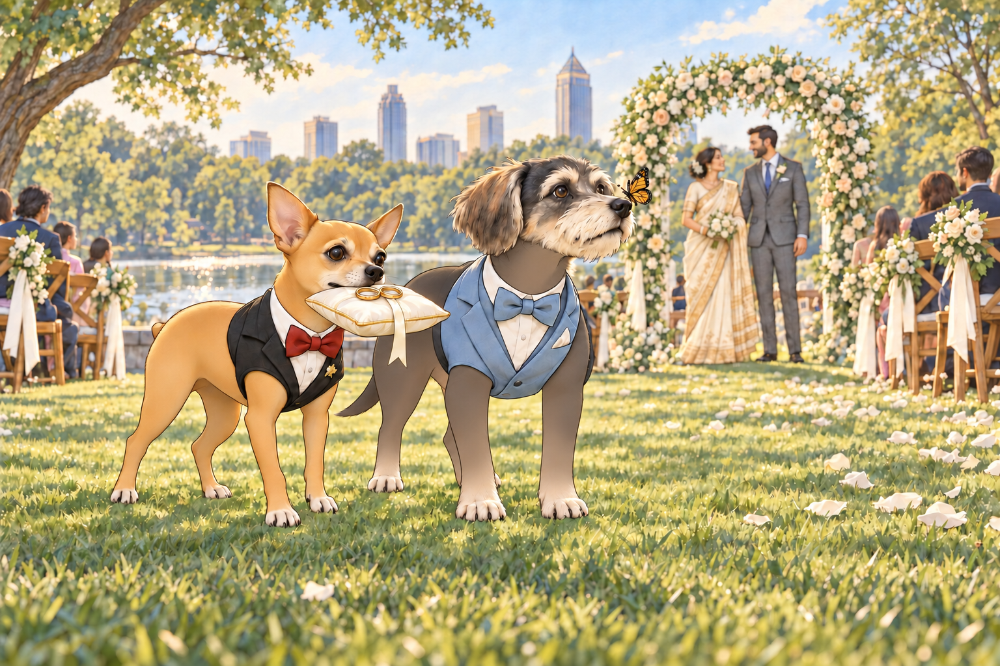
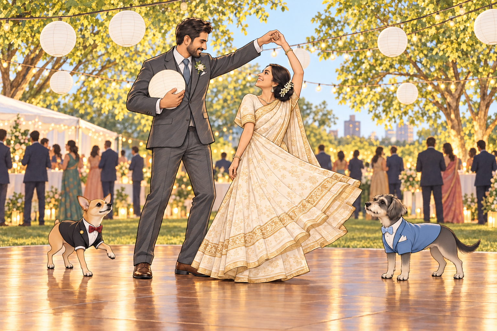
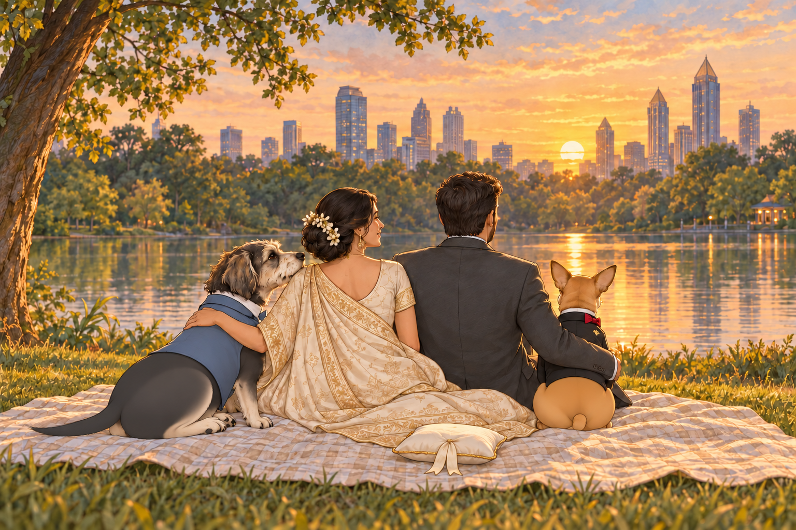

# The Piedmont Park Wedding

The sun rose over Piedmont Park with a theatrical flourish— as if it, too, had RSVP’d to the most anticipated wedding of the season: the union of Heather and Sagar.

Birdsong danced in the breeze, dew sparkled like confetti on the grass, and near the park’s tranquil pond— backdropped by the Atlanta skyline— stood an arch draped in flowing silks and delicate flowers. Friends and family, dressed in pastels and beaming with joy, milled about in gentle laughter.

And then the real stars arrived.

Neet and Buddy.

Neet wore a perfectly tailored black tuxedo, complete with satin lapels, a red silk bowtie, and a gold pin that said “Best Dog.” Buddy wore a powder blue tux, his kerchief monogrammed with the initials “B +H” in delicate cursive embroidery. They paused at the aisle until everyone had looked at them, then continued. Buddy had intended to pause by the macarons. Neet had selected the wrong end of the row.

Heads turned. Murmurs spread through the crowd like wildfire.

“Are those dogs?”

“No, darling. Those are legends.”

---

## The Tuxedo Royalty

The other dogs— friends of the couple invited with their humans— looked on from the “Paw-sons of Honor” row, a section thoughtfully arranged with pup beds, chilled bowls of water, and beef-flavored dog macarons.

There was Basil the pug in a wrinkled bowtie. Luna the goldendoodle in a tutu that had already collected three twigs and a feather. Even Mr. Waffles, the geriatric shih tzu with cataracts and a sour attitude, tried to stand up straighter when Neet passed by.

Neet walked like he owned the park. Like he’d inherited it, sold it, and repurchased it in cash.

Buddy, his calm and collected counterpart, trailed slightly behind, nodding regally at guests, eyes twinkling under the morning sun. “Thank you, thank you. We are honored by your presence at our humans’ ceremony.”

Neet took one look at the guest pups and whispered to Buddy, “Did Basil… roll in mulch?”

“Twice,” Buddy replied. “Luna’s brought half the garden with her.”

“Unacceptable,” Neet huffed, then struck a pose near the koi pond just as a photographer turned their lens. Click. Neet smirked. “That one goes on the mantle.”

---

## The Ceremony Begins

As Heather appeared, radiant in a flowing cream saree stitched with gold, Neet turned to Buddy. “Our human looks like a queen.”

“She is a queen,” Buddy said, his tail wagging.

“And I am her knight,” Neet announced proudly.

“You barked at a cupcake this morning.”

“Even knights have bad moments.”

Sagar, meanwhile, stood at the altar in a classic charcoal suit, beaming. When Neet and Buddy took their places— front row, with two custom velvet cushions marked “His Floofiness” and “Sir Sniffsalot”— the officiant couldn’t help but pause to acknowledge the dogs.

“I’d like to welcome all of you, and especially our two best-dressed attendees.”

Neet did a polite cough-bark and gave a short nod. Buddy bowed his head with great solemnity, though his tongue hung out sideways like an excited emoji.

---

## Royal Duties

Just before the vows, Neet and Buddy performed their assigned roles: delivering the rings.

The audience collectively held their breath.

From behind the crowd emerged the duo, Neet carrying a tiny gold pillow in his mouth, Buddy pacing beside him like secret service. The moment was graceful… until Basil sneezed so violently he knocked over his water bowl, sending a wave of dog commotion through the back row.

Neet paused. “Hold,” he whispered to Buddy, eyes narrowed.

“Agreed. This is beneath us.”

Buddy looked down at the spreading water. Literally beneath them. He moved one paw onto dry grass and waited for Neet to notice.

When the spilled water stopped moving, he matched Neet’s next step. A butterfly landed on his nose. He held still rather than shake it toward the pillow. “Magical,” he whispered.

Heather giggled mid-ceremony. “They’re more coordinated than most wedding parties.”

When Neet reached the altar, he dropped the pillow perfectly between Heather and Sagar, then turned to face the guests, tiny nub lifted in triumph.

Buddy gave a slow nod. “Mission accomplished.”

They sat side by side, Buddy’s tail sweeping the grass and Neet’s tiny nub working hard, basking in the applause.

Then everyone looked at Heather and Sagar.

Neet began to rise. Buddy settled one paw on the edge of his cushion.

“Now their bit.”

Neet sat again. A generous host.

---

## The Jealousy Fest

During the reception picnic, the dogs gathered near the catering tent, sniffing the air with synchronized fervor.

Neet, perched atop a picnic basket like a Roman senator, turned to the crowd. “You may now admire us.”

“Oh please,” grumbled Mr. Waffles. “They’re just mutts in fancy clothes.”

“Mutt?” Neet arched an eyebrow. “Sir, I am a boutique original.”

“From a line of genetically refined chaos,” Buddy added proudly.

“Exactly.”

Buddy edged toward the macarons. Neet shifted on the basket to keep his audience facing him. The lid dipped. Buddy put a paw against it.

“Your throne opens,” he murmured.

Neet lowered himself carefully into a seated position. “It is adjustable.”

A corgi named Tater Tot tried to initiate a humble brag. “I was in a dog calendar once. November.”

Neet responded by adjusting his bowtie with a paw and simply saying, “I am eternal.”

---

## The Dance Floor

When the live string quartet transitioned to acoustic pop, the dance floor opened. As Heather and Sagar danced their first dance, Buddy and Neet joined, not so much dancing as gliding— paw over paw, tail to tail.

At one point, Neet did a spontaneous spin, brushed a low-hanging paper lantern and sent it tumbling. The audience gasped.

“Neet, I think you just invented interpretive ballroom bark.”

“I’m a trendsetter,” Neet declared. “You’re welcome.”

Sagar caught the lantern against his chest without stopping the dance. Heather turned neatly beneath his free arm.

“New step?” she asked.

“Apparently.”

Buddy, meanwhile, had been following the flower girl’s slow circuit of the floor. She seemed to know how to dance without hitting anything. He stepped closer, hopeful for a partner, and was scooped up and waltzed through the air like a baby prince.

“I have ascended,” he said softly.

He had wanted one elegant turn. From this height, he could also see exactly where the macarons were.

---

## Golden Hour Reflections

As the sun dipped behind the skyline, Heather and Sagar sat with Neet and Buddy on a picnic blanket, watching the reflection on the pond ripple gently.

“You two really stole the show,” Sagar said, tossing Buddy a bit of goat cheese.

“Let the humans think it’s their wedding,” Neet muttered between bites of smoked salmon. “We know what this was.”

Heather scratched his chin. “You’re the best wedding gift anyone could ask for.”

Buddy leaned against her, sleepy but proud. “We’ll keep your story weird and wonderful.”

Neet nodded solemnly. “Forever and ever.”

Buddy nudged the empty ring pillow beneath his chin. At last, a wedding assignment he could perform lying down.

And as the lanterns flickered on and laughter echoed under the stars, Neet and Buddy dozed off side by side— two tired ring-bearers, with a gold pillow safely under Buddy’s chin.

## Provenance and editorial notes

Working selection dated October 3, 2026. Selection and shelf order are editorial; owner approval and event chronology remain unverified.

Original numbering: unnumbered source.

- Editorial title added to an untitled narrative. Its Atlanta ceremony remains separate from the India wedding recalled in The Tunnel to India.

Archive recovery: use [Studio recovery guidance](../Studio/Recovery.md). The paths below are paths **inside the verified snapshot**, not active navigation. SHA-256 pins identify the exact sources.

- `elevenlabs-reader-36` — `02_Story_Library/ElevenLabs_Imports/reader-36-untitled-piedmont-park-wedding-story.txt`; SHA-256 `0eebae35cadb70f1d1f8a6fc71ac9dafd3bcfdeae2de1bd2a69c555e1f8551a3`.

## Refinement record

Refined October 3, 2026; [episode record](../Productions/E068-the-piedmont-park-wedding/episode.json) documents the reading comparison and illustration work. The pre-refinement text is preserved in the [dated recovery snapshot](/Users/sagar/Documents/ChatGPT/NBC_Archives/NBC-before-refinement-2026-10-03_200659.tar.gz) at `NBC/Stories/S068-the-piedmont-park-wedding.md`. Historical provenance above remains unchanged.

Expanded comedy and illustration pass, October 4, 2026: [revision record](../Productions/E068-the-piedmont-park-wedding/comedy-pass-v002.json). Three proposed contextual illustrations await independent visual and complete-reading review. Owner approval remains unapproved.
