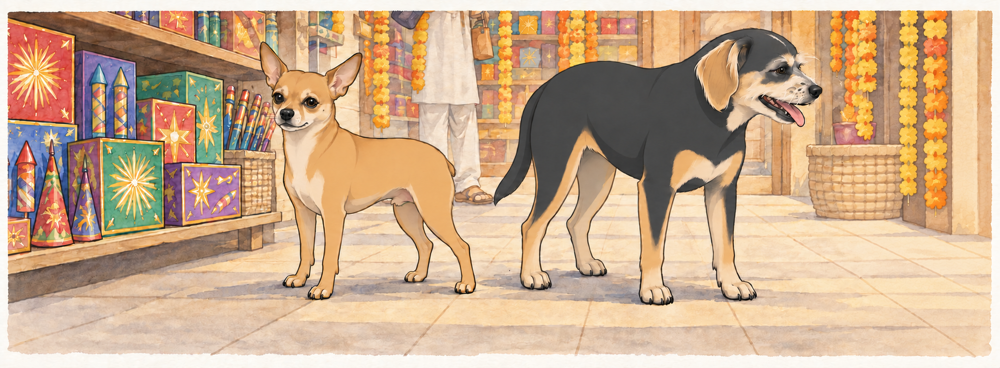
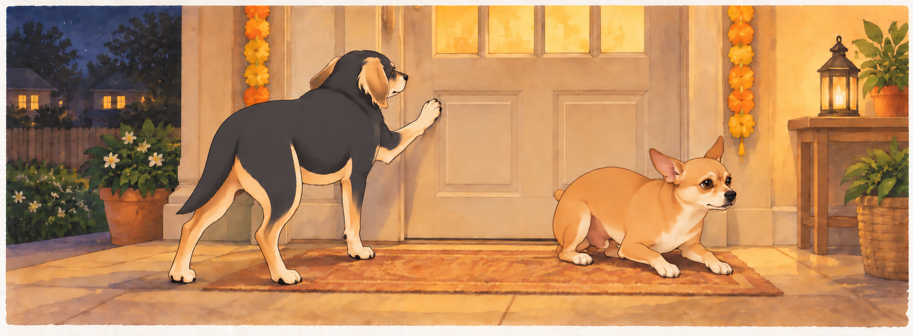
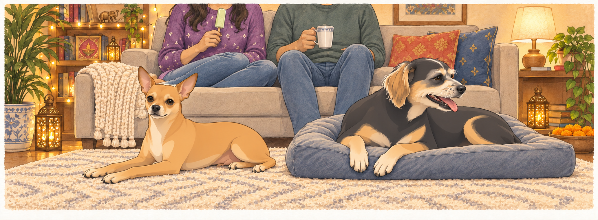

# The Festival of Lights

The morning of Diwali preparations dawned bright and full of promise. Neet conducted his usual pre-departure security sweep of the car with the gravity of a four-star general— or rather, a 4.9-star general, as Buddy liked to remind him.

"This tire has been compromised," Neet announced, sniffing the rear left wheel with deep suspicion.

"That's a leaf," Buddy observed from the driveway.

"A leaf that could be ANYTHING."

"It's a leaf."

"Your security standards are alarmingly lax."

Buddy picked up the leaf and dropped it beside the tire.

"Now it's beside the compromised tire," Neet said.

Buddy left it there. Shopping had already taken too long.

Sagar emerged from the house jingling the keys, and both dogs immediately abandoned the Great Tire Debate. "Alright, numbskulls. Diwali shopping. You're coming because apparently I can't be trusted alone in Costco."

Heather appeared behind him, practically glowing with excitement. She wore a bright purple sweater with tiny mirrors sewn into it that caught the morning light, creating little rainbows on the driveway. She bounced on her toes while Sagar sorted the car key from the house keys. Buddy moved closer, hoping that energy meant an early start.

"The sweet section," she said, her eyes lighting up. "Don't let me forget the kulfi."

"I will tie a string around my finger," Sagar said with that small smile that made Heather beam.

"Or we could just—"

"— make a list," Sagar finished. They said it at the same time, then laughed.

"That's unnerving," Neet whispered to Buddy as they loaded into the car.

"They do that."

"How do they DO that?"

"I stopped asking."

---

## The Costco Expedition

Costco on a Saturday morning was a sensory assault of epic proportions. Neet's nose went into overdrive the moment they entered, processing approximately seventeen thousand competing smells simultaneously.

"Buddy. BUDDY. Do you smell that?"

"I smell everything. There's too much. My nose is filing a complaint."

"That's rotisserie chicken. And also— WAIT. Is that—"

"Focus, lunatic. We're on a mission."

But Neet had already spotted the sweet section in the distance, where Sagar and Heather stood examining boxes with the concentration of scientists studying ancient artifacts.

"The assorted collection has penda and burfi," Heather read, turning the box over.

Sagar was already reaching for it. "Done."

"But maybe we should—"

"Get two boxes?" Sagar held up a second one, and Heather's laugh was pure delight.

"You know me too well, King."

The word was soft, almost lost in the ambient warehouse noise, but Buddy caught it. She said it without looking up from the second box. Buddy leaned toward the cart, checking whether anything had fallen.

Meanwhile, Neet had discovered the kulfi section and was vibrating so intensely he was practically levitating.

"Rose kulfi. Malai kulfi. PISTACHIO KULFI," he rattled off like a military commander reading weapon specifications. "Buddy, this is the motherlode. This is—"

"Frozen dessert you can't have," Buddy finished.

"Your negativity is noted and disregarded."

Heather picked up three boxes of kulfi— one of each flavor— and hugged them to her chest like precious treasure. "Pistachio is my favorite, but rose is so beautiful, and malai is classic, so really, all three is the only logical choice."

Sagar didn't even question it, just added them to the cart with the solemnity of a sacred ritual.

"See?" Neet said to Buddy. "She gets it. All three is logic."

"That's not what she said."

"That's exactly what she said."

Buddy sat beside the cart in his best, most deserving posture. Sagar nudged the cart forward.

Buddy moved six inches to remain directly beneath the kulfi.

"I thought we couldn't have it," Neet said.

"I'm available if circumstances change."

---

## The Indian Store Adventure

The Indian store was smaller, cozier, and smelled like incense and cardamom. Neet immediately went into General Mode, conducting a thorough perimeter sweep while Heather made a beeline for the decorations with the focus of a woman on a mission.

"Oh! Sagar, look!" She held up a string of marigold flowers, the orange and yellow blooms bright against her purple sweater. "And they have the glitter diyas!"

Sagar was examining LED candles, turning one over in his hands. These had glitter embedded in the wax— when Heather spotted them, she actually gasped.

"Those are perfect," she breathed, reaching for them. "They're so sparkly. Can we get—"

"All of them?" Sagar was already loading his arms.

"I was going to say six, but I like your thinking better."

Near the flower section, Buddy discovered something that made him pause. One of the marigold pots had two flowers growing from the same stem— intertwined, inseparable, perfectly balanced. He sniffed both blooms in turn, then sat beneath the shelf.

"That one," Sagar said quietly, appearing beside Buddy. He picked up the pot, showing Heather. She didn't say anything, just touched the flowers gently, then Sagar's hand. Buddy stayed by the pot until it went into their cart.

Neet, meanwhile, had found the fireworks section.

"Buddy. BUDDY. Come here. NOW."

Buddy trotted over to find Neet standing at attention before shelves of fireworks like a general surveying an armory.

"We need a tactical assessment," Neet said seriously. "Sparklers— good for perimeter illumination. Fountain cones— excellent for defensive positions. And THIS—" he sniffed at a box labeled 'Kothi Flower Pot,' "— this is clearly heavy artillery."

"They're fireworks, not weapons."

"Everything is a weapon if you're creative enough."

Sagar appeared, Heather beside him, both trying not to laugh at Neet's military stance. "Find something you like, General?"

Neet's tail wagged so hard it was a blur. "Sir, yes sir! I recommend the sparklers for aesthetic purposes and the fountain cones for maximum visual impact."

"And the Kothi?" Heather asked, her eyes dancing with amusement.

"Essential, ma'am. Absolutely essential."

Buddy looked back toward the marigold pot. His flower purchase was considerably quieter.

They loaded the cart while Neet supervised with the seriousness of a four-star general approving ammunition orders. Then Heather spotted the painted diyas— small clay lamps with glittering gold borders that caught the light like tiny treasures.

"Oh, these are beautiful," she murmured, picking one up with the care usually reserved for glass. The glitter on the border sparkled in her palm, and her whole face lit up with that childlike wonder that made her Heather.

"How many?" Sagar asked.

"Is twenty too many?"

"Twenty is perfect."

---

## Preparation Day

The afternoon found Heather in what Neet called "whirlwind mode"— cleaning with the kind of focused energy that made both dogs wisely relocate to the couch.

"She's got that look," Neet observed as Heather swept past them with the vacuum.

"The cleaning look?"

"The 'everything must be perfect' look."

"For festivals. She takes them seriously."

"Should we help?"

"How would we help, Neet?"

"Moral support? Enthusiastic tail wagging?"

Buddy pulled the loose end of his blanket onto the couch. Neet sat on it before he could finish.

Buddy pulled once more. Neet slid two inches without changing expression.

"Helping," Neet explained.

As if hearing them, Heather paused mid-vacuum to scratch both their heads. "Good boys. Stay out of trouble."

"We're ALWAYS out of trouble," Neet protested, but she'd already moved on, humming something that might have been a prayer or might have been a Bollywood song— with Heather, it could go either way.

By evening, the house gleamed. Sagar and Heather worked together to hang the toran— the decorative door hanging— above the entrance. He held the ladder steady while she draped the mango leaves and marigolds, their movements synchronized without discussion.

"Left side needs—"

"Got it," Sagar said, already adjusting before she finished.

"How do they DO that?" Neet asked again.

"Magic," Buddy replied. "Or they share a brain. I haven't decided which."

The LED candles came out next, each one positioned with care throughout the house. When Sagar plugged them in, the glitter inside caught the light, creating tiny sparkles that made Heather clap her hands with pure joy.

"It's perfect," she said softly. "It's absolutely perfect."

The painted diyas came next, filled with oil and little cotton wicks. As twilight settled over the neighborhood, Sagar lit them one by one while Heather watched, her eyes reflecting the growing light. The two-flower marigold pot sat on the porch, where Buddy stopped to sniff it again.

The house glowed. Every surface sparkled with light and color— the vibrant reds and oranges and golds of Diwali, the glitter catching and throwing rainbow reflections everywhere. Even Neet, not typically prone to philosophical observations, felt something shift in the air.

"It looks like happiness," Buddy said quietly.

"It looks like home," Neet agreed. "But brighter."

Heather knelt between them, wrapping an arm around each dog. "The festival of lights," she said. "Light defeating darkness. Goodness winning. New beginnings."

Sagar watched the three of them, framed by candlelight and glitter, and smiled that quiet smile that meant everything.

---

## Fireworks Festivities

As darkness settled completely, they moved to the backyard with the fireworks. Neet was practically vibrating with anticipation.

"This is it, Buddy. This is what I've been training for."

"You haven't trained for anything. You've napped for eighteen hours a day."

"Tactical rest. Very important."

Sagar set up the sparklers first, lighting one for Heather. She waved it through the air, creating spirals of light, laughing as sparks trailed behind like fairy dust. The light reflected off her mirror-studded sweater, creating a small galaxy around her.

"You look magical," Sagar said. Buddy watched the sparks reflected in her sweater, then chose a spot nearer the back door.

The fountain cones were next, shooting colorful sparks upward in cascading waves. Neet watched with the intensity of a general observing a successful mission, occasionally providing tactical commentary that no one requested.

"Excellent dispersal pattern. Nice color saturation. I'd give that a solid 8 out of 10."

"Thank you, General," Sagar said, absolutely deadpan.

Then came the Kothi flower pot.

Sagar set it up carefully, lit it, and stepped back. For the first few seconds, it was beautiful— gentle sparks rising in a perfect fountain, creating a flower-like pattern that made Heather gasp with delight.

Then the crackers inside activated.

POP! CRACK! BANG! BANG! BANG!

The gentle flower pot transformed into a percussion section, sharp cracks echoing through the quiet neighborhood like gunfire.

Neet hit the ground like a soldier under fire. "WE'RE UNDER ATTACK!"

"It's the firework, lunatic!"

"I KNOW IT'S THE FIREWORK! THAT DOESN'T MAKE IT LESS LOUD!"

Heather had her hands over her ears, eyes wide. "Is it supposed to do that?!"

Sagar was already moving toward the house. "I'll get water—"

"No, let it finish!" Heather grabbed his arm, but she was laughing now, that slightly unhinged laugh of someone caught between panic and hilarity. "The neighbors are definitely calling the police!"

CRACK! POP! BANG!

Buddy had plastered himself against the back door, all dignity abandoned. "This is how we die. Killed by a flower pot. The irony is not lost on me."

He tried the door with one paw. Closed. He tried the same door with the other paw, in case it respected seniority.

Neet, recovered from his initial shock, had switched to attack mode. "SHOW YOURSELF, FLOWER POT! FIGHT ME LIKE A—"

BANG!

"— OKAY, I RESPECT YOUR AUTHORITY!"

Finally— FINALLY— the Kothi flower pot sputtered, sparked one last defiant time, and went quiet. The silence that followed felt almost holy.

For three heartbeats, nobody moved.

Then Heather started giggling. Not her usual laugh, but the helpless kind that comes after holding your breath too long. Sagar started chuckling, which made Heather laugh harder, which made Sagar actually laugh, which set off a chain reaction that ended with all four of them in various states of laughter-induced collapse.

"That was—" Heather gasped.

"Terrifying," Sagar finished.

"I loved it," she wheezed, and somehow that made it even funnier.

Neet, still slightly shell-shocked, looked at Buddy. "Did we survive?"

"Barely."

Buddy waited for the door to open before asking, "Next year, can I choose the flower pot?"

"Was it worth it?" Neet asked.

They looked at Sagar and Heather, still laughing on the porch steps, the house glowing with candlelight behind them, the smell of sparklers and incense and festival sweets drifting through the air.

"Yeah," Buddy said softly. "Yeah, it was."

---

## The Quiet After

Later, after they'd relocated to the living room— safely away from any remaining fireworks— they settled into their usual configuration. Sagar and Heather on the couch, Neet sprawled across the rug, Buddy occupying his favorite cushion where he could see everyone.

Heather had the kulfi, working her way through a pistachio one with the slow reverence of someone savoring something precious. Sagar sat beside her with his chai, and they didn't need to talk. The silence between them was comfortable, full, complete.

The house sparkled with a thousand tiny lights. The sweet smell of festival food lingered in the air. Everything felt warm and safe and exactly right.

"You know what Diwali celebrates?" Neet asked suddenly.

"Light over darkness," Buddy replied.

"Victory of good."

"New beginnings."

"All of that," Neet agreed. "But also... this. Being together. Being home."

From the couch, Heather reached down to scratch Neet's ears. Buddy moved his chin onto her knee for his turn. Her fingers found the spots that made both dogs melt, that magic touch that said you're loved, you're safe, you're ours.

"Best Diwali ever," she murmured.

"Best Diwali ever," Sagar agreed.

And there, surrounded by light and laughter and the quiet joy of being exactly where they belonged, two dogs and two humans celebrated the eternal victory of light over darkness— though if you'd asked them, they'd have said the real victory was getting through the Kothi incident without the neighbors calling the cops.

Buddy glanced toward the porch, where his own flower pot had completed an entire evening without a single explosion.

Small wins, Neet thought, already halfway to sleep. Small wins.

Outside, the glitter diyas flickered on the porch, their light steady and warm. The two-flower marigold swayed gently in the evening breeze, two blooms from one stem, inseparable and perfect.

Just like home.

---

**THE END**

## Provenance and editorial notes

Working selection dated October 3, 2026. Selection and shelf order are editorial; owner approval and event chronology remain unverified.

Original numbering: independent captured sequence Chapter 35.

Archive recovery: use [Studio recovery guidance](../Studio/Recovery.md). The paths below are paths **inside the verified snapshot**, not active navigation. SHA-256 pins identify the exact sources.

- `story-the-festival-of-lights` — `02_Story_Library/Standalone_Stories/the-festival-of-lights.md`; SHA-256 `1d949ba90d8301f8176373db3a3c467972fec5cb705883646222aa4c20e34546`.
- `elevenlabs-studio-GGHfzyD7WAjcmlgPvwg1` — `90_Archive/2026-10-03-elevenlabs-recovery/Raw_Exports/studio-GGHfzyD7WAjcmlgPvwg1.txt`; SHA-256 `ee1b097c807e2760468b1cd52cf4e00013fa7435860710192fefe81c004686ea`.

## Refinement record

Refined October 3, 2026; [episode record](../Productions/E069-the-festival-of-lights/episode.json) documents the reading comparison and illustration work. The pre-refinement text is preserved in the [dated recovery snapshot](/Users/sagar/Documents/ChatGPT/NBC_Archives/NBC-before-refinement-2026-10-03_200659.tar.gz) at `NBC/Stories/S069-the-festival-of-lights.md`. Historical provenance above remains unchanged.
