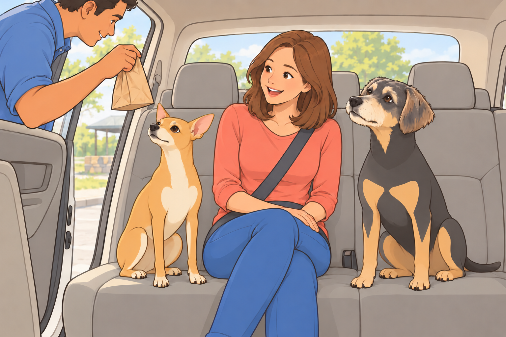
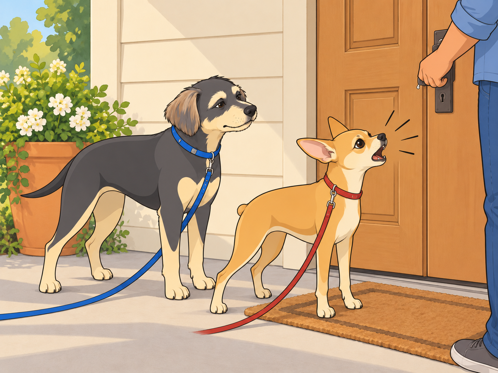
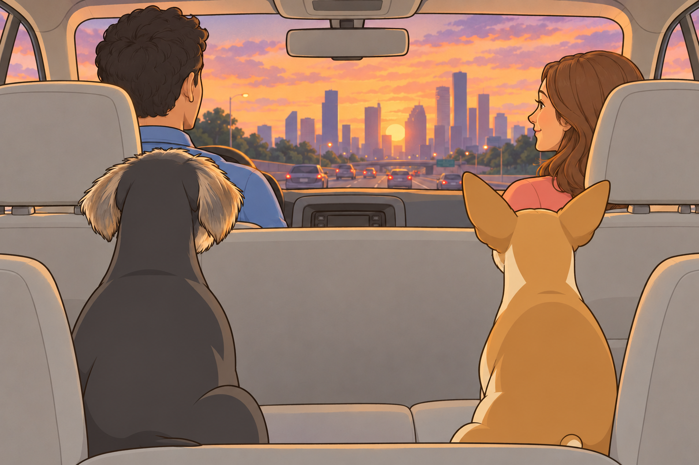
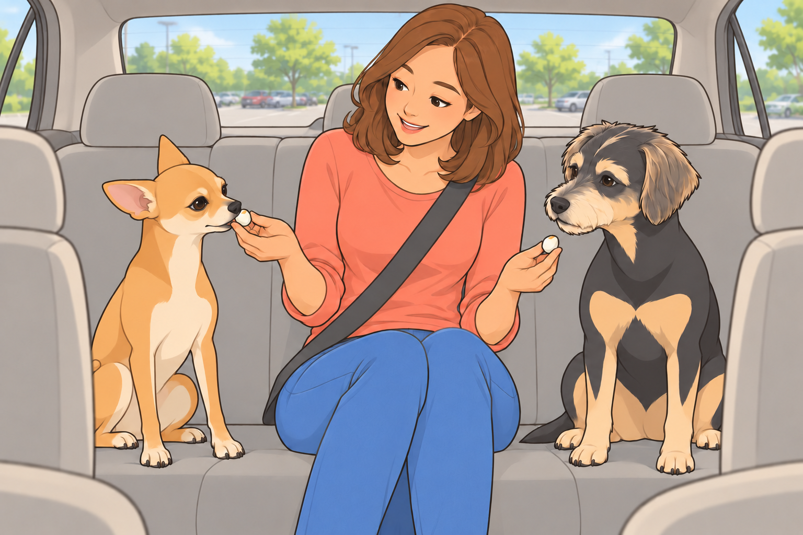
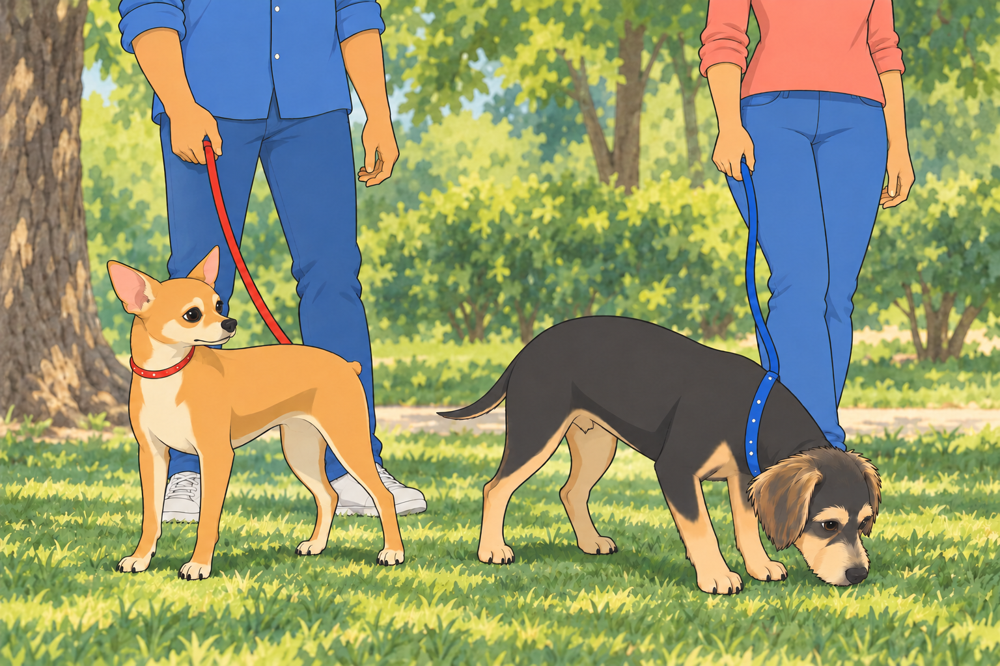
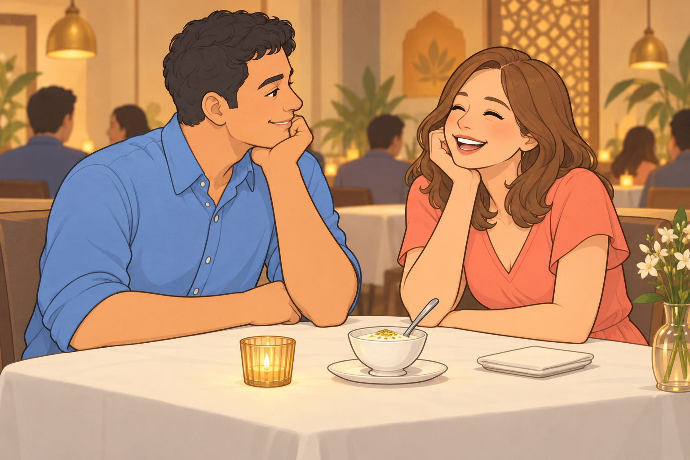

# The Great Houston Expedition

The morning sun painted Austin in shades of gold as Sagar loaded the last bag into the car. Neet conducted his pre-departure inspection with the seriousness of a tiny general, circling the vehicle three times before declaring it roadworthy with a single decisive bark.

"You check the same tires every time," Buddy observed from his spot in the shade.

"Security is no joke, Buddy."

"You're sniffing for squirrels."

"Security squirrels are the most dangerous kind."

Heather emerged from the house with the treat bag, and both dogs abandoned all pretense of dignity. Buddy’s tail swept the doorframe. Neet bounced once on his front paws.

"Easy, you ragamuffins," she laughed, scratching both heads simultaneously— a talent that never ceased to amaze Buddy. How did she know exactly where to scratch? It was uncanny.

Sagar opened the back door. "Alright, idiots. Load up."

Neet bounded in with his characteristic lack of grace, overshooting his target and sliding across the seat into Buddy, who had entered with infinitely more dignity.

"Personal space, lunatic."

"That's just my enthusiasm."

"That's your entire body weight on my paw."

Buddy withdrew the paw. Neet slid another inch.

"Your enthusiasm needs brakes."

---

## The Road to Buc-ee's

The highway stretched endlessly, and Heather settled between the dogs in the back seat while Sagar drove. This was Buddy's favorite configuration— Heather's hand absently stroking his ears while the world blurred past, the gentle rumble of the road beneath them creating a peaceful rhythm.

Neet, predictably, had other ideas about how to spend travel time.

"I see a red car," he announced.

"Congratulations."

"Now I see a blue truck."

"This is riveting."

"OH! A motorcycle! Buddy, did you see the—"

"I saw it, Neet."

Buddy closed his eyes. If he could sleep through a vacuum cleaner, he could sleep through a traffic report.

"White van."

Apparently he could not.

Fifteen minutes of this passed before Neet's entire demeanor changed. His nose shot up, nostrils flaring like he'd caught wind of something biblical.

"What's wrong with him?" Heather asked, amused.

"He's having a moment," Buddy said, though of course she couldn't understand him.

"Buddy." Neet's voice had gone reverent. "Do you smell that?"

"I smell highway and the treat bag you've been staring at for twenty minutes."

"No. THAT." Neet pressed his nose to the window hard enough to leave a smear. "It's Buc-ee's."

Now Buddy perked up. Even he wasn't immune to the legend of Buc-ee's— that cathedral of excess where the bathrooms sparkled and the snack selection could make a grown dog weep.

Sagar took the exit, and the massive beaver mascot rose before them like a benevolent god welcoming faithful pilgrims.

"Charging stop," Sagar announced. "Fifteen minutes."

Fifteen minutes at Buc-ee's was like fifteen minutes in a parallel dimension where everything smelled incredible and the humans inexplicably needed to examine every possible variety of beef jerky.

The car parked, Sagar and Heather took the dogs for a quick walk around the grounds. Neet marked his territory on seventeen different spots (Buddy counted) while maintaining a running commentary about the strategic importance of each location.

"This trash can has hosted at least three other dogs today."

"How do you know?"

"Layers, Buddy. It's all about the layers."

When they returned to the car, Sagar carried a small bag that smelled like paradise.

"Did you really buy beef jerky?" Heather asked.

"It's for later."

"For the boys or for you?"

"Yes."

Buddy sat up very straight. He would demonstrate that one passenger could wait sensibly. When Sagar moved the bag from one hand to the other, Buddy’s whole head followed it. Sagar tried the movement once more. Same result.

"Excellent tracking," Sagar said.

In the back seat, Neet vibrated with anticipation. "He bought beef jerky. Buddy, he bought beef jerky. This is the best day of my life."

"You said that yesterday about the cheese."

"I was wrong then. I'm right now."

---

## The Temple and the Lassi

An hour later, Houston's skyline emerged from the heat shimmer. The BAPS temple appeared like something from another world— pristine white marble gleaming under the Texas sun.

Sagar parked with the car’s climate control running. "We’ll take turns, boys." Heather stayed with the dogs while he went in; when he returned, she took her turn.

Buddy watched each of them walk toward the temple entrance. Their steps had slowed after the bustle of the drive. When Heather came back, her hand brushed Sagar’s arm as he passed her the bags.

"They look fancy," Neet observed.

"It's a temple. They're being respectful."

"By walking slowly?"

"By being present."

"You're getting philosophical again."

"One of us has to think."

Between their visits, they had collected containers that smelled like actual magic and two cold drinks.

"Gujarati thali," Heather said, settling back between the dogs. "And look— rose and pistachio lassi!"

Buddy lifted his nose toward the containers. Heather shifted them to her other hand.

"You remembered," she said, and Sagar's quiet "always" carried more weight than a thousand grand speeches ever could.

In the back seat, Neet sniffed the air. "That lassi smells pink."

"How can something smell pink?"

"I don't know, but it does."

---

## The Bark Contest

The Airbnb was charming, tucked in a quiet neighborhood with trees and a neat little porch. Sagar had just inserted the key when both dogs heard it.

*Woof.*

Neet's ears shot up so fast Buddy heard them whoosh.

*Woof. Woof.*

"Oh, it's ON," Neet declared, his chest puffing up to twice its normal size— which, given his chihuahua roots, wasn't saying much, but he committed fully to the effort.

"Maybe we should be diplom—" Buddy started.

"WOOF! WOOF WOOF WOOF!"

And just like that, they were engaged in the ancient canine tradition of the Bark Contest— that timeless battle conducted through doors and walls, signifying everything and absolutely nothing.

"WOOF WOOF WOOF!" Neet proclaimed. *This is MY family and MY temporary lodging and MY side of this door!*

"WOOF WOOF!" came the response. *Yeah well this is MY side!*

"WOOF!"

"WOOF!"

This continued for approximately forty-five seconds before Sagar said, calmly, "Neet. Stand down."

But Neet was on a roll. "WOOF WOOF—"

"Neet."

"But Sagar—"

"You're barking at a door, lunatic," Buddy said. "You've established dominance over wood."

"It's the PRINCIPLE."

Buddy tried one low, conciliatory woof. The dog inside answered. Neet looked delighted.

"Reinforcements!"

Buddy shut his mouth. His peace talks had lasted one syllable.

The barking from the other side had devolved into confused woofs, as if the other dog was wondering why they were still doing this and if maybe they could be friends instead.

Heather knelt down, and both dogs immediately quieted. "Come on, numbskulls. Save your energy for the actual park."

Neet grumbled but conceded. "I totally won though."

"Undefeated champion," Buddy agreed, because some battles weren't worth fighting.

---

## The Park That Wasn't

Evening arrived in shades of orange and purple as they headed out to find the park. Sagar drove while Heather navigated from her phone.

"Turn left at the light," she said.

"This light?"

"No, the next— wait, yes, this one. I think."

Ten minutes later, they'd circled the same block three times.

"The park should be right here," Heather said, less certain than before.

"We've passed that gas station four times," Neet whispered.

"I'm aware," Buddy replied.

"Should we tell them?"

"How, exactly?"

"Meaningful barking?"

Buddy had stood up at the first sight of grass. By the third pass he stayed seated and watched the same empty bench go by.

"I’ve chosen where to sit," he said. "Apparently we’re viewing it by appointment."

Another fifteen minutes of circling revealed the park's greatest defense: absolutely zero available parking. Cars filled every spot, double-parked, and possibly stacked on top of each other.

"I'm sorry," Heather said. "I thought this would be nice for everyone."

Sagar took her hand for just a moment— quick, easy, the kind of gesture that spoke of years of understanding. "Look."

They'd climbed onto an overpass, and there before them, Houston's skyline blazed against the darkening sky. Glass towers caught the last rays of sun, creating a light show that took Buddy's breath away.

"Oh," Heather breathed.

They rode in comfortable silence across the overpass, all four of them watching the city glow. No one needed to say anything. The moment was enough.

"Home's still better," Neet added eventually.

"Home's always better," Heather agreed, reaching back to scratch his ears. "But this is pretty good too."

---

## The Wrong-Way Incident

"I'll drive back," Heather offered. "You've been driving all day, King."

They switched seats, Sagar adjusting everything for her before moving to the passenger side. The first few minutes went smoothly. Then came the turn.

"Wait," Sagar said, his voice carefully level. "Heather—"

"What?"

Then she saw them: headlights. Coming straight at them. Multiple pairs.

"Oh no. OH NO. I'm going the wrong way!"

In the back seat, Neet went rigid. "Buddy, this is how we die."

"Not today."

"HEATHER—" Sagar started.

But Heather's hands were already moving. She yanked the wheel right, bumped over a curb into a parking lot entrance, and executed a turn that would have impressed a stunt driver, emerging back onto the street in the correct direction.

For three heartbeats, nobody breathed.

Then Sagar started laughing. "That was... actually brilliant."

Heather's face had gone scarlet. "I can't believe I—"

"Quick thinking, Queen. Most people would have frozen."

"I almost killed us!"

"You fixed it. Let’s stop here a minute." Once she had parked, his hand found hers. "My quick-thinking queen."

Buddy watched as Heather's embarrassment slowly transformed into a reluctant smile, then actual laughter.

"Your FACE though—"

"I thought you were aiming for the lake!"

"What lake?!"

"I don't know, you seemed determined!"

In the back seat, Neet's tail started wagging again. "We survived."

"Barely."

"That was actually kind of exciting."

"You thought we were going to die."

"I've evolved past that position."

Buddy looked down. Neet was still pressed firmly against his side.

"Then you can evolve back onto your own half of the seat."

"In a minute."

---

## Starbucks and Egg Bite Philosophy

The next morning, they stopped at Starbucks for breakfast. Sagar ordered coffees and egg bites, and the smell of eggs and cheese filled the car like olfactory heaven.

Heather broke off pieces for the dogs with the solemnity of a sacred ritual. Neet consumed his first bite in approximately .003 seconds.

"Buddy. BUDDY. This is a religious experience."

"It's eggs."

"It's PHILOSOPHY wrapped in protein."

"You said that about the beef jerky yesterday."

"I contain multitudes, Buddy. These egg bites understand me on a molecular level."

Buddy accepted his piece with more dignity, letting the flavor settle. It was, admittedly, exceptional. "These are very good."

He intended to make his piece last. His mouth made a separate decision.

"VERY GOOD? Buddy, these transcend mere goodness. These egg bites have seen the face of the divine and—"

"Neet."

"I'm just saying, if I could only eat one thing—"

"You'd starve because you'd change your mind in ten minutes."

Heather laughed, breaking off another piece for each of them. Neet took his gently, without catching her fingers.

Buddy waited until she turned to him, then did the same.

---

## The Small Park and the Journey Home

Before heading back, they found a smaller park— just a quiet green space with some trees. Nothing special, but as they walked together, Buddy thought it might be perfect anyway.

Neet investigated a tree with intense focus. "Seventeen different dogs have been here."

"You can't possibly know that."

"Seventeen. I counted the layers."

Buddy led Heather toward a patch of shade and took his time over its smells. At last, a park they could actually use. Sagar and Heather’s restaurant dinner the night before had yielded a container of paneer that Neet called “transcendent.” The egg bites had improved on that. Buddy, for the moment, was satisfied with grass.

Neet finished his report and turned to lead the way. Buddy remained over one small patch.

"We’ve inspected that."

"You’ve counted it. I haven’t smelled it."

Heather let the leash slacken. Buddy took another luxurious breath. At last, someone understood the itinerary.

"You know what's funny?" Neet said. "All this adventure, and I keep thinking about home."

"Me too."

"Our yard. Our bed. Our spot on the couch."

"The way the afternoon light hits the kitchen floor."

"The sound of Sagar making coffee in the morning."

"Heather singing when she thinks no one's listening."

They completed their loop and loaded back into the car. As they pulled onto the highway toward Austin, Heather dozed between them, and Neet surrendered to a nap against the window.

But Buddy stayed awake, watching the road unspool behind them. Sagar glanced back in the mirror. Buddy met his eyes, then rested his chin beside Heather’s hand. Familiar countryside was beginning to appear.

When they finally pulled into their driveway, the sun was setting, painting their house in golden light. It looked exactly the same as when they'd left— and somehow more beautiful for having been missed.

"Home," Heather said softly.

"Home," Sagar agreed.

Neet jerked awake. "We're back! Buddy, we're—"

"I can see that."

They tumbled out and immediately inspected the yard. Everything was exactly as they'd left it. The grass still smelled right. The fence still stood guard. Their kingdom remained intact.

Inside, the dogs claimed their favorite spots— Neet on the rug by the door where he could monitor all comings and goings, Buddy on the couch where he could see everyone. Sagar came toward the couch while Heather made tea, and Neet trotted over to complete their circle.

Buddy moved just enough to make room for Sagar on the couch. He could see Heather making tea and Neet approaching across the rug. After a day of looking through car windows, he could stop keeping track.

"Best trip ever," Neet mumbled, already half-asleep.

"Best trip ever," Buddy agreed.

Outside, the Texas evening settled over Austin like a blanket. Inside, a family of four— two humans and two dogs— rested in the perfect comfort of being exactly where they belonged.

Home. With each other. Where all the best stories ended.

---

**THE END**

## Meaningful alternative

### Houston extended draft with Musafer dinner — complete alternative

Expanded dinner, return and human relationship/spiritual material. Its chronology and approval remain unknown.

Read the complete alternative

The morning sun painted Austin in shades of gold as Sagar loaded the last of the bags into the car. Neet stood at attention by the trunk, supervising with the gravity of a general inspecting troops before battle.

"That's the treat bag," Neet observed to Buddy, who sat nearby with his tail swishing contentedly across the driveway. "Third most important item, after us."

"What's second?" Buddy asked.

"Water bowl, obviously."

Buddy counted the proposed order again. "We’re two dogs."

"Joint first."

"Of course."

Heather emerged from the house carrying a small cooler, and both dogs immediately straightened, tails accelerating to helicopter speeds. She smiled at them with that gentle warmth that made everything feel right in the world. "Ready for an adventure, my sweet boys?"

Neet would have answered, but Sagar appeared beside her with the keys. Buddy stood before Neet did, determined to get his usual seat before the general occupied all of it.

"Houston awaits," Sagar announced, opening the back door with a flourish. "Your chariot, noble hounds."

### The Journey Begins

The highway stretched before them like a ribbon through Texas, and Neet pressed his nose to the window, watching the landscape blur past. Heather sat between him and Buddy in the back seat, one hand absently stroking Neet's ears while the other rested on Buddy's head. The rhythm of Sagar's steady driving from the front seat created a peaceful cadence that made Buddy drowsy.

"I smell something," Neet announced suddenly, his nose twitching with such violence it made his whole face wiggle.

"You always smell something," Buddy replied without opening his eyes.

"No, this is important smelling. This is... this is..." Neet's eyes went wide. "Buddy. BUDDY. It's Buc-ee's."

Now Buddy's eyes opened. "The legendary Buc-ee's?"

"The very same."

Both dogs had heard tales of Buc-ee's— that magnificent temple of Texas excess where the bathrooms were cleaner than most houses and the snack selection could make a dog weep with joy. As Sagar took the exit, the giant beaver mascot loomed into view like a benevolent deity welcoming pilgrims.

"We're stopping to charge the car," Sagar explained, catching Neet's vibrating excitement in the rearview mirror. "Fifteen minutes."

Fifteen minutes at Buc-ee's was like fifteen minutes in heaven, except heaven probably had less beef jerky.

While the car charged, Sagar and Heather took the dogs for a quick walk around the grounds. Neet executed what he considered an extremely thorough perimeter check, which mostly involved sniffing every single trash can (seventeen in total, he counted) while Buddy trotted alongside Heather, content to simply be near her.

"Do you think they have a squirrel section?" Neet asked hopefully.

"Why would a gas station have a squirrel section?"

"They have everything else."

Buddy steered toward a patch of shade. Neet returned to the last trash can. Buddy waited, one paw already pointing toward the shade, while Neet checked whether the last dog had left an address.

When they returned to the car, Sagar carried a small bag. Both dogs' noses went into overdrive.

"Beef jerky?" Neet whispered.

"I think so," Buddy confirmed, his tail betraying his calm demeanor.

"Just a small snack for later," Sagar said.

Buddy sat very straight to show that he understood waiting. His eyes followed the bag down, up, and into Sagar’s other hand. Heather watched him, then moved the cooler. Buddy did not blink.

"No fooling that one," she said.

### The Temple Stop

An hour later, the Houston skyline began to rise in the distance like a kingdom emerging from the plains. Buddy felt Heather's energy shift— she sat up straighter, her hand moving to gently squeeze Sagar's shoulder from behind.

"Almost there," she said softly, and something in her voice carried that particular note of reverence that made Buddy think of sacred things.

When they pulled into the BAPS temple parking lot, even Neet fell silent. The building rose before them in pristine white marble, so beautiful it seemed to shimmer in the afternoon sun.

"Magnificent," Heather breathed, and Buddy heard in that single word her soul speaking.

"We’ll take turns," Sagar said. The climate control stayed on; Heather remained with the dogs during his visit, then Sagar stayed during hers.

Neet watched each human take the path toward the temple entrance. "Why do they look different?" he asked.

Buddy understood what he meant. There was something about the way they moved— Heather's steps measured and graceful, Sagar's bearing somehow even more regal than usual. "Sacred ground," Buddy said simply. "They're honoring it."

"With their walking?"

"With everything."

Twenty minutes later, both visits complete, the humans opened containers that smelled like heaven had opened a restaurant. Both dogs leaned toward the bags.

"Gujarati thali," Heather announced, settling back into her seat. "And look what your king found— rose and pistachio lassi!"

Sagar passed her the drink. Buddy checked her other hand for anything that might be his.

"That lassi smells pink," Neet observed.

"How can something smell pink?"

"I don't know, but it does. Pink and... fancy."

Heather took a sip and actually sighed with happiness. "This is perfect. You always know exactly what I love."

From the driver's seat, Sagar's quiet "Always" carried the weight of a promise that Buddy felt certain extended far beyond lassi.

### The Airbnb Incident

The Airbnb was a charming little place in a quiet neighborhood, and Sagar had just inserted the key when both Neet and Buddy heard it.

Woof.

It came from inside, muffled but unmistakable.

Neet's ears shot up so fast Buddy heard them whoosh. "Did you hear—"

Woof. Woof.

"Oh, it's ON," Neet declared, his chest puffing up.

"Maybe we should be diplomatic—" Buddy started, but Neet was already launching into full defense mode.

"WOOF! WOOF WOOF WOOF!"

The dog on the other side responded in kind, and suddenly they were engaged in the ancient canine tradition of the Bark Contest— that timeless battle of wills conducted through doors and walls, signifying everything and nothing.

"WOOF WOOF WOOF!" Neet proclaimed. This is MY family and MY Airbnb and MY side of this door!

"WOOF WOOF!" came the response. Yeah? Well this is MY side of the door!

"Neet," Sagar said calmly, though Buddy detected the slightest hint of amusement in his voice. "Stand down, warrior."

"But Sagar—"

"Buddy, can you talk some sense into your brother?"

Buddy sighed. "Neet, you're barking at a door. You've established dominance over... wood."

"It's the principle, Buddy."

The barking from the other side had devolved into slightly confused woofs, as if the other dog was wondering why they were still doing this.

Heather knelt down, and both dogs immediately quieted, drawn by the gentle authority she wielded as naturally as breathing. "Sweet Neet," she said, stroking his head, "let’s get your blanket inside. You can inspect the door afterward."

Neet glanced at the blanket, then back at the door. Buddy had already chosen the blanket. He stood close enough for his nose to touch its folded edge.

"You’re abandoning the perimeter."

"I’m securing the soft part."

"Fine," he grumbled. "But I won the contest."

"Undefeated champion," Buddy agreed, because some things were more important than being right.

### The Park That Wasn't

Evening painted Houston in purple and orange as they set out for the park. Sagar drove while Heather navigated from her phone, and the dogs lounged in the back seat, contentedly tired from the day's adventures.

"Take the next left," Heather instructed.

"Left here?"

"Yes— wait, no. Right. I mean right. The turn is left but I meant... turn right?"

Buddy and Neet exchanged glances. This sounded suspiciously like the beginning of one of those human moments.

Fifteen minutes later, they were still driving.

"The park is definitely close," Heather said with less certainty than before.

"We've passed that gas station three times," Neet whispered to Buddy.

"I'm aware."

"Should we tell them?"

"How would we tell them, Neet?"

"Excessive meaningful barking?"

Buddy stopped rising whenever he saw grass. On the next circuit he watched the same bench pass the window and gave it a small, disappointed nod.

"Lovely bench," he said. "I feel we’re getting to know it."

Another fifteen minutes crawled by. The park, it seemed, existed in some quantum state— simultaneously close and impossibly far, protected by the ancient magic of No Available Parking.

"Every spot is taken," Sagar observed as they circled the park for the fourth time. "It's like the whole city had the same idea."

"I'm sorry," Heather said, and Buddy heard genuine distress in her voice. "I thought this would be nice for the boys."

From the front seat, Sagar reached over and took her hand. "It is nice. Look."

He gestured at the windshield, and they all fell silent. They'd climbed up onto a highway overpass, and there before them, the Houston skyline blazed against the darkening sky— towers of glass and steel catching the last rays of the sun, creating a tapestry of light that took Buddy's breath away.

"Oh," Heather whispered.

"Sometimes the journey is the destination," Sagar said quietly, and Buddy felt the truth of it settle over them all like a blessing.

Neet pressed his nose to the window. "It's beautiful," he said, and for once, there was no joke, no commentary— just honest wonder.

For the minutes it took to cross the overpass, the four of them watched the city glow beyond the windows.

"Home is still better," Neet added eventually, because he was still Neet.

"Home is always better," Heather agreed, scratching behind his ears. "But this is pretty good too."

### The Wrong-Way Incident

"I can drive back," Heather offered as they returned to street level. "You've been driving all day."

Sagar pulled over and they switched seats. Buddy waited through the seat and mirror adjustments. When Sagar kissed Heather’s temple and finally closed the passenger door, Buddy settled against Neet.

The first few minutes went smoothly. Heather was a good driver— careful and attentive. Then came the turn.

"Wait," Sagar said, his voice carefully controlled. "Heather—"

"What?" she asked, and then she saw them: headlights. Coming straight at them. Multiple pairs.

"Oh no. Oh NO. This is one-way! I'm going the wrong way on a one-way!"

In the back seat, Neet went rigid. "Buddy, are we going to die?"

"Not today," Buddy said with more confidence than he felt.

"HEATHER," Sagar said, louder now.

But something remarkable happened. Heather didn't freeze. Didn't panic. Her hands tightened on the wheel and Buddy saw her eyes flash with quick intelligence— the same sharpness he'd seen in her when she solved puzzles or remembered things everyone else forgot.

She yanked the wheel right, bumped over a curb into a parking lot entrance, and executed a turn that would have made a stunt driver proud, emerging back onto the correct side of the street in the correct direction.

For three heartbeats, nobody breathed.

Then Sagar started laughing. Not cruel laughter, but the kind born of pure relief and astonishment. "That was... Heather, that was actually amazing."

Heather's face had gone crimson. "I can't believe I— I'm so—"

"You just executed an emergency maneuver that most people couldn't pull off," Sagar continued, his voice warm with admiration. "You saw the problem, you fixed it, and you got us out. You were brilliant."

"I almost killed us all!"

"You got us out. Pull over here and take a breath." When she had parked, he added, “My quick-thinking queen.”

Buddy watched as Heather's embarrassment slowly transformed into something else— a reluctant smile, then a small laugh, then actual giggles.

"Your FACE," she gasped, laughter bubbling up. "You said 'HEATHER' like I was about to drive us into a lake!"

"I thought you might!"

In the back seat, Neet's tail started wagging again. "We survived," he announced.

"Thanks to Heather," Buddy added, because it was true.

"Okay, yes, but can we talk about how I WON that bark contest earlier? Because I feel like in all the chaos—"

"Neet."

"I'm just saying, it was a clear victory—"

By the time they pulled back into the Airbnb, they were all laughing, the panic transformed into one more story in the grand tapestry of their adventures together.

### Musafer

Later that evening, after the dogs were settled in the Airbnb with water and treats and promises of return, Sagar took Heather to dinner.

Neet watched from the window as they walked to the car. "She looks beautiful," he observed.

"She always does," Buddy replied.

"No, I mean... extra beautiful. Like when they take pictures beautiful."

Heather wore a dress the color of sunset. Sagar waited while she straightened its hem; Buddy watched their shadows move toward the car.

"Do you think he tells her?" Neet asked quietly.

"Tells her what?"

"How he feels. How much..."

"I think," Buddy said slowly, "that she knows. The way we know when it's time for dinner, or when a storm is coming. Some things you don't need words for."

The restaurant was called Musafer, which meant traveler, and from the moment they stepped inside, Heather felt transported. The ambiance wrapped around them like a beautiful story, and when Sagar pulled out her chair, his hand lingered on her shoulder— a touch that said you belong here, with me, always.

The paneer rizzala arrived first, rich and aromatic, and Heather watched Sagar's face as he tasted it.

"Good?" she asked.

"Exceptional. Try this." He lifted his fork to her lips, and she accepted the offering, the intimacy of the gesture making her heart flutter even after all this time.

The dal muradabadi came next, and they shared it in comfortable silence, trading tastes and smiles. Then came the mishti doi— that beautiful Bengali dessert that looked almost too pretty to eat.

"Like you," Sagar said, and she laughed.

"That's the worst line you've ever used."

Sagar considered the dessert. "I had fifteen minutes at Buc-ee’s to prepare."

"And you spent them on jerky."

"Time well spent."

"But did it work?"

She reached across the table and took his hand. "Against my better judgment."

His thumb traced circles on her palm. "Today was perfect," he said. "Wrong-way streets and all."

"I'm still mortified."

"Don't be. You were magnificent. You're always magnificent."

Heather felt tears prick her eyes, the good kind. "I don't know what I did to deserve you."

"Existed," he said simply. "That's all you ever had to do."

Heather kept her hand in his while they finished the mishti doi. Outside, they would have to negotiate Houston’s streets again. Here, for a while, neither had to navigate.

### Morning Coffee and Egg Bite Philosophy

The next morning dawned bright and promising. Starbucks beckoned with the siren song of caffeine and breakfast.

"Two coffees and four egg bites, please," Sagar ordered.

Neet's ears perked up from the back seat. "Did he say egg bites?"

"He definitely said egg bites," Buddy confirmed, tail starting its anticipatory wag.

When Sagar returned with the bag, the smell of egg and cheese filled the car like olfactory heaven.

"For the boys," Heather said, breaking off pieces and offering them with the solemnity of a sacred ritual.

Neet consumed his first bite in .003 seconds. "Buddy. BUDDY. This is the best thing I've ever eaten."

"You said that about the beef jerky yesterday."

"I was wrong then. I'm right now."

"You say this about everything."

"Because I MEAN IT every time!" Neet protested, accepting another piece from Heather's gentle fingers. "These egg bites understand me, Buddy. They get me."

"They're eggs."

"They're philosophy wrapped in protein."

Buddy accepted his own piece with more decorum, letting the flavor settle on his tongue. It was, he had to admit, exceptional. "Okay, these are very good."

Buddy tried to save a little on his tongue. It was gone before he had decided how long a little should last. He looked at Heather’s hands again.

"VERY GOOD? Buddy, these are—" Neet paused mid-sentence as Heather offered him another piece. He took it with gentleness that always surprised Buddy, never once catching her fingers even in his excitement. "Thank you, beautiful Heather."

Heather held Buddy’s next piece in her other hand.

From the front seat, Sagar chuckled. "I've created monsters."

"Happy monsters," Heather corrected, her eyes soft with love as she watched the dogs enjoy their breakfast.

"The happiest," Buddy agreed, and meant it with his whole heart.

### The Small Park

Before heading back to Austin, they found a smaller park— just a quiet green space with some trees and a walking path. It wasn't grand or famous, but as Sagar clipped on their leashes and they all walked together, Buddy thought it might be perfect.

Neet investigated a particularly interesting tree with the intensity of a detective solving a murder. "Seventeen different dogs have been here," he announced.

"You can't possibly know that."

"Seventeen, Buddy. I counted the layers."

Heather laughed. Sagar walked beside her, their shoulders touching. Buddy drew Heather toward the shade and stopped over a patch of grass.

Neet was ready to move on. Buddy was not.

"You’ll fall behind."

"Then circle back. You’ve had practice."

Heather waited with him, the leash loose. For once, the expedition was running on Buddy’s schedule.

"You know what's funny?" Neet said as they walked. "All this adventure, all these new places..."

"What?" Buddy prompted.

"I keep thinking about home. About our yard, our bed, our spots on the couch."

"Me too."

"Don't get me wrong— this was amazing. The egg bites alone were life-changing."

"Naturally."

"But I miss home. Is that weird?"

Buddy looked ahead at Sagar and Heather, walking together in that effortless unity they shared. "No," he said softly. "Home isn't just a place. It's them. It's us. And we've had home with us the whole time."

Neet was quiet for a moment, which was unusual. "That's pretty wise, Buddy."

"I have my moments."

"Yeah, but don't let it go to your head. I still won the bark contest."

"Whatever helps you sleep."

They completed their loop and returned to the car. As Sagar loaded them in and Heather settled between them once more, Buddy felt her hand rest on his head, warm and familiar.

"Ready to go home, boys?" Sagar asked.

"Yes," Neet barked.

"Please," Buddy added.

### The Journey Home

The highway unwound behind them as they drove back toward Austin. Heather dozed between the dogs, her head tilted against the headrest, peaceful in sleep. Neet had long since surrendered to a nap, snoring softly against the window.

But Buddy stayed awake, watching Sagar drive. There was something meditative about it— the way he handled the wheel with quiet competence, the way his eyes stayed alert but calm, the way he occasionally glanced in the rearview mirror to check on his sleeping family.

Their eyes met in the reflection, and Sagar smiled. "Good trip, Buddy?"

Buddy's tail thumped once against the seat. The best, he thought. But I'm ready for home.

"Me too," Sagar said softly, as if he'd heard the unspoken words. "Me too."

When they finally pulled into their driveway in Austin, the sun was setting, painting their home in golden light. It looked exactly the same as when they'd left— and yet somehow more beautiful for having been missed.

"Home," Heather murmured, waking from her nap with a smile.

"Home," Sagar agreed.

Neet jerked awake. "Are we— oh! We're back! Buddy, we're back!"

"I can see that."

They tumbled out of the car, and even though they'd only been gone a day, both dogs did a thorough inspection of the yard. Everything was as they'd left it. The grass still smelled right. The fence still stood guard. Their kingdom remained intact.

Inside, Sagar and Heather unpacked while the dogs claimed their favorite spots— Neet on the rug by the door, Buddy on the couch where he could see everyone.

"Houston was wonderful," Heather said, settling onto the couch beside Buddy and stroking his ears. "But this is better."

"This is perfect," Sagar corrected, joining them. Neet immediately trotted over, completing their circle.

In that moment, with all four of them together in their home, Buddy understood the great truth that he'd been circling all day: adventures were wonderful. New places were exciting. Egg bites were indeed life-changing.

Heather’s hand had found his ear. Neet settled by Sagar without another report. The unpacking could wait.

They were home.

"Best trip ever," Neet mumbled, already half-asleep.

"Best trip ever," Buddy agreed, closing his eyes.

And there, surrounded by love and light and the familiar smells of home, the chronicles of Neet and Buddy added one more perfect chapter to their story.

## Provenance and editorial notes

Working selection dated October 3, 2026. Selection and shelf order are editorial; owner approval and event chronology remain unverified.

Original numbering: unnumbered source.

- The working primary keeps the excursion centered on the dogs with subtler human relationship writing. The extended alternative retains the complete Musafer dinner and expanded relationship/spiritual passages below.

Archive recovery: use [Studio recovery guidance](../Studio/Recovery.md). The paths below are paths **inside the verified snapshot**, not active navigation. SHA-256 pins identify the exact sources.

- `story-the-great-houston-expedition` — `02_Story_Library/Standalone_Stories/the-great-houston-expedition.md`; SHA-256 `317511832c5993a7ffcb4e508baf8629cd1d9d18829dfb6ad83983edc128477e`.
- `elevenlabs-studio-swNU206vGuD93cA8xUIE` — `02_Story_Library/ElevenLabs_Imports/studio-swNU206vGuD93cA8xUIE-the-great-houston-expedition.txt`; SHA-256 `45199674a8e2f7810069795364434f003d539aeb6bbe8105f88dcb861c421c39`.

## Refinement record

Refined October 3, 2026; [episode record](../Productions/E070-the-great-houston-expedition/episode.json) documents the reading comparison and illustration work. The pre-refinement text is preserved in the [dated recovery snapshot](/Users/sagar/Documents/ChatGPT/NBC_Archives/NBC-before-refinement-2026-10-03_200659.tar.gz) at `NBC/Stories/S070-the-great-houston-expedition.md`. Historical provenance above remains unchanged.
